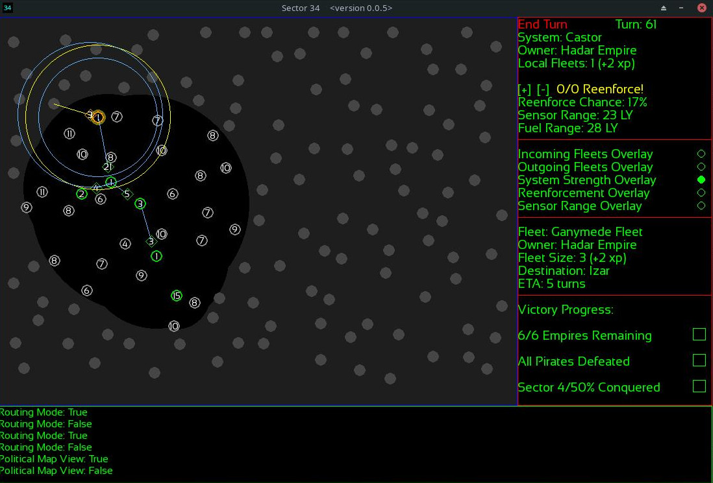
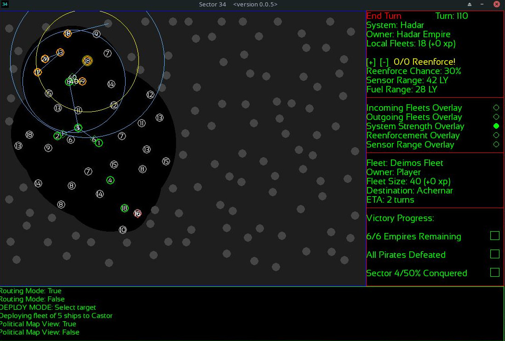
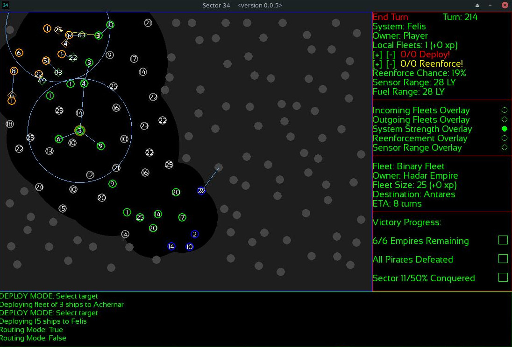
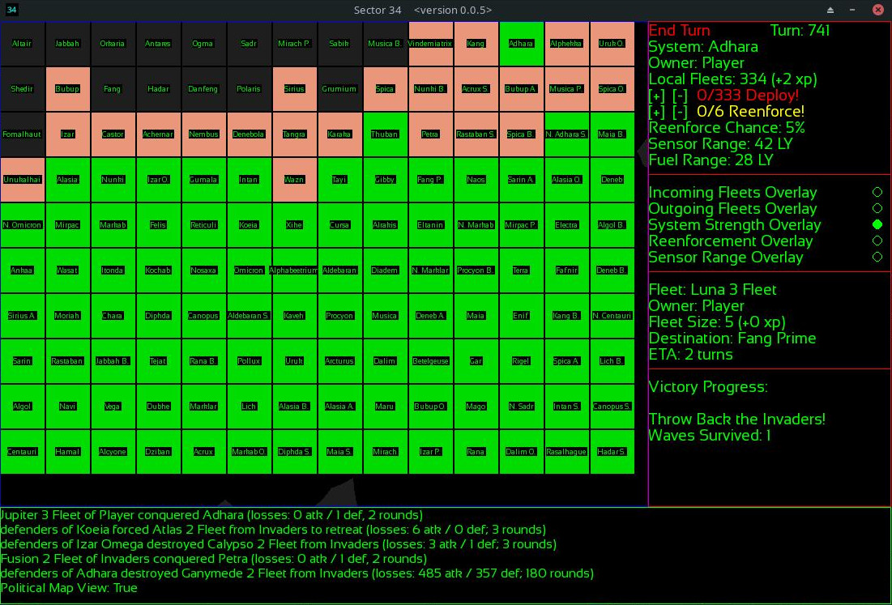
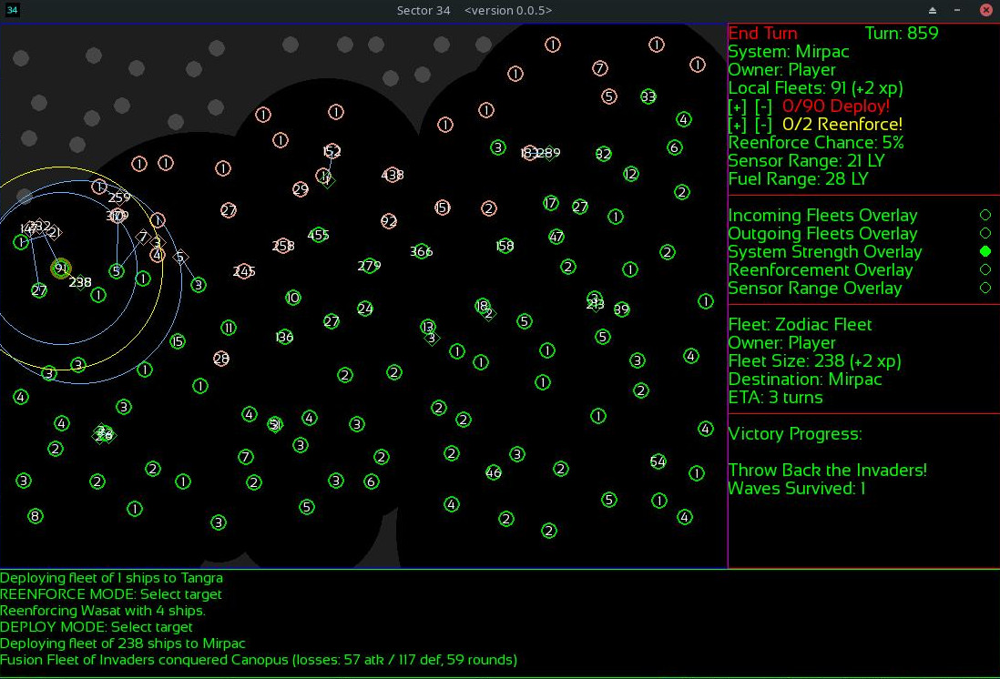
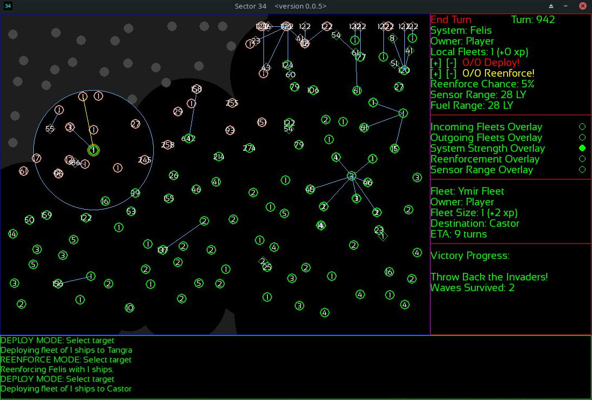

**Start**: Turn 1. The empire collapsed a hundred years or so ago. Our faction has been biding its time in the system of Kochab (which, incidentally, has the best ship production in the sector). Most of our neighbors no longer have access to the FTL technology which we possess. One exception to that is the Pirate hub to our "south" at Canopus. (in the below image I have highlighted Markab, a neighboring system we shall target shortly)

**Strategic Decision**: The main advantages we have over the other factions (which we haven't met yet) are two-fold: firstly, we have slightly better ship production. For the first few dozen turns of the game, this gives us a serious edge. Secondly, the AI is best at scale, and doesn't yet handle the early game decisions as well as a human would. This makes the wise use of your fleets at the very beginning of the game a vital moment. The first thing we see nearby, when switching to the reenforcement chance overlay, is a non-FTL world with the max reenforcement chance that any of the other systems can have (30%). It is guarded by 2 ships, but it'll potentially have a few more by the time a fleet gets there. We're going to send 10 ships that way to make sure we get it, and keep the rest at home as a guard against those Pirates. We'll deal with them shortly! 

*Mechanical Note*: In this build of the game, the AI factions and player start with the same amount of ships: 20.

**Lemons Into Lemondade Moment**: Battles at the beginning of the game are less predictable than in the late game, for reasons of scale. It was 10 vs 4, but that's not *always* enough to ensure victory at the start of the game (though such numbers almost always are when scaled to, say, 1000 vs. 400 in the late-game). These are really skirmishes at the start of the game. We will have to be cunning to overcome this unexpected setback! We lost all ten ships. However, the Pirates have decided to raid a nearby system. The Pirates of Sector34 are not empire-builders; they conquer a system, use it up, build a bigger fleet, and then migrate to a new system as a group, leaving only a few people behind at the previous one. They'll raid other Pirate systems, and don't cooperate. Although the Pirate system to our "south" is a much less tasty target than the non-FTL system we just tried to take, we shouldn't pass it up. It'll extend our borders a little and is better than nothing. Fortunately, no major factions have shown up in our neighborhood yet. We can recover from our failure at Markab!

**Take Two**: We have expanded a little further south, capturing the next Pirate system after it was abandoned by the main fleet. It turns out we're next to an area of the map rife with Pirates. These areas are dynamic but less dangerous in the long run than being next to a major faction. We'll be able to move in and sweep the area soon enough. In the meantime, a larger fleet has been sent to Markab to take the valuable system.

**Victory at Markab**: With Markab taken, we will rapidly be able to build a fleet in the area and take on all of the nearby non-FTL systems. For building big fleets over the long term, and for defense, it's helpful to have at least a few "core" areas where you have a lot of systems close to each other. The first order of business is to take the local neighborhood, and defend against/take advantage of the pirates nearby. Other factions will show up soon, and we should be ready...!

**The Hadar Empire Appears**: Our first major faction appears: The Hadar Empire. We can assume they control that "northwest" corner of the map. This changes our plans a little bit. By blitzing them we can use their former lands as an industrial base with which to build the fleet we need, while putting the zero-sum game with the other factions a little more in our favor. We've immediately sent the fleet which just took Markab to try and take the Castor system, which they just won at cost from its local defenders. The AI will prefer to avoid obviously unwinnable fights, and has chosen to evacuate the system here. From its flight path, we can tell that there are other systems in that direction controlled by this faction. Let's see how far we can push them while we have the element of surprise!

**Assessing the Hadar Empire**: We've caught them relatively unprepared, but not defenseless. They've got a fleet that we wouldn't want to challenge yet without backup. But we should be able to hold Castor as a staging point while we bring up reenforcements. They haven't expanded far yet. We even have their home system of Hadar within reach, and that will be quite a prize as those not only have 30% reenforcement chance but a 42 LY sensor range (as good as the player's homeworld, and much better than most systems on the map).

**Attack on Hadar**: After spending some time bringing up as much reenforcements as could be spared from the "southern" reach of our fledgling empire, we've got a little over 80 ships at our staging point. The Hadar Empire has comparable numbers in the area, and has split them among the border systems. A combined attack on our staging point would not be advisable just yet, but if we wait too long we'll be outnumbered for a moment in the region before we can bring up more reenforcements, at which point the AI just might decide to combine some of those fleets and come for Castor. Now is the time to strike! We can undercut their whole potential to threaten our position by splitting the fleet at Castor in to two smaller fleets of 40 each, and taking Hadar and the other nearby system. Those fights are likely to go in our favor, and taking Hadar will give us a huge production boost in the region. Neither of those systems can be reached in time by help, and by attacking both at once we make sure they are unlikely to reenforce each other. If this attack is successful, we'll be in good shape to blitz these guys, and then the rest of the map!

**Adventurous Pirates**: Our attack on the Hadar Empire was successful! Although they still have two systems with reenforcement ranges in the high 20s%, most of their remaining worlds are below 20%. We will be able to outnumber them in the area and punch through their lines soon enough. In the meantime, a band of adventurous Pirates has set their sights on one our worlds in the Canopus system (a vital link to the "southern" reaches of our fledgling little empire). We aren't going to let them do that! We've sent reenforcements to get there before the pirate fleet does. In Sector34, the defender has a few small advantages that can sometimes make the difference when numbers are close to even. Our defenders at Canopus won't outnumber them by much, but they will have a slight edge. On the flip side of that, the incoming Pirate fleet has a +1 veterancy bonus on its ships, which will negate some of our defending advantage. It's a bit of a gamble, but we'll see. We've left some fleets at the "southern" border in case the other nearby Pirates get frisky with us.

**Not Today, Pirates!**: Our gamble paid off. The Pirate fleet got terrible rolls, and we took hardly any casualties. This gives us an opportunity down in Pirate Country: the system they left to attack us at Canopus has a high reenforcement %. Rather than let it spawn more Pirates, why not take it for ourselves? We've sent our border fleet at Rana Beta to take it quickly, while our defenders at Canopus shift south to help out in the coming turns. Meanwhile, up in the Hadar Empire, they have begun to test our defenses. Defense in Sector34 is well played when you use your neighboring systems to reenforce each other. The AI makes its decisions on a rough estimate of local strength (both friendly and hostile). It is turtle-y by default, but it'll do probing attacks and eventually big attacks when it feels it has an advantage. This attempt at our lines is a sign of things to come, but it's easily fended off by shifting some fleets to defend the threatened world. The AI will do this to us when we attack a strongly defended area, and so the best way to attack is to use some fleets as "fixing attacks" which prevent nearby worlds from reenforcing each other as we are about to do on defense here.

**The Last Charge of Binary Fleet**: When a fleet begins a combat outnumbered by any amount, there is a 5% chance (currently) that "charge!" will activate. This gives them a +1 bonus to all d20 rolls over the combat, and also prevents them from ever deciding to retreat! This has consequences on a well-planned attack on a neighborhood of systems. Normally, a fleet will begin to consider retreat when it is outnumbered by 1.5x or more (attackers only -- defenders either withdraw on the strategic layer or fight to the death once engaged). This means that if a system is reenforced heavily before your fleet arrives, you can count on it retreating before it becomes a total loss to your long-term plans in the region. If they "charge!" then it is victory or bust, and it can cost you a fleet (or, win you a system, or cause a plan-changing level of attrition on the opposing fleets which they were fighting). The probing fleet they sent to us at Achernar (one of the systems we just took from them in the previous attack) decided to "charge!", and they were lost to a ship. We outnumbered them at the start of the battle by enough such that without the "charge!" they may have only stuck around for one or two rounds before retreating, otherwise. This interplay between retreats, reenforcements, many connected systems on every "front line", and the fact that it takes longer than one turn to reach neighboring systems is why coordinated attacks will always prevail over piecemeal assaults in Sector34. The AI currently is very conservative about attack, even when it has the numerical advantage. The player can usually get the edge over it with superior coordination. But don't understimate it when it gets critical mass! It makes me proud sometimes when it pulls some things off. Note that "charge!" will occur when a fleet belongs to a faction with 1 or less systems remaining on the map, as well. This makes late-game off-map Pirate raids very dangerous.

**The Duchy of Rana Appears**: A new contender appears! The Duchy of Rana has shown up to the Pirate-laden frontier of our "southern" border. Should we attack their outpost immediately? I would, but that big Pirate fleet nearby is a real threat. As soon as the opportunity to do so emerges, I may. But for now I am going to let them have that outpost and hope the Pirates give them trouble. Old political maps of the Sector from before the fall of the empire still note the names of the star systems, and we can tell by looking at it that the Duchy of Rana must have expanded a fair bit beyond their home system, and will be no push-over. Meanwhile, we have a slight numerical advantage on the Hadar front. Almost big enough to coordinate a successful attack on them! It is tempting to risk it too soon, and gamble too much. If we let them build up for too long, we might miss our chance. The time for attack is near...!

**Backed into a Corner**: The Hadar Empire left its flank open to attack by consolidating its fleets more closely together. In the short term, this makes it harder to attack their strong fleets, as they can more easily support each other. On the other hand, we can make a little scramble for those systems! The noose tightens on the Hadar Empire... muaha! Meanwhile, down in Pirate country, the big fleet at the Kaveh system has decided to raid somewhere off to the "east". Pirate worlds will never reenforce each other. One left abandoned by its guardian fleet is simply there to be taken. As our fleet arrives to liberate this system from its former Piratic overlords, we also come across the broader frontier of the Duchy of Rana. They won't be an opponent to take lightly, and the sooner we finish off the Hadar Empire the better our position against them will be in the mid-game.

**Just a Nibble**: The frontier system of Arcturus is a tempting target. We can hit it with overwhelming force before reenforcements could arrive. The fleets of the Duchy of Rana are starting to appear on our border in force. More than we can tangle with directly. Our best bet now is to deny them what we can in the area, and trade space for time if we have to. We run the real risk of a two-front war now.

**A Plan so Crazy It Just Might Work**: No sooner had we taken Arcturus (at no real cost), did the Duchy of Rana send one of its fleets to try and take a non-FTL system nearby. We can't have that! We leave Arcturus to its fate to be recaptured (we have at least denied it to the Duchy of Rana for a few turns), and aim to take the system of Lich before the Duchy of Rana's fleet arrives. This is a gamble, but it serves a purpose: if it works, then our fleet won't be able to reenforce from nearby systems before the Rana fleet arrives one turn after we get there. We'll be a little outnumbered. On the other hand, our surviving fleet will be "shock troops" with a +2 to all d20 rolls during combat (versus the +1 from the experienced fleet headed our way). On top of the defender winning ties, this gives us a really good chance of turning them away and/or causing severe casualties. The first stage of this plan works, and as the Rana fleet is 1 turn away from Lich it's likely that we'll be in a position to take several of their now-lightly-defended systems in the area.

**Great Success!**: Having fell into our trap, the Duchy of Rana finds itself less powerful than it was a few turns ago on our southern border. We even managed to keep Arcturus! More reenforcements are coming, but we have a small window of opportunity here in which to inch a little further in on their territory. Meanwhile, up "north", the Hadar Empire is also trying to backdoor its way into our sphere of influence by way of taking non-FTL systems. This would effectively "flank" us on the front line, and we can't allow that. I've sent the bulk of our fleets on that front to pre-empt them, and hopefully both take that non-FTL system and turn back their incoming fleet.

**Retreat!**: Our plan worked! Our overwhelming fleet arrived at Alasia before the Hadar Fleet, securing it from the local defenders and gaining valuable experience in the process. Arriving to the battle both outnumbered and outgunned, the fleet from the Hadar Empire fled after a few rounds of combat. The Hadar front remains active, however: they have sent a small probing fleet to try and take back their homeworld. 

**Not Today, Hadar!**: In a thematically pleasing turn of events, the fleet sent to probe at Hadar decided to "charge!". It was a doomed attempt (the most dangerous charges occur during the late game, when fleet scales are much higher and some locations have enough defenders to require multiple coordinated attacks in the area to take, and attrition is felt differently compared to the early game so far here). We now have a rather good numerical advantage in the Hadar region, while our thinly-stretched "southern" forces are still looking good. The time to launch another coordinated attack on the Hadar front lines is near.

**Frontal Assault**: We have the numbers to take a whack at the Hadar Empire's front lines now. Frontal assaults like this are tricky in Sector34. To succeed in them you must attack multiple neighboring systems at once, to prevent them from reenforcing each other. Systems beyond your reach which are closer to your target than you are must be considered a potential source of reenforcements. Not every attack will be successful. But by "fixing" most of the fleets in an area and making sure each one is at least a somewhat wise engagement individually, you can usually ensure that you bite out a "chunk" of the line. We are going to attempt to do this here to the Hadar Empire. If we succeed, their entire realm will be ours shortly! If we fail...? Well, now is the time to try, in any case. Our "southern" flank is starting to look a little arms-race-y, and the sooner we can shift some of these forces down there the better!

**Best Laid Plans**: Faced with overwhelming numbers in a coordinated assault, the Hadar Empire has done what little it can. It evacuated its weakest system to slightly reenforce another, and has sent a fleet it had in the rear to attack one of the worlds we just came from! Leaving any gaps in the line invites such counter-attacks. That may cause us a little trouble, depending on how the upcoming engagements go. But the other thing it might have done there is use those ships to further reenforce the systems we are attacking, which would have messed up our plans more. 

**Last Stand at Bubup**: Whenever a defending side is outnumbered at the start of a battle there is a 5% chance of them gaining the "last stand!" bonus. This gives them a +1 bonus to all d20 rolls over the course of the battle. It will also be triggered any time a fleet is defending a faction's last system. It did not save the defenders, in this example! 

*Mechanical Note*: "Brilliancy" is a round-specific bonus that a side has a 5% chance of getting on any given round. It rarely makes the difference in an engagement, but shakes things up a little bit.

**Shattered Line**: Only one of our assaults failed! Despite that, and the counter-attack seizing one of our rear systems, the overall attack was successful: we wiped out most of their ships and took two systems. We now have a total edge in numbers against the Hadar Empire, and the fleet which invaded our rear is now in a deadly pocket. The Hadar Empire will fall soon...!

**Sphere of Influence**: The Hadar Empire is no more! Henceforth, that region of Sector 34 will be a boon to our fleet production. We shall not turn all of our attention to the Duchy of Rana just yet, however. In the early game, the non-FTL systems can be a real terrain obstacle. But once we have reached the mid-game (as now), we can assemble fleets which are large enough to take them on without sustaining severe casualties. Not only does this mean we can bring the entire region we just secured under our control (and the much-needed ships that will bring), but it also gives our fleets vital experience on the way to the border. We'll expand outwards, take as much as we can, and prepare to bring the fight to the Duchy of Rana shortly. This is a good position to be in, and with clever play the game is already won.

**Exponential Growth**: This is a critical moment in the game! Worthy of taking a moment to reflect on, and appreciate. The non-FTL systems in our sphere of influence are now cheap and easy to take. Our fleets grow faster than we can use them simply to expand into the region un-opposed by a major faction. Even our border fleets begin to outnumber the Duchy of Rana in the "south". There is little stopping us from claiming the entire "west" side of the map, and blitzing the rest of the factions in the "east". Or is there? In any case, we'd be fools not to jump on this apparent advantage. In the south-west we claim the rest of the non-FTL worlds in that part of the map, and up in the "north" we liberate some systems from Pirates. We also encounter our next neighbor: The Adhara Polity!

**Shaping Up**: We had that whole half of the map to ourselves after dealing with the Hadar Empire and fending off the probes of the Duchy of Rana! The non-FTL systems fell like dominos to our swift advance, and we're ready to build a real front line. This is where the first phase of the game ends!

**Scouting the Midgame**: We've gobbled up our half of the map, and are racing our now-highly-experienced fleets to the front lines, along with a ton of reenforcements. We've got just over half the map to ourselves, with the rest being split between the remaining five factions. Meanwhile, I've sent some scouts to check out the scene beyond the center of the sector. Normally it is risky to send out 1-ship scout fleets for two reasons: it's a waste of a ship, usually (especially in the early game) and also because they cause the defenders of the system they arrive at to suddenly be veterans (only one battle is required). But this seemed like a good time to risk it, and check out the landscape. 

**Raiders from Beyond**: All pirates have been cleared from Sector 34! It is almost as safe as in the old days of the empire, some say! But from beyond the sector's borders, a daring group of raiders is making for our system of Sabik. Pirate raids from off-map are scaled to the size of your fleet at the system they target. They can target any system close to the map's edge! Sometimes it is wise to keep few ships there, so that raids are small. But sometimes it is important to keep big fleets on the flank, and that's when their raids get risky! Our defenders at Sabik are experienced, with the +1 veterancy bonus, while the raiders coming for it are fresh. They might beat the pirates, but the Pirates should also get "charge!", since they are the only pirates on the map now. That one could go either way! 

It began as a toss-up, but once the tide began to turn the outnumber bonus made it a forgone conclusion. A victory for our stalwart defenders at Sabik!

**Probing Attacks**: Now is a good time to begin chipping away at the weak parts of our opponents' lines! As we can see, they have also had some time to build up their forces. But they by no means outnumber us, and they are weaker than us individually. If we strike now, we may be able to get them! Towards the center of the map I am sending very large fleets to two relatively lightly defended systems, and even if they are met with reenforcements they'll be able to fall back in to the line. I may get a foothold in their territory, or if not I'll gauge the strength of their defense. In the "south" of the map I am being more aggressive, as I think I can take that cluster of systems under the control of the Duchy of Rana with a coordinated attack at this point, pretty safely.

**Duchy of Rana Reacts**: The Adhara Polity has not noticed our doom fleet approaching Tayi yet, because of the sensor ranges of its border systems. Our fleet is just shy of its farthest reaching sensor bubble. It won't react to our approaching fleet just yet. But we can see that they certainly aren't prepared for the sudden arrival of all of our fleets! The AI does not consider a system "understrength" if it can't see what you're keeping in reserve deeper behind the line. This allows the quick mobilization of reserves to be very successful if pointed in the right direction. It is also a reason to not put *every* ship on the front line -- why show your plans until the decisive moment? The factions' AIs are not the most aggressive, but they aren't foolish. They'll try to match forces. The Duchy of Rana, on the other hand, has seen our fleets approaching and chosen to evacuate Aldebaran rather than waste the defenders there. Meanwhile, in the southern part of the map, the defenders are unable to reenforce each other effectively -- our coordinated attack on all of those planets at once ensures they can't effectively pool their forces on one system, as they otherwise might! Even in this situation, it'll sometimes evacuate some systems to get better numbers at another, thwarting some of your plans. 

*(AI Note: In this case, faced with no really good options at all, the defenders in the southern sector tried to evacuate their systems towards each other at the last moment, This resulted in them swapping places with us, and becoming the attackers of the systems we just took. Which doesn't help them much, but would give them the chance to retreat to some other nearby system if the whole area weren't a pocket far from their lines. In the future I'll include another layer to check for this exact situation, and have them at least pool their fleets on one planet, or try to "break out" towards the main lines. What should happen here now is that, once the Rana fleets enter combat as attackers against the systems we just took, they will gain the "charge!" bonus because no friendly worlds at all are within range. This allows pocketed fleets to at least occasionally attempt some sort of attrition-causing rather than just be lost in an overwhelmed defense, but a more deliberate "breakout" system would be best. It is good strategy to create and destroy pockets with overwhelming force. This will become relevant. Most of the time, when it can, the AI will do these things to fluster your attacks if there is anywhere to escape to.)*

**Enter the Resistance**: Our domination of the Sector was not going unnoticed by the other factions! We succeeded in taking the southern systems, and the two in the center, and now control just over half the map. But what's this? The remaining FTL-capable factions have banded together into "The Coalition", which will oppose us! This event is triggered to occur (as of this build) when the player has 55% or more of the systems on the map. If the Coalition/Resistance has less ships than the player, then it will get a significant production boost and rush all the ships it can to the line until it has reached parity with the player in either ships or systems. The console informs us that the production boost ended immediately, suggesting that the combined factions actually had more ships than we do, deep behind the lines. And this makes sense, because there were 5 factions left and they all must have been over there clumped together. When factions don't "blob", they "clump", and when they clump they build up big fleets which never get used. Those fleets are now certain to appear somewhere on our front. But where? Now the real game begins!

*(AI Note: By chance (they could have picked any of the threatened systems to try and evacuate to within the pocket), the AI fleets chose to assault Maia Secundus, allowing one of them to retreat to another system along the line, while the other chose to "charge!" (although it only had a 5% chance to do so, given that that was the only pocketed system where retreat towards the line was possible). This "breakout attempt" was emergent, but it worked out for them. In the future I'll make that behavior more intentional. Perhaps before the release of this update, as it would be easy to include in the waypoint system I've included in this update (something which the AI in general has also benefited from).)*

**Momentum**: While we were prepared for this conflict, the Coalition is still rushing its reenforcements to the line and most haven't shown up yet. We can win some ground by advancing while we have the advantage. Most of their fleets are trying to trade space for time, but if we move quickly enough we can trap some of them and prevent them from linking up with their reserves. One ambitious fleet has decided to try and break through a gap in our lines to raid our reserve-generating rear areas, but we're positioned to intercept it at Tayi! A promising start to this conflict!

**The Coalition Reacts**: While most of The Coalition's forces are still attempting to trade space for time, they did manage to pool enough defenders on one planet to counter one of our incoming fleets, and we can expect it to give our fleet a fight when it arrives. We've only been able to trap one or two of their fleets in a good battle so far, but they are losing ground quickly to our advance. The plan is to keep steady pressure on The Coalition until we've hit their reserves (and hopefully split them into multiple pockets before they've had a chance to organize).

**The Battle of Dalim**: This is actually the *second* battle of Dalim, the first being a scout we sent out earlier who did not return from their important mission. This is the first sign of stiff resistance from our foe! They reenforced this system up to a number which could have fended us off if they had gotten lucky, in the midst of trading space for time elsewhere. This battle could have gone either way, and because of the way the battles are scaled (regarding the outnumber dice in particular), the bigger a battle is the more chances it has to "take a turn" at any point. Fleets who start a battle on otherwise mostly even footing (and remember the defender at the very least wins ties on the d20 rolls) can go either way, but once a side starts to accumulate outnumber dice the other side is less and less likely to come back. So while it could have gone either way, the amount of ships we'd have left alive entirely depends on when the battle "turns" in our favor (or doesn't, as the case may be). The retreat routine for attackers begins considering retreat (under the hood) when the other side has at least 1 outnumber dice (which as of this build is at 1.5x the size of the opposing fleet), and that chance increases for each outnumber dice. An attacker outnumbered by 1 die will usually retreat before long. In the battles' animations, however, they begin their retreat halfway through the playback (for aesthetic reasons). So those who are interested in how this works under the hood should remember that the decision to retreat was actually the last thing that happened in the simulation. In large battles you can take a lot of casualties by not taking that into consideration. The more you outnumber a defender by, the less casualties you take. The more you outnumber an attacker by, the more likely they are to quickly retreat. The flip side is also true: the more you outnumber a defender by, the more likely they are to evacuate before you arrive; the more you outnumber an attacker by, the less opportunities you have to cause that attacker attrition in their attack if they don't "charge!". There is a time and place for considering all of those situations over the course of the game. The +1/+2 veterancy bonuses can be very powerful, as they apply to every roll made throughout the battle. The outnumber die replace lower rolls in the set (kind of like "advantage" in DnD). A battle which starts on even footing can not only go either way, but at which point it does may take several twists and turns. There are a number of parts of the animation which only trigger during battles of a certain scale, and although the procedural battle animations are at an early stage they already meet some of my goals of representing each "phase" of the game a little differently. There are some things you'll only really see in truly epic late game battles -- but they are an early example of what I hope to accomplish with that part of the game (and are tied to the way the combat system scales and handles over the course of the game, strategically, though they are an entirely gratuitous feature). In this case, the opponent did not win, and we have a healthy number of survivors! 

**The 2nd Battle of Diadem**: Here is another example of the AI managing to rush reenforcements to a spot quickly enough to make a difference, now that we're pushing a little deeper and their reserves are arriving at the front. In this case, they managed to outnumber our fleet before it arrived! Thankfully, our fleet decided to retreat quickly before taking any serious damage. It will return to the nearest friendly system automatically, and we'll set up a good defense in the area.

**The 3rd Battle of Musica**: Here is a good example of how the mechanics work on a larger scale. In this battle we're attacked by a fleet which outnumbers us enough to get 1 outnumber die, but not 2. At the earlier stages of the game that might have been enough most of the time to get a decisive win, but at this scale the attacker should have brought more. The defenders are crack veterans, and will get +2 to every d20 roll in addition to winning ties. 

By the time they manage to secure 2 outnumber die, they have taken a ton of attrition.

And, although the battle was always going to be theirs from the start (most likely), the result for them by the end is downright pyrrhic compared to if we hadn't had veterans there. The scale of battles increases throughout the course of the game -- this is still a relatively small one! For this upcoming update, at very high numbers, the *base* number of dice rolled per side also increases (to a maximum of 6 each), and this makes the outnumber dice have an even more marginal effect compared to "charge!", "last stand!", or the +1/+2 experience bonuses. As a consequence, the player must be more coordinated in their large-scale attack and defense, strategically, as the game goes on. "Turning Chance into Chess" is ze name of ze game. A bit of flexibility is always required, because the opponent has a few turns to react to any attack you make and wide-front assaults won't work out exactly like you plan. The game is scaled to get more strategic and less random as it goes on. But, really, as long as the player doesn't squander their first few dozen turns, they should always be able to win the three scenarios currently implemented ("free for all", "coalition", and "invaders" so far).

**The Epic Stage is Set**: The Coalition is beginning to push us back a little. They've consolidated their lines, and brought up their reserves. The time has come to begin the assault in earnest, now! While we plan that, reserves continue to pool in the rear areas, to be brought forward when the time is right. Solid front lines have formed, and unlike the first stage of the game (which is really a kind of tutorial) this stage requires putting solid complex attacks together to win a breakthrough, or any signficant portion of the line.

**Scouting Before the Big Attack**: We've decided to take the risk here of sending out a few scouts, to gauge the depth of the Coalition's lines. Failing to do that before a big attack can result in being ambushed by fleets which you didn't see! What we can see here is that we've done a fair bit of damage to them during the initial push, trapping a few fleets and causing serious attrition elsewhere. Remember: they started with more ships than us! Now they are down on ships, down on systems, and we have the momentum. The time is now to launch the big attack! Elsewhere, at the top of the map, we are helped in our timing by an off-map Pirate raid (they have a very low chance to occur to at most a single system on any given turn) which conveniently wiped out a large garrison for us (but we now must consider a large marauding group of veteran Pirates in the neighborhood, which will complicate things). 

**Cracking the Nut**: The goal here is to break their strongest defenses right away, and then pour through the gaps. By attacking in a coordinated way along the line, we prevent them from reenforcing each other effectively. Before the attack I organized my fleets so that most of the ones who arrive at their destinations will be winning decisive battles, or at the very least not being terribly harmed if they are forced to retreat by sudden reenforcements from nearby (or a decision to evacuate or break out by the AI). In one spot of the line I had to send a fleet that would be severely outnumbered when it arrived at its destination, so that the place I was attacking would not be able to reenforce another nearby location which I have trapped in a decisive engagement. The hope is that that particular fleet will retreat quickly upon arrival -- but it might "charge!". These kinds of "fixing attacks" are an often-necessary part of a wider coordinated attack.

**The Parthian Shot!**: Our fixing attack (dubbed Fusion Fleet) arrives at the 1st Battle of Eltanin! It's outnumbered, but its troops are veterans and will enjoy a +1 advantage throughout the engagement. It is hope that they will retreat before being too badly harmed, but if they stick around and cause a little attrition first... why not? Knowing when to pull back is tough, and you have to trust your fleet commanders to do that for you here. Their judgment isn't perfect. You have to help them along with good strategy!

It went even better than we could have hoped! Because our ships were experienced, and came in relatively large numbers, they caused a severe amount of attrition against their relatively less experienced opponents. By the time they pulled back from the engagement, they had done more damage to them than they took in return! Not only did they succeed in their fixing attack, but that system won't be much of a threat to our new positions nearby. Well done, Fusion Fleet! A successful parthian shot!

(*Note*: I will include an achievement for this in the final game, for sure. That was quite satisfying!)

**2nd Battle of Mago**: As our attack advances, it's tempting to try and take on defenders you don't outnumber much because you are using experienced troops at the tip of your advance, who enjoy a +2 bonus -- especially when the defenders are fresh recruits! Here is an example of a wrench being thrown into that plan: our fleet arrives slightly outnumbering the opponent, and with a big experience advantage. It could have gone either way, but was sure to at least cause the other side a lot of attrition. That is, until they got the "last stand!" bonus (a 5% chance of that occuring when the defender is at all outnumbered at the start of a battle), which changed my +2 advantage over the course of the battle to a mere +1 advantage. This was enough to turn a possible victory into a very unlikely one, and our fleet had to retreat. At this stage of the advance we're swiftly overwhelming them across the line, and these numbers are often working out in our favor. But because of "last stand!" and "charge!" even the perfectly planned advance will have to adapt flexibly. "The enemy gets a vote", as some people say! The opportunity to reenforce and evacuate systems before fleets arrive also means that even a perfectly planned attack won't go perfectly according to plan. But in this game good long-term strategy will always win out.

**The Nut is Cracked**: The combination of our swift initial advance before they brought up their reserves, combined with the crushing decisiveness of our big attack, has completely broken their fleets. We caused far more damage than we took in nearly all engagements, and disrupted their line entirely. Not every bite out of the line went according to plan, but the plan was flexible, the nut is cracked! We now control an unbeatable percentage of the map, and we can strike hard before they get a chance to build up new reserves.

**A Sector Almost United**: With their front broken in our big attack, the momentum was in our favor ever afterwards. Within a few dozen swift turns, we have them backed into a corner! Soon, all of Sector 34 will be ours. The people rejoice! But let's not get ahead of ourselves... a bigger boss looms, for which I have carefully saved some of my fleets. In the meantime, we prepare the final blow against our opponent!

**A Sector United**: We have defeated the coalition of factions who sought to prevent us from conquering Sector 34, and victory is ours! But, no sooner have we declared victory than rumors from beyond our borders begin to circulate: strange invaders to the "north" have been conquering and destroying all in their path, and they will be upon us within thirty turns! We expect opposition to be heavy, based on the reports. We will use this time to position our fleets carefully.

**The Invasion Stage**: The AI has been improved a bit since 0.0.4, and as a result the invasion has been changed up a little bit from that version. In 0.0.4 the AI didn't use waypoints, and relied on chance to ever reach the front lines. In 0.0.5 they will use waypoints, and some of them will send different "packets" of reenforcements to the front at different rates and in different quantities. The two types of AI personalities used in the FFA and Coalition stages don't particularly favor one part of the front line, and differ only slightly in their differences otherwise. The invasion is handled by a different personality type who uses "centers of gravity" to throw all of their reserve fleets (anything not on the front line in a threatened or understrength area) at a single area of the front line for hundreds of turns at a time, before switching to another. In 0.0.4 the invasion was scaled a bit higher because of the invaders' lack of aggression, but all the AI types are much more aggressive now (including and especially the one handling the invaders). So, I have scaled the invaders to have 1.5x the number of ships as the player in this build, and they now come in six distinct waves (the first scaled at 1.5x player ships, and the rest bringing them back to that scale). The waves are evenly spread among "border" systems on the invading side (in this case the "top" of the map, but it's random each run) and is too big to be countered directly, but because every system it hits is a "front line" it won't usually succeed in punching a hole the first wave. The succeeding waves only bring in enough reenforcements to bring their fleets back up to that scale with player (including losses), so if the player has been winning then the waves will be bigger (and if losing, smaller). The additional waves will try to hit specific parts of the line with all of the incoming reserves, whenever possible! Otherwise, the invaders don't reenforce, while we do. The invaders will decimate every system they succeed in taking, reducing its reenforcement chance to 5%. Letting even a few of their fleets run amok behind the lines could severely damage our ability to push them back quickly, but with good play this stage should always be winnable because of the relative scaling of the invaders (and the fact that the AI is not yet as good as it can and will be in the future). One thing to consider is the veterancy bonus: although we can't say for sure what kinds of conquests these invaders have been involved in as a group, the ones coming to us are fresh fleets whom we may have a temporary advantage over. But they will outnumber us to begin with, and most of their fleets will have the +2 bonuses on attack and defense in most fights after the initial contact, while our fleets will survive in large part due to an influx of fresh reserves. The best strategy is to try and do some damage to them on the first wave, but not to put *all* our ships at the front (the invaders would win, then); to give some ground without giving up too much ground (why let more systems get decimated than we can help?), and then counter-attack. The counter-attack is dangerous because the more we have been clobbering them (and if we're pushing them back then we must be clobbering them) the bigger the reenforcement waves will be (which come at semi-random intervals every couple of hundred turns), and one runs the risk of being hit unexpectedly by a large wave just at the moment of apparent victory! We will want to defend flexibly, and then counter-attack carefully. We will lose some ground in the first wave, for sure, but hopefully the line will hold!

**Why Do I Hear Boss Music?**: They have arrived! They've already conquered and decimated several of our border systems. Is our home system of Kochab far enough from the front line to avoid such a fate? (*Note: I'll probably have an achievement in there related to that*) This invasion looks imposing, but we have big fleets positioned to do a little damage to some of their fresh fleets before the line has to pull back. The entire sector is generating fresh reserves for us, and if we can hold the line and stop their advance then victory will be ours!

**Not Today, Invaders!**: While most of our front line is trading space for time, in a couple of areas we managed to position large fleets which can disrupt their advance a little bit.

**Interdicting the Advance**: The invaders advance swiftly, and outnumber us in general. But we have opportunities to use our few big fleets near the front to intercept some of them before they reach their destinations, with numbers that will either be overwhelming on attack (when we catch them at a system they can't escape from) or defense (with numbers which aren't so high they'll retreat right away, but aren't so low that we'll lose). In this way we can cause them a lot of attrition while we trade space for time!

We've managed to do this effectively on both flanks, and in the center. While giving ground to their superior numbers, we're picking and choosing small fights to win in detail before pulling back!

During one such interception of a fleet arriving at a system, the invaders were unlucky enough to roll the "charge!" event, running headlong into our lines! We enjoyed 1 outnumber die shortly after the battle began. Once the trend was firmly in our favor, their casualties began to mount. When the lines finally met we had two outnumber die, and it was a forgone conclusion. By the end of the battle? A total victory. That's one invader fleet that won't be breaking through! While fleets grow exponentially, they are not an infinite resource for the player -- time is a factor, and you can lose this stage by letting the invaders gather enough momentum to wreck a good portion of your reserve-generating areas. It is harder to ensure an outnumber bonus later in the game, because the fleet numbers are so much bigger: being able to realistically *get to* 1 outnumber die is sometimes the difference at the start of the battle. In this case, it worked out in our favor! Those invaders charged headlong in to our trap!

This brave interdicting behavior by some of our fleets has seriously slowed the invader advance, allowing us time to bring up reserves and try to form a line somewhere! We may even save the homeworld of Kochab! That last successful trap alone relieved a lot of the pressure on the "northeast" corner of the map. Unfortunately, the Adhara system will still have to be abandoned during the general withdrawl from the top portion of the map, but perhaps the brave actions of our defenders there will allow enough civilians to evacuate. (*Note: I may make a mechanic/achievement for that in future versions, as for now population is not modeled*). In fact, I see a potential opportunity to pocket the invader fleets which are now much more vulnerable in that corner. By our careful interdiction, we've turned a tidal wave into a mere high tide. Great success!

**Bent, But Not Broken**: Not only have we given them a whalloping during the retreat, but their advance is running out of steam! A few probing advances are attempting to break through, but we've got fleets ready to intercept them everywhere, and we're even about to start putting the hurt on that fleet we've trapped in the top right of the map. They probably still have a few fleets we can't see, and in 100-200 turns the next wave will hit, but for now we've stopped the advance. And just  in time! Kochab is now a front-line world again.

**To Counter-Attack, or Not to Counter-Attack?**: If we try to push the invaders back right now then we'd be making a strategic gamble: can we then push them *all* the way back before the next wave hits? If not, then the wave which hits us will be that much bigger. It may be possible to try and push them all the way back before the end of the first wave, and I am going to attempt it. Realistically, though, the second wave will probably hit as I am closing in on the top portion of the map. In the worst case scenario, that will result in all of my front-line fleets being hit with 1.5x their total number in ships, and that would be a hard thing to interdict effectively (it was the depth which allowed us to do that in the initial push). Also, since the AI handler for the invaders is programmed to weight all of its reenforcements towards one "side" of the line, it is useful to try and at least drive a wedge in the center so that some of the reenforcements are cut off from whatever part of the line it decides to use as a center of gravity in the next wave. We're going to at least attempt to do that here! 

(*Note: Having satisfied myself that 1.5x is a winnable scale with the new AI improvements, I may scale it back up to 1.8x or higher for the 0.0.5 release.*)

**Bringing Up the Reserves**: Although our front line fleets are in some cases enjoying the +2 experience bonus, much of the fleets we've brought up are fresh recruits. It's important to take this into account during the invasion stage, because those little defensive actions along the line can be more costly than you expect (remember: the invaders are almost all +2 XP now, until they are reenforced by an off-map wave).

Fortunately, that example ended in a quick retreat due to our outnumber bonus; but had they triggered "charge!" we might have taken some big casualties there, which would have changed our situation in the area.

**The Counter Attack Begins**: We have three things happening along the "line" here right now, and the conditions are right to begin the counter-attack. In the top-right of the map, we have one of their fleets trapped in a situation where they won't flee (that's not usually a certainty unless your incoming fleets outnumber them about 3:1, but that varies a lot by some of the other considerations in the AI's "front line" layer), but stands a chance of winning the battle entirely and will at the very least leave the fleet there very reduced, and ready for a second try in a few turns. In the center of the map there is an invader fleet bearing down on one of our system, and there are enough defenders there to attrit it very heavily before the outnumber die trigger (ensuring it won't flee the combat until we've reduced it severely as a strategic threat). On the the top-left of the map we have a big blind-spot, but it tentatively appears that we have the means to keep the invaders from advancing further, due to our large fleets being in a position to intercept anywhere the invaders might try to advance into (they won't try that unless they think they can get away with it usually -- probing attacks are usually the result of feeling like they have a numerical advantage, and they won't do that when they begin to be strategically outnumbered in an area). Once we've caught that fleet bearing down in the middle, their advance will be truly stalled for the first wave. And what better time to begin a counter-attack than right before the opponent realizes their attack has stalled? 

By golly, we may even be able to save Adhara! That would be quite satisfying!

**The 2nd Battle of Spica Omega**: We began this battle with just enough ships to ensure a *possible* victory and *certain* attrition to the opposing fleet at Spica Omega. Victory was far from assured, however. A fleet does not gain its first outnumber die until it has 1.5x the ships of the opponent, and the bigger your fleets are the harder it is to gain more. Would we take a ton of attrition and then retreat? Would we we win in a landslide? Would we barely win? All of these were possible. This was a gamble of an attack. A bit of a risk!

Deep into the battle, neither side has gained an outnumber die yet! The ships remaining for both sides reduces in a wiggly-wobbly way, and just *when* a side will gain the advantage (even when you've sent enough fleets to probably win regardless) is hard to say with total certainty. How many casualties you take (regardless of win or loss) is a big factor strategically. At this point it's still possible that our fleet may have to retreat.

Farther into the battle, the twists and turns begin to go our way. An outnumber die is gained! It is not a forgone conclusion yet, but as the numbers scale down it is easier for our fleet to capitalize on this advantage, and it will gain more, more quickly. At what point in the battle either side gained the outnumber die makes a difference in the way the rest of the graph will look there. In a future update I'll include a toggle to watch this graph play out, because each battle has its own twists and turns in that way, and a good 4x-like game should include many charts and graphs. In this particular race to the y-intercept, it's best not to be first! I'm very pleased with how this has turned out as a system. Originally my goal was just to mash Risk and Master of Orion together, but it has evolved in to its own little thing from there. The battles themselves are expressions of this graph, and the goal is to have more and more procedural events occur in the animations which reflect these twists and turns (some are already implemented, such as certain stages of the animation only being likely to occur to their maximum awesomeness in certain situations, at certain scales). 

It winds up a victory for our fleet! But at such cost! Was it worth it to try and save Adhara, and pocket that corner of the map? We shall see. We have several dozen turns to exploit the newly gained section of front and bring up more reenforcements to that area. In the meantime, nothing is left to oppose us in that corner, but that one could have had several outcomes which would have had different effects on the strategic part of the game.

(*Systems Note*: I'm not an expert in mathematics. I just sort of mashed ideas from my favorite TTRPGs and dice games together here, obviously based heavily on Risk. The current balance, achieved through much playtesting, is something I am eager to preserve as I include more features going forward.)

**Critical Hit**: When we planned our defense of Fang Prime, it was under the assumption that it was probable that the attackers would take relatively more attrition than us over time (because defenders win ties). We outnumber them only slightly, but at this scale that was a safe bet with the +2 XP bonus being equal on them. But what we didn't count on was a "charge!" Not only does this cause the attacker to *never retreat*, but it gives them a +1 edge! Now it is far less clear who the probable winner will be. If there's one thing I've learned from DnD, it's that a 5% chance to critical hit happens more often than you think!

Who had more ships varied from point to point as the lines on the graph traveled down to 0. It switched places several times. In the future, I would like to include more nuances in the animations which reflect those "wiggles" in momentum. 

Eventually the tide turned in favor of the charging attackers, but at a truly pyrrhic cost.

But thankfully, our strategic situation was prepared for this eventuality. Another fleet of over 200 ships is about to retake Fang Prime. The remaining defenders (the prior attackers) have no choice but to flee, and we will take it before the reenforcements (the largest fleet of which is 165 ships, against the 246 which just displaced the recently-victorious 60-ish invaders who had just won that pyrrhic victory) arrive to secure what was just won. Although we took a critical hit, we took it in stride, and our operational momentum is sustained. The late-game strategy is about managing attrition as much as it is about winning battles.

**Give and Take**: Our earlier speculations about the blind spot in the top-left corner of the map were borne out by events! A great number of invader fleets have emerged, to push in the center and on the left. But it is nothing we can't counter. Meanwhile, in the top-right, our advance continues carefully in light of a 600+ ship fleet which just arrived in the neighborhood of Adhara! Reenforcements are brought up just behind the front line, in case a little more ground has to be given, and I continue to push in the top-right, carefully.

**Red Rover, Red Rover**: The large fleet sighted near Adhara earlier turned around and headed for the center, reenforcing a number of fleets there. On the left, they've begun to push us back a little. The first wave had more push than we were expecting! But we are flexible, and will stop them. Meanwhile, on the top-right, we continue carefully retaking ground. At this point, the second wave could hit very soon (potentially within the next fifty or so turns) and we can expect it to be a big one! The best strategy now is to try and reach the top edge of the map with the tip of a salient, to divide their wave when it arrives, *if we can spare the fleets*. Otherwise, we'll want to brace ourselves for the next wave, and absorb it before renewing our counter-attack to the top edge of the map. In the center-left, we can see a daring fleet has broken through the lines! The GUI for the game is still in an early state, and is very "noisy". Some fleets will get by you because of this inherent and unintended layer of the "fog of war". I will improve that going forward (because I play this game *a lot*, and that's an important part of the game) and if any players have urgent requests for interface improvements then please let me know on the forums and I will fast-track those over other features I am currently implementing. Lately I've been focusing on AI improvements, scenarios, and balancing the veterancy mechanic for the game. But a round of GUI improvements is probably due soon. In any case, we can't let this daring group of invaders wreck our rear! We'll try to halt them, surround them, and destroy them before they get too far.

**"Never Tell Me the Odds!"**: While in many situations it is a liability if a fleet decides to "charge!", it can be advantageous sometimes to your overall strategic situation. While the invaders are causing me to trade space for time on the left, I had to make some risky calls. In this battle that could have gone either way, these invaders decided to "charge!". And while the momentum hung in the balance and swayed back and forth at various points in the race to the y-intercept, they came out on top and secured an outnumber die when relatively few ships were left. What is unwise at a smaller scale can sometimes work out at a larger scale, because there are more chances for it to hang in the balance along the way. It is the combination of the "fleet width" (which is usually 3-6, except when a fleet has less than 3 ships) and the outnumber dice, along with the way the phases of the game scale, which produce these interesting wrinkles in the game's strategic and tactical pace throughout a run! It was Paradox games that made me think of having a "width" that was larger than in Risk, but still small-ish, while being variable. This winds up contributing to the overall variety in the battles over time and scale, and also makes the battles long enough to cram (eventually) any number of interesting procedural animations into based on these "twists and turns" in the rolls themselves (which are entirely computed and simulated before the animation ever plays -- the animations merely draw from the rolls for some things). A moment of appreciation for these brave little invaders. It won't save their cause, but bravo for the charge! Never tell those guys the odds. That 5% chance of getting a +1 to every roll over the course of the battle (combined with not having a chance to retreat it if went against them) changed their overall +1 advantage to a +2 advantage, and what would likely have been either a *very costly* victory for them or them retreating resulted in a moderately costly win for them, instead. So the "critical hit" of "charge!" is entirely situational, and its effects are limited but important on the strategic scale of the game at this stage. It's important to bear in mind that attackers have a 5% chance of "charging!" when outnumbered to start a battle, and defenders have a 5% chance of "last stand!" (while defenders must retreat *before* a battle or not at all, they benefit inherently from the win on ties, and that extra +1 from "last stand!" is significant sometimes -- and there is a 1/400 chance of getting both "charge!" and "last stand!" in the same battle!)

(*Systems Note*: I can study the graphs produced by these battles and their "wiggles" to not only come up with new animation ideas, but also bits of lore which explain why trends turn the way they do at certain points, being a sci-fi setting and not a model for actual war in reality. This is absolutely part of the idea, and something I am eager to do once I have a better grounding in the math. Right now this is all based on a lot of trial and error, and as of 0.0.5 I am very pleased with the feel. Future changes to mechanics which affect the battle system will want to be considered carefully in the context of that graph -- specifically, the graph of losses per round per side in a battle, and how each factor influences that at different scales and at different stages of the battle. Right now the animations are sort of "placeholders" for how deeply I want to explore that possibility; especially once more mechanics are implemented which include more bonuses, and perhaps an eventual rock-paper-scissors system for damage and armor. What makes the current system great not only for the animation potential but also for the strategic part of the game is how their consequences for attrition are so variable; especially at the larger scale of the game. It is much like Risk in this regard, and quite frankly I think a room-sized Risk map with roughly equal-ish "province" sizes and a > 1 turn movement time between provinces would result in a game pretty similar to this, and with a need to implement something like outnumber dice or "fleet width" at some point, if done in practice. But I am no expert. Paradox games were my inspiration there!)

**Tip of the Spear**: We've slowed their push on the left! They are no longer making probing attacks, and once the invaders lose a distinct numerical advantage their AI becomes fairly passive, and waits for those reenforcement waves. But attacking them now comes at a cost: the more we damage them between now and when the next wave hits (as soon as a dozen or so turns from now, and potentially over a hundred turns from now), the bigger the wave will be. We are spread thin in some areas, and the AI for the invaders are programmed to throw all of their reenforcements (which start evenly distributed along the invading side of the map) at one specific "area" of the line (one target system and its immediate neighbors), and that's where we'll be in danger if the wave hits while we're pushing thin if we try to pocket and destroy all of their fleets now. 

The best strategy here is two-fold: Firstly, I am going to continue to match them on the left and in the center. Secondly, I am going to continue creeping up on the top-right, and try to prepare a trap for the fleets which will arrive there (we can try to outnumber them locally). At the very least, this will reduce the total amount of invader fleets which have a chance to be thrown at some random part of our line at any point within the next couple of hundred turns. But I am not going to try and push them back hard just yet! What we want to do is break the next wave, and then quickly reach the top of the map long before the third has a chance to arrive. While the game can be won at any point after the first wave launches, up to six waves will launch if given the opportunity (and I may play with making them infinite in the near future). If the next wave launches within the next thirty turns or so, we'll have to give ground on the right before pushing them back. It's a small gamble. Of note here is that we lost our homeworld of Kochab! Well, plans must be flexible. But we stopped them where we did!

**A Successful Gamble**: We don't have overwhelming force in the top-right yet, but we've got more than enough to disrupt the next wave a little bit (which could hit any moment now). 

**The Second Wave**: I was hoping for a few more turns to prepare, but the time is now for the second wave! Importantly, until those new fleets mix with the veteran fleets they already have at our borders, they are at a serious disadvantage compared to the fleets we have waiting in the top-right corner of the map. Hopefully, we'll be able to trap a number of them there. In the mean time I've sent scouts beyond the front line to see if I can figured out where the rest of them (beyond the fog of war) are headed. Wherever they go, the invaders will start being more aggressive or even try to punch through!

**Wave Breaking**: The AI handler for for the invaders changes its "center of gravity" at which to throw reenforcements every so often. While a center of gravity is active, all reserves in "rear systems" (those safely behind the lines) are routed on a direct path to a friendly system within range of the one chosen as the center of gravity. However, if a system along the way is taken then it will try to adjust its waypoints to compensate, and if they become engaged in front-line combat they will prioritize that whole layer rather than rejoin the push to the "center of gravity" (unless the spot falls behind the lines again).  There are two parts of the line which are receiving reenforcements right now, but I'm pretty sure the initial center of gravity was around the "Karaka" system (the other candidate being the right edge of the map). By scouting behind their lines to the top-left, we took a few systems incidentally (the invaders aren't ones to leave lots of garrisons behind the lines) and we disrupted a big portion of that attack, which is now causing a lot of units over there to get distracted in what they are prioritizing as "front line" stuff over their waypoints. It's also possible that the wave began shortly before the timer for the center of gravity change triggered, in which case some would be routed to a new location, while the ones we didn't manage to distract head for the first one (I assume the Karaka region, but we really can't say for sure). I'm not sure whether to leave this "disrupting scouts" in as a feature, or have the invaders prioritize intercepting them more to prevent that from "breaking the wave". Probably both. If all of those had hit the Karaka region then we'd be in a tough spot! In any case, I'm pleased with the way this makes the invader stage seem like a more dynamic event!

(*Personal Note*: So proud of little Haymaker right now.)

**Haymaker**: Although we have caused a *lot* of disruption along the line, by tying up a bunch of fleets in the top-right with our advance, and by tying up a bunch of fleets in the top-left with our scouts (a temporary measure), the AI handler for the invaders is definitely throwing a big haymaker at the Karaka region. Not all of those fleets will have been distracted from their mission or tempted in to joining the line somewhere else, and it seems like most will meet up around that center of gravity. However, now is the time to try and win! We have between 100-200 (as of this writing -- that's a variable in progress) turns until the next wave, and the size of it will depend upon the kill/death ratio of our engagements between now and then, because it always brings in ships which will bring the invaders up to 1.5x the total number of current player ships (plus any surviving ships on non-FTL worlds, if they still exist at this stage). So when you are close to pushing it off the edge of the map you are also close to being overwhelmed suddenly by a wave. The most conservative strategy is to slowly surround the invaders while creeping closer and closer to the edge of the map with fleets that can handle the relatively smaller reenforcement waves (because the bulk of their forces are tied up on the front lines, or even in a pocket), without causing very many casualties to the ones you have trapped, and then strike all at once when you're sure you can win right after repelling a reenforcement wave. The reason this wave is so big is because we've done a *lot* of damage to the invaders! But it is well within our ability to handle, for our plan is flexible (like our front line)!

(*Note: I'll probably put a GUI timer in there for the 0.0.5 release, so players can time that to within a range.)

**Punches Landing**: We are beginning to feel the weight of numbers in both the center and the top-right, and our attempt at distracting their fleets in the top-right has more or less run its course! The next few dozen turns will determine whether we can push them back this wave, or have to adopt a more conservative approach. In the top-right, one of our fleets is headed in to a rough situation, because the invaders managed to reenforce that system (and move on some other systems nearby) before it could arrive. But the real danger is in the center right now, where we may be facing fleets of over 1k ships very soon! The haymaker lands! In the worst case scenario, the player can simply "hold the line" until all of the waves have run their course (at which point victory for the player is inevitable), but it would be satisfying to push them back before then!

**Force Concentration**: At this part of the game, more than the others, it is important to concentrate your forces before attacks. You have to pick small parts of the line to take with an overwhelming fleet, which you can prevent from being reenforced by using fixing attacks on nearby systems and picking sources/destinations for attacks which are short enough in distance. The invaders by now have +2 xp bonus on most of their fleets, and even the waves which recently arrived have already gained a lot of experience. Meanwhile, our attacking forces are often totally fresh reserves. In the 9th Battle of Naos, we knew we sent overwhelming force (as much as we could spare for that single battle) to try and win with as few losses as possible. 

Although victory was assured for us here, the amount of attrition we were going to take was quite variable. We began with a single outnumber die to the opponent's none, but they enjoy a +2 advantage over us on every roll because of xp, and also defenders win ties. By the time we've secured two outnumber die (the value of which is mitigated even more by the larger fleet width in larger-scale battles) we have taken quite a lot of attrition, but the tide is beginning to turn.

The trend is much more firmly in our favor by the time we've secured our third outnumber die!

We won the above battle handily after that, without taking too many more losses. 

To win we need to trap invader fleets in situations where we outnumber them locally, at least for a moment! A major strategy for this is "line shifting", where we move fleets laterally along the line to try and concentrate some of them in places where we'll have an advantage for an upcoming engagement. The AI does this, to a degree, when it prepares to attack -- but it is much slower and less efficient at this than a good player will be (for now -- I shall make it stronger there in the future). Now that the "center of gravity" that the invaders were throwing the bulk of their reenforcements at is starting to fill up, we are faced with fleets of over 1k ships there! To throw them back before the next wave will be a real challenge, while to sit back and let all the waves arrive before we commence our attack would be a bit safer (as the waves will be smaller the less we push, and the AI won't attack except where it has a significant local advantage or a weak spot to exploit in the player's lines).  

**Sharpening the Sword**: As the invaders now have a general +2 xp experience bonus in most cases, while our defending fleets are heavily dependent on fresh troops, attacking is very dangerous. We'll take a lot of casualties unless we send in experienced fleets. Fortunately, every ship which is engaged in a battle becomes a veteran, and the bonus is based on the percentage of veteran ships in a fleet (+1/+2 at 50%/90%). When the invaders make probing attacks or attempt to attack us along the line, we can "sharpen" our fleets for the eventual attack by placing overwhelming numbers at the spot. Yes, the invader fleet will retreat quickly before it has sustained much attrition if you we do that (which is why that's not *always* the right approach), but our green newbies will be hardened veterans afterwards, and we can then counter-attack much more effectively, at far less cost. 

*Mechanical Note*: When deploying fleets for any reason (attack or defense) the game will prioritize veteran ships first from a fleet, and mixed fleets mix proportionally. In the future I'll add sliders or a toggle so the player can be more engaged with that feature, but by default it currently concentrates veteran troops with this mechanism, which is a boon to both the AI and the player. A player is capable of using this feature more effectively than the AI, for now.

**Sacrifice**: In chess, it is often necessary to sacrifice a piece to set up a situation in which you may take some other piece. While we can regenerate reenforcements and be like Zapp Brannigan (throwing "wave after wave" until the invaders reach their preset limit), we do not want to waste our ships. In the earlier phases of the game the other sides reenforce in the same way you do (minus the universal pool available to the player), and in this phase a careless player can still lose because of such wastefulness if they are extreme about it. Nevertheless, sometimes a situation will arise where the only real option is to use a "fixing attack" on one system to prevent it from reenforcing another you intend to take, knowing that the fleet doing the fixing attack may lose or take severe casualties. 

In the Karaka region, where the invaders concentrated their forces, we face our biggest threats: huge fleets, numbering nearly 2k ships in total on the two systems of Gibby and Fang Prime. We have one advantage here: their fleets are fresh, while we have one fleet with a +1 xp bonus and one much larger fresh fleet. We've concentrated our forces as much as possible for this attack, but in order to take Fang Prime with our more experienced fleet we have no choice but to do a sacrificial "fixing attack" on the Gibby system (or it will reenforce Fang Prime, as we don't have the numbers in the area to deter it otherwise -- the AI considers all ships in a local area when making such decisions, and is much less likely to reenforce nearby systems if the source from which they might do so is under incoming attack). The battle at Gibby was immense, costly, and nearly destroyed both engaged fleets.

But their sacrifice was not in vain! The more experienced fleet arrived at Fang Prime with an outnumber die's advantage in numbers, and a +1 veterancy bonus over the defending fleet. It was a flawless victory for us. 

Even better: that entire chunk of their line is now totally exposed. There are less than 20 defenders remaining at the Gibby system, and our fleet next door at Fang Prime numbers over 500. We can now begin to break down their defenses in the region.

*(Mechanical Note: Deployed fleets will currently overlap the system's remaining defenders. For now, clicking on the system underneath is the best way to see both at once. I'll come up with a better solution at some point for the noisy GUI.)*

We secure the Gibby system and fend it off easily from an attempted counter-attack. It was a costly sacrifice, and our entire front line will feel it for awhile -- but the invaders will feel it more, and the tide is beginning to turn! Piecemeal attacks against the AI when it is well-entrenched will very rarely, if ever work. Fixing attacks, sacrificial moves, and force concentration are required to win small chunks of the line in a big war. But once the "nut is cracked", then we can exploit the fact that the invaders have effectively no reserves behind their own lines until the next wave hits. And speaking of the next wave, it may not be long before it arrives!

**Assessing Wave 2, and Preparing for Wave 3**: Wave two had us on the back foot, although we managed to hold the line, and trap and destroy a large portion of their fleet. But they succeeded in pushing us back a little on both flanks, and in the center, before we stopped their advance. At this stage, they are no longer launching attacks (they simply lack the numerical advantage to launch more) and are waiting for the next wave (which can arrive at any point in the next hundred turns). We don't know where along the line they will concentrate the next wave, and we don't know when it will occur except roughly within the next hundred turns (as of this build they are every 200-300 turns, but that's a variable in progress). 

So what do? We could try to trap and destroy more of their fleets before it arrives, but that will just cause the resulting wave to be larger. We don't really have the numbers to try for a general breakthrough just yet, as simply holding the line and destroying their concentration in the middle was costly. Patience is called for here. We must muster our reserves, await the next wave, and then try to create the conditions for that general breakthrough. While the free-for-all and Coalition/Resistance stages of the game reward the savvy blitzer, the invasion stage is about flexibility on defense, and patient timing. There will be a time to advance rapidly once we create the conditions for it. But as the invaders have a finite number of waves, this stage is actually much harder to lose than the Coalition phase. I may increase the length of time between waves just slightly, and make the number of waves infinite, for the release of this update.

**The Third Wave**: The third wave arrives! It's not a small wave -- we've inflicted no small amount of casualties against the invaders, and they've brought in plenty of reenforcements. As soon as the wave triggered in the HUD display I sent out scouts to try and discern just where they were headed. They seem to be heading for the region of the Spica Omega System, in the top-right. 

Perhaps I am a hopeless optimist, but I smell an opportunity here. They are headed for our most forward part of the line, and whatever happens there we can count on a couple of things being true: firstly, we have far more experienced fleets in that area. Their advances there will be costly. Secondly, the systems in that region have already been taken and retaken several times, and we can afford to give a little ground there if we have to (as opposed to on the left and in the center, where a deep advance will cut in to our ability to reenforce -- remember that systems decimated by the invaders are reduced to 5% reenforcement chance!). We have the numbers elsewhere along the line to start picking battles. While we hold them on the right, we may be able to crush them on the left and in the center. Perhaps? Only one way to find out! We have between 200-300 turns until the next wave. That's more than enough time for a rapid breakthrough, if we can create the conditions for it.

Already we are being pushed back by superior numbers on the right, and some of the invaders' reenforcements have emboldened them to make some probing attacks in the center. But we are also ready to start taking some bites out of the left and center areas.

**"It's a Trap!"**: When you have the opportunity to reenforce a system that is under attack from an incoming fleet, it is tempting to put overwhelming force there. But this has several potential drawbacks, depending on your strategic situation. If you begin the battle with an outnumber die on defense, and the attacker does not "charge!", then they won't stick around long to take attrition before retreating. Moreover, if they were fresh fleets then they will be experienced ones the next time you meet. It's better to place enough defenders to ensure a win after the attackers have taken severe casualties, so that they retreat only in the middle of a battle they are already losing (the chance to retreat is based on the outnumber die). Because this incoming fleet was fresh, and our defenders were crack veterans, we caused them a good bloody nose before they realized it was time to retreat. Remember that the retreat decision is the *last thing* calculated in the actual roll simulation (which occurs before the battle animations ever play). The fact that fleets turn around halfway through the animation is an aesthetic choice.

**"Oh, How the Turn Tables!"**: Our plan worked *perfectly*. The invaders are pushing us slowly back in the top-right, concentrating most of their forces there. In the meantime, we sprung into action on the left, picking our battles carefully, making sure we had the advantage in every engagement (when possible), and destroyed almost all of their fleets in that area. Now I have several roving doom fleets deep in their lines, and they have little to defend against them over there. It has been about 50 turns since the third wave launched, so we have 150-200-ish turns until the next wave. It is possible that we may be able to pocket them in the top-right, and throw them back now! "Haymaker" (the AI personality controlling the invaders) is not yet capable of large-scale re-orientation of its entire line in a deliberate way, like the player. It will throw its punch at the right side of the line, and then try to survive until the next wave. Can we beat it? The AI types controlling the other factions in the FFA and Coalition stages are more uniform in their approach to victory, but are also not capable of deliberately re-orienting their entire line just yet in the same way as the player. All AI types so far make mostly local decisions about that kind of thing, while "Haymaker" uses a center of gravity in addition to what the other types do.

By turn 1313, we still have over a hundred turns before the earliest point at which the next wave will trigger, and we've begun to collect the invaders in a pocket. We advance rapidly on the left, but take advantage of this timing moment to move most of our forces behind the invader lines in the center. We we will prepare the headsman's axe for these despoilers! But there is risk yet: we've caused a lot of damage to the invader fleets in our sudden collapse of their flank, and we've been bleeding them dry in their advance on the right. If we try to pocket them all now, and don't destroy them all before the next wave hits, then the fourth wave will be *big*. The time table is strict, and our preparations must allow for the possibility that we'll be defending against a fourth wave.

**Breaking the Center**: It is time to take advantage of our, uhm, advantage! We sent an overwhelming and experienced fleet at the strongest point on their center. They sent reenforcements, but those reenforcements were a turn late and by the time we got there it was a battle our moderately experienced fleet would win handily.

By the time the lines met, the trend was already strongly in our favor!

Had the fleet of over 200 reenforcing ships arrived, that might have been a more costly attack. We cracked that nut at just the right moment, and those 200 ships are now flying into a trap. If they "charge!" then they are a total loss to the invading side. 

Lucky for the invaders, they chose instead to retreat immediately. This is what you *hope* your fleets will do when they arrive severely outnumbered at a location, but you can't count on it. A 5% chance to "charge!" is just enough to happen more often than you might expect, and it's worth preparing for that situation on both offense and defense.

**Encircled and Doomed**: With less than 60 turns until the earliest point at which the next wave could launch, we are now in a promising position to destroy the remainder of the invader fleet! Our fleets closing in from the left are hardened veterans, and our total forces in that area will seriously outnumber them in just a few turns. Meanwhile, small groups of scouts have been reclaiming systems behind the lines. Victory before the fourth wave seems possible! Onward!

**The Final Assault**: Oh, how the turn tables! Every big fleet in the pocket is being hit at once now, and most of the attacking fleets are more experienced than the ones they'll be facing (and all are larger than the defending fleets). While victory is not certain, it is entirely possible that this is the killing blow. A round of applause for "Haymaker" this time around, however -- for that was a most satisfying and worthy foe! I will continue to tweak the "invasion" stage going forward, perhaps with a larger scale, more variance in the wave timing, infinite waves, etc. 

All of our finishing attacks were devastating successes. Even in the one where we didn't begin with an outnumber advantage, it turned in our favor by the end. There is nothing left stopping us from claiming the top-right corner of the map before the next wave hits, but time itself! Can we pull it off? All of the ships in this game are (for now) of the same type, and have a fixed speed limit of 3 LY/turn. Fortunately, I've been preparing for this moment, and have scout fleets near the top of the map. Although the percentage of reenforcements which go to the player's universal pool is small, it is more than enough to facilitate this rapid advance at this late stage of the game, as they are used on freshly conquered systems. 

With two turns left until our last fleets arrive at the remaining systems to be liberated, it looks like we beat the clock!

**Victory Is Not About Winning All the Battles, But Rather Winning the Right Ones**: At turn 1396, we have liberated the sector from the invaders! Unfortunately, about half of the Sector will be spending many decades (or even centuries) recovering from the after-effects of this invasion. Many are reduced to 5% chance of producing ships on a given turn. Our newly-won Empire is in a fragile state. Will the invaders return? Or should we launch all of our fleets now against the place they came from? That is a scenario for another update, but it is one I would like to make. Different mechanics will apply for the player's reenforcements in that stage, and I may include a few other new mechanics as well. The main upgrades for 0.0.5 are the veterancy mechanic, superior (though still in an early stage) AI opponents, improved art, a (still rudimentary) waypoint system, the inclusion of "waves" in the invasion stage (as opposed to the single-wave invasion I used in 0.0.4, when the AI was less capable), and some other minor fixes in general. All in all, I am extremely pleased with this! I look forward to pushing 0.0.5 out in a week or so (perhaps sooner). I expect some of you may beat my score!

Throughout this run from start to finish (which took a couple days!), we won 298 battles, and lost 478. However, we destroyed 20,512 enemy ships and only lost 16,127. This statistic is a little biased by the fact that it isn't accounting for "good withdrawls", or the systems you lose when trading space for time, or "battles" which include a single scout arriving at a heavily defended system. It's the K/D ratio which is a better indicator of a run's performance thus far (though I intend to include many more statistics). This was not a perfect run! I could have done much better, in fact. It may have been possible to save Kochab, and deciding to push hard after the first wave was a showman's error. In a future version, when I have a save/load system and achievements, etc., I would like to have some which have to do with preventing a certain percentage of the sector from being decimated, preventing your home system from being captured, etc. For those with suggestions about achievements, please make a note on the game's forums! I've been collecting a list as I play, but there is always room for more there.

Thanks for reading! If anyone tries my game, please leave feedback on the forums. While I am making it to my taste, for people with similar taste, I am open to suggestions which align with my general idea of what the game will be.

