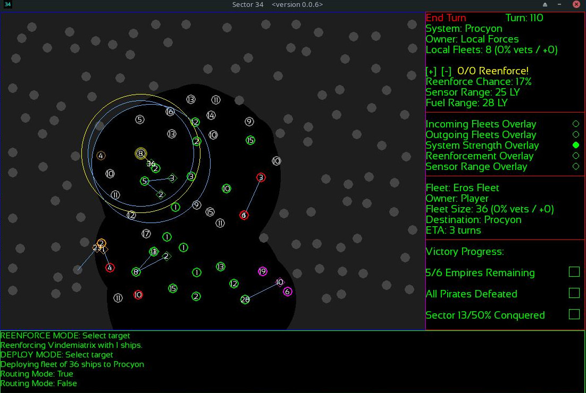
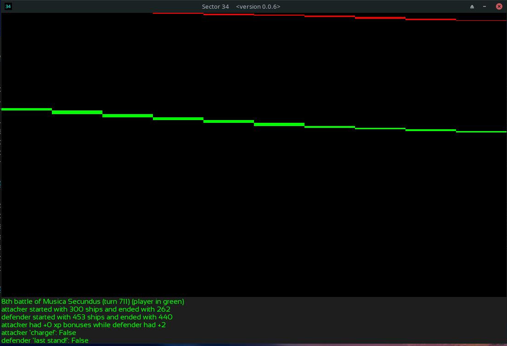
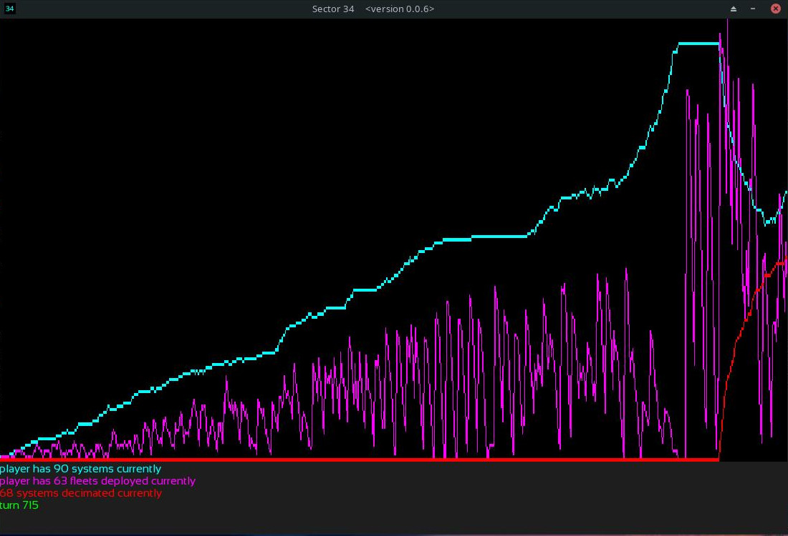
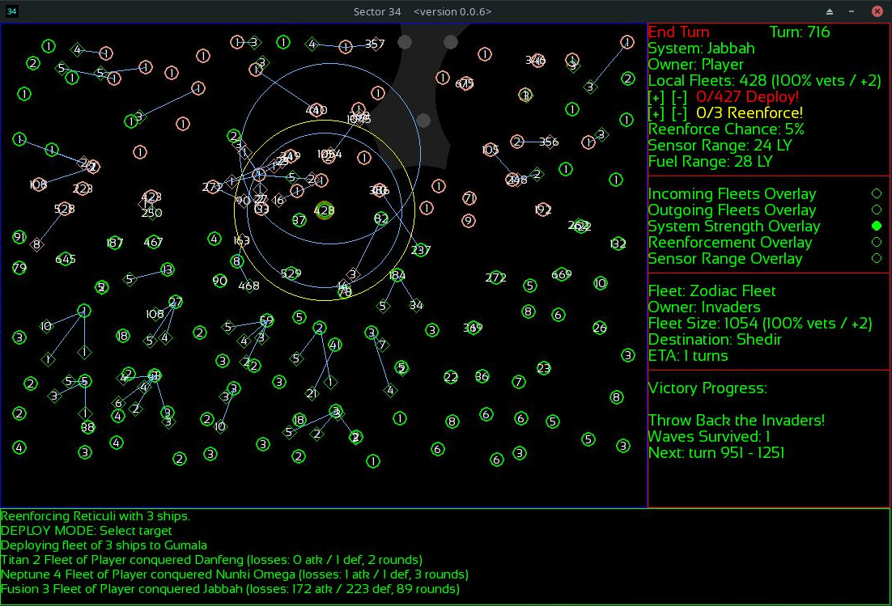
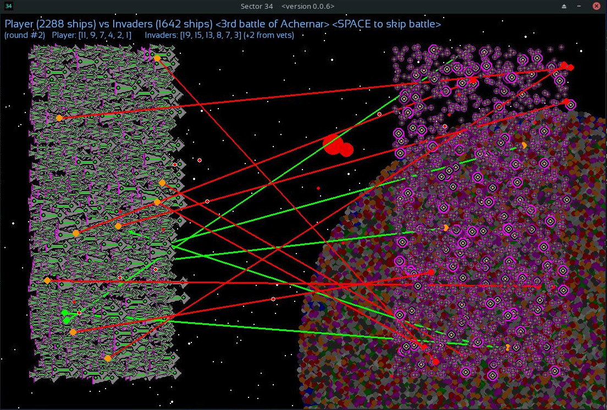
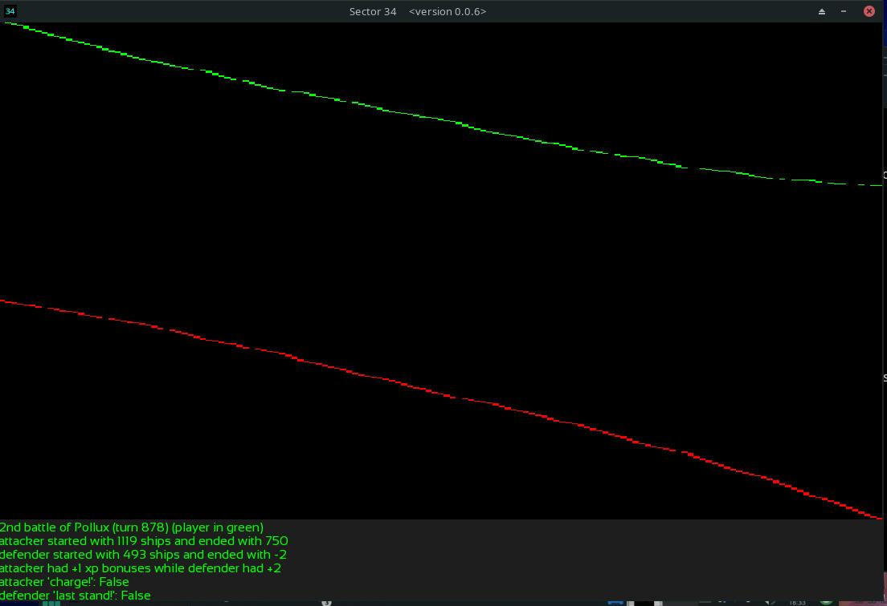
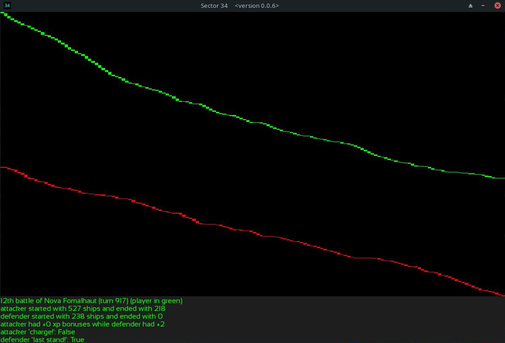
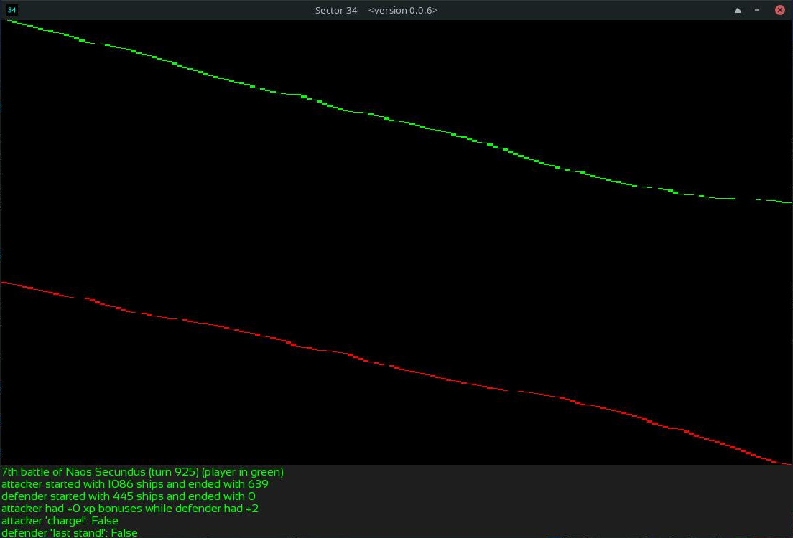

**Background**: For this run, I am increasing the scale of the invaders to a whopping 2x, but also the player now receives the "last faction buff" during the invasion (to simulate the idea of the sector banding together to handle an outside threat). I am also going to increase the time between waves by double, and make them effectively infinite. This should ensure that the player has enough time to push them back after stopping them. For the last run (which I haven't uploaded, as not all of the graphs were implemented yet -- but long story short: I got crushed because I chose the wrong time to "mark the X" during the invader stage; will upload that as a blooper run at some point). Was winnable, but my error. I have implemented several new graph features which (in my opinion) help tell the overall story in a very neat way. The Invaders now get *infinite* waves, but the time between waves is greatly spread out from before. Let the playtesting begin!

**Humble Beginnings**: It has been 100 years since the collapse of the empire. But the time has come to claim the sector for our mighty faction! We start out in the center, which means this could be a difficult game. If we wind up surrounded on all sides, we'll be in trouble. We are in an area of the map with mostly middling reenforcement chance. We have Pirates nearby, but we won't gain great systems by taking their worlds (however, we will remove a threat). 

We take a conservative start this time, because that Pirate fleet is not a small threat right now. 

We secure some nearby Pirate systems, and encounter our first neighbor: the Deneb Clique! We can see on maps of the old empire that Deneb is a bit further back from the front line presented to us right now. There is a small window of opportunity for blitzing in this stage of the game, and we'll test the waters here. We've sent some fleets to take Fafnir, and the defenders evacuate in the face of the attack.

**eXplore**: In my last run, I got jumped hard in the early game and barely survived, because I didn't scout the map enough! We survived that part of the game, but lost in the end-game due to another unforced error. We shan't repeat those mistakes here! While we mass forces for a stab at the Deneb Clique, our scouts discover another blobbing Empire to the northeast: the Itonda Confederacy!

I'm trying a slightly more complex approach to the Deneb Clique this time. Trying to destroy their fleets while conserving my own, before trying to hold too much territory. Meanwhile, they take a stab at Fafnir, without realizing Pirates are also headed there! We're going to evacuate that system, and let them fight each other, and then come back for whoever is left.

At Diadem, we trap one of their fleets before it has a chance to join the others, in a losing position.

The experience they gain there is crucial, for when they pounce on the rest of their fleet at Acrux, we now have the advantage in a big way!

**eXpand**: We are helped in our attempt at the Deneb Clique by a band of marauding Pirates, aimed at their homeworld! All of their nearby fleets have withdrawn there to defend against that attack, and now we have the opportunity to strike. Meanwhile, we encounter scouts from the west, suggesting that the Tayi Union controls that territory. We are going to be surrounded this time. Can we pull it off?

We meet our next neighbor in the region, the Sirius Empire! The Deneb system survives its pirate attack, and the surviving pirates head for one of our systems!

We finish off the Deneb Clique in swift fashion. Their surviving fleets evacuate in the direction of another neighbor just encountered to our east: the Dalim Alpha Republic!

Judging by how far some of their fleets are from their home systems, I am going to consider the Tayi Union and the Dalim Alpha Republic to be the biggest dangers to our position so far. Especially the Tayi Union, as we can't afford to lose our home system.

As we fend off attacks from the Dalim Alpha Republic, we see that the system to our west has changed hands and now belongs to the Grumium Federation. So, there are multiple factions to our north and west.

We prepare to strike out west. Before sending our fleets at the Grumium Federation, we stop at a non-FTL system along the way to sharpen our invading fleets.

The Tayi Union and Grumium Federation both control systems which are of equal distance from their home systems. In the best case, this means neither is powerful enough yet to oppose us, and have been opposing each other.

In the south, we prepare pushes to both the west and east. In the north, we advance upon the Tayi Union as the Itonda Confederacy closes in on our northeastern frontier.

With the Dalim Alpha Republic, at Tangra Omega, we have one of our bigger battles so far. We turn away an attack!

As we're landing the finishing blows on the Sirius Empire in the southwest, and holding the line against the Dalim Alpha Republic in the southeast, our scouts discern the situations in the northwest and northeast: the Grumium Federation and Tayi Union will keep each other busy for a little while, but the Itonda Confederacy to our northeast controls big, closely-connected chunks of territory which we can only hope to keep at bay for a little while.

We can see the Itonda Confederacy and the Dalim Alpha Union competing for territory in the east, suggesting neither fully has dominance there yet. Our window of opportunity is still open!

The Itonda Confederacy begins to push us back. We abandon a relatively poor system to save a fleet from an uncertain battle. Hopefully they will not strike much deeper at us just yet.

We fight off an attack from the Tayi Union, just barely, and continue to expand into the Sirius Empire. We'll finish them off soon, but we'll need to bring those fleets north ASAP to survive.

As we close in on the last system of the Sirius Empire, it is also time to begin consolidating the non-FTL systems in our territory. We're going to need those reserves! So far so good during the Machiavellian free-for-all stage. But this part of the game is really just a tutorial, and usually comes down to clever timing and the use of your initial early-game advantage. As evidenced in my last game, however, it can be a challenge! Lik most games, each phase of the game offers a slightly different challenge, and you must build on your losses and lessons-learned to win. A loss will nearly always be due to an error, rather than bad luck.

A doomed charge by the Tayi Union on our expanding northwestern frontier caps off the eXpand phase.

As the lone survivor retreats back to Tayi space, we take a moment to assess our newly-won realm. That was one of the tightes margins I've blitzed the early game by, although not as close as the last run! That said, the early game isn't over yet. Exciting run!

**eXploit**: In Sector 34, the planets are not bombarded by the factions competing to reclaim the old empire. This sector is immensely rich, and nobody wants to destroy all these precious Earth-like worlds so densely packed together (courtesy of the old empire's terraforming program). The worlds will give their allegiance to whoever has an uncontested fleet overhead.

And so fleets are what the powers of the realm put all of their resources in to for this war. As the game progresses, so does the scale of things increase. We now boast over a thousand ships! We'll need many, many more -- and we'll need to safeguard our best systems carefully.

Over 50 solar systems, each with an Earth-like world producing ships for us. There are no longer any non-aligned non-FTL systems in our area of space, and we share borders with all of the remaining powers (who are each a threat).

**eXterminate**: We have come upon the southwest border of the Tayi Union very quickly, and they are not prepared for us. Along every other border we are in a defensive posture, but it's here where we can strike while we have momentum and an advantage. We'll try to carry that momentum clear through to the top of the map! The mid-game begins. No more can we count on being able to pick apart factions before they've had a chance to build up forces.

The Tayi Union makes the first move in this war. We turn back an attack closer to the center of the map.

Just in time to launch our fleets at their southwestern flank. Meanwhile, the Dalim Alpha Republic and the Itonda Confederacy are going at it in the east!

Our main thrust lands on a big fleet that might have stood a chance if it were a bit more experienced, but we made sure to gather our best fleets for this, who had gained valuable experience sweeping up the non-FTL systems along the way, mixed with an influx of fresh reserves. It was a crushing victory. At this stage of the game, attrition matters more (and will matter more as the game goes on). While it becomes more strategic, and less random, the player must also calculate more carefully because not every battle will be one which can be won, and some will have to be carefully chosen losses which either buy the player time or change the attritional balance in their favor while setting conditions for victory in some other area at some other time. While the early game can be won almost entirely with good timing, the rest of the game increasingly must be won with good long-term strategy.

The second arm of our attack is more costly, but it succeeded in fixing that force and preventing it from reenforcing the first one, and is also a victory.

The third system we had targeted in that attack is evacuated before we arrive. Before the Tayi forces can muster a defense, we push forward more! We must get while the gettin' is good. Meanwhile, we reenforce our borders elsewhere.

As we corner the Tayi Union, the Dalim Alpha Republic tests our eastern border, and the Itonda Confederacy begins to look dangerous in the north.

The border clash at Tangra Omega is one of the largest yet, but we bring in enough reenforcements to hold the line!

Our attack cuts clear behind the remaining Tayi lines as our main strike closes in on their biggest remaining fleets. Meanwhile, reserves are hustled to the other fronts to keep the defenses strong until we finish off Tayi and can move on one of them.

Our first thrust at their big fleets is a fixing attack, meant to keep the system there from reenforcing the bigger target nearby. It succeeds in its mission, but is forced to retreat after taking severe losses. However, a follow-up fleet is close behind to mop up.

The main attack succeeds, thanks to the fixing attack next door. The Tayi Union is at our mercy now. Our advantage over the other factions is secure, for now!

Timing is everything in the first stage of the game. We beat the clock at every turn, using the slight production advantage on our starting world to maximum effect. We tried to make sure every battle was a victory before they began, relying very little on chance, and a few sacrifical fixing attacks when they had to be done. We can now finish off the Tayi Union at our leisure, and prepare for the next phase of the game: when we have conquered 55% percent of the map, the remaining factions will coalesce in to a Resistance/Coalition to oppose us all at once. In most games, there will be a lot of small factions left alive at that point, with big fleets which can be rushed right to the front, outnumbering us for a time. That isn't the case here: these three factions are all that remain, and they've been going hard at each other. Nevertheless, it won't be an easy fight. We're going to slowly inch in on the worlds we can take, while making sure our front line is strong. The first phase of the game is over, and we have entered the mid-game. Our Machiavellian chops were up to the task, but can we handle a big war in which the front line stretches across the map, and every battle carries attritional consequences for several turns hence? This is one of my favorite parts of the game right here, coming up!

The Tayi Union manages to intercept one of our fleets with reenforcements before it arrives at its target. But the 5% chance to "charge!" triggered, and amazingly our fleet pulled out a victory! That is the nail in the coffin for the Tayi fleet.

With the Tayi Union nearly removed from the map, we mass our forces for the final attack on their western fleet, and move up reenforcements to the other fronts. When the Coalition/Resistance stage begins, we'll be ready.

Although you can sometimes trap the AI in losing defenses by ensuring you send less than a 3:1 advantage in ships, it won't always work. There are a variety of things in the AI's decision-making processes which can cause it to withdraw in the face of a superior attack, even when you're trying to cheese it into a losing battle. The defenders of Danfeng evacuate the system for our large fleet to occupy. One or two more systems conquered will trigger the next phase of the game.

while we pause and take a moment to consider how best to trigger the next phase, let's take a look at the spoils of victory. Although we've suffered dips and spikes, our fleets continue to grow. The key to our success has been the timely movement of reserves and fleets in coordinated movements; rarely leaving any part of the map still for long. The AI will never rest on its laurels, and neither should we. For this brief moment, we have a serious advantage over the other factions. That won't be true for the rest of the game! The Coalition will start with nearly as many (if not more) ships than us, while the invader stage afterwards is scaled to more ships than the player no matter how many we build between now and then (and, as evidenced in the last run, that stage can be dangerous even though it is designed to always be winnable with good play; one mistake is all it takes).

How shall we approach this? Which nut to crack? Because there are no minor factions left in the game, we can predict where the fleets will be that we don't currently have front-lines with: they can only come from the north-west corner, where the Dalim Alpha Republic and Itonda Confederacy have been duking it out. When the Coalition/Resistance forms, that'll be the most dangerous area. In the south, our border with the Dalim Alpha confederacy is highly militarized, but there should be very little behind it if we can break through there. We have deep defenses in the center, where we'll probably hold on. In the north, we'll probably get pushed back a little. Let's take a few turns to position breakthrough units in the south before we trigger the next phase of the game. One thing I appreciate about my game is that a perfectly planned attack never goes perfectly according to plan. Flexibility is key. But we are going to take this rare opportunity to try and enact a good plan before the next war even begins!

The Itonda Confederacy and the Dalim Alpha Republic are still duking it out in the northwest while we position our fleets.

**The Die is Cast**: The time comes to launch the attack! In the middle of our assault in the south, we send overwhelming force towards Alphabeetrium Omega. They will win that battle, for sure. Just to the south of there, we've sent a fleet which is a fixing attack, and will prevent that system from reenforcing other systems and perhaps cause some damage before retreating. To the north of that is another fixing attack -- more likely to succeed, but still mostly just to ensure the success of the main one. Ahead of the fleet, a last-second scout makes sure we're not walking into an ambush. A small fleet of 30+ ships makes a break for our recently-left staging points, but it will be swept up by the second wave when it arrives. If all goes according to plan, this attack should trigger the Coalition/Resistance stage as soon as it takes a couple of systems, and we'll be able to punch deep into their lines before they have a chance to organize a serious resistance in the south-east. The die is cast!

The fixing attacks have succeeded in the first part of their mission: nobody in the neighborhood moved to reenforce each other, and we will have our way with the southern front. You can win this game when you're outnumbered by out-playing the AI (in fact, the invasion stage requires this), but it becomes a razor's edge where one misstep will cost you the war a few dozen turns later (as I found out in my last run). We should take advantage of this opportunity to set them up and knock them down while we have the opportunity! The mid-game wars are very different from the early-game wars. While in the early game a kind of simplified grand strategy and good timing can win you the day, the mid-game and late-game require an "operational" approach to the front line at every step. If the first stage of the game is 4x-lite, then the 2nd and 3rd stages are more like a Paradox game such as Hearts of Iron. Many of the same ideas apply, and will be needed for victory! One of my main goals with Sector 34 is to have each phase of the game feel like it is getting progressively more epic in scope. Bets "against the trend" will be less and less likely to succeed as the game increases in scope (and the consequences for getting it wrong will be larger, and more strategic in their effect). Although I am no math expert, good math is the key to winning this particular set of wars in a box! My own algebra skills have increased ten-fold just making and playing this, which is an unintended but happy side-effect. I would like to keep that a major part of the game going forward, even as I add new features. I want the player to make good decisions based on the available numbers, to win the game. Video games are products of art and engineering, math and science. That's an aspect of the game I am very pleased with, as an amateur mathematician, programmer, and sometimes-artist (if I may brag, just a bit). While this is not much compared to a lot of games out there, I'm pretty pleased with it so far, and hope it will be a genre great some day (for those who share my particular taste).

At Alphabeetrium Omega, the main thrust of our attack lands. The outnumber dice provide diminishing returns in larger and larger battles. The longer we waited to build our fleets, the more wasteful our attacks would be. It is better to attack now, and bring in reenforcements in subsequent waves (nevertheless, there are times when you have no choice but to launch such large attacks). This fleet utterly destroys the defenders there, and it is well-positioned to pick off the places we have sent our fixing attacks to should they need mopping up. So far, so good. They don't go much smoother than that! It hasn't triggered the Coalition/Resistance yet. The next systems taken probably will.

The first fixing attack lands, and does a lot of damage (and takes a lot) before retreating. It succeeds in its mission, however. The remaining defenders will be mopped up shortly.

The second fixing attack had much better odds of success. It would have been a one-sided thrashing, if not for the "last stand!" bonus triggering for the defenders (a 5% chance of that). It was still a thrashing, however. We were prepared for this, and don't even need a mop-up fleet there.

**Textbook**: *claps hands* They don't go off much smoother than that. The entire southern flank is broken, and we'll take that whole southeast corner. Meanwhile, we have the forces in the center to hold them back for a long while. As the remaining factions form The Coalition to resist us, we begin the war with the momentum and we look likely to keep it. The real challenge will be in the invader stage (which, for this run, has some new wrinkles).

Even a textbook attack is costly, however. No military force can just "attack, attack, attack". Eventually they will need to regroup, and bring in reserves. However, when you can force a breakthrough like that, you are at maximum momentum for a little while. All of your ships are +2 XP veterans and, in this case, they are advancing in to open country! We'll come upon their freshest reserves with the tip of our spear.

At Rasalhague, we mop up the remaining survivors of our fixing attack from earlier.

At Koeia, the tip of our advance destroys a garrison, just in time to position itself to intercept some +0 XP reenforcements on their way to that system in a few turns.

As the reenforcements are about to be intercepted at Koeia, a small fleet in the south is already behind the lines of our advance, for it is moving so swiftly! The attack splits up: one group to strike north and complete the encirclement of the fleets in the center, and several to sweep the southeast corner. In the north, they test our defenses at Rastaban. We don't want to let them out of that pocket! They will stay there, if we have anything to say about it.

At Naos, the tip of our advance crushes another garrison and finds itself in a very tempting situation for us. It is outnumbered by the fleets which are incoming, but they are +0 XP, while our fleet is +2 XP. It will take some attrition, but cause a lot more. We have the momentum, and shouldn't waste this opportunity.

Our advance since the initial push has not cost us much (not nearly as much as the initial push itself). I think we can lay this trap for them!

At Rastaban, they are turned back sharply!

Ah, I love it when a plan comes together. At Naos, our well-positioned fleet gives much better than it gets from all incoming reenforcements that we intercepted, and they are sent packing!

More probing attacks come towards us in the north, and a bigger one south. They are trying to break out of the pocket! Meanwhile, we break through to the east.

**Oh, How the Turn Tables**: Their attempt to break out of the pocket was dangerous, made by +2 XP ships. The algorithm for deploying ships prioritizes veterans, and this helps the AI to do such things as this even though it's not explicitly programmed to consider the veterancy bonuses any more than the player. Nevertheless, they are often the key to a successful attack or defense! Here we brought all the forces we could spare to block it, but it wasn't enough. At this scale of the game, a 1 for 1 between +2 XP attackers and +0 XP defenders is often a loss for the defenders. But *by how much* was really the main thing we needed to pay attention to here. How many attackers are left after that win makes the difference between an attack that stalls right away and can be countered, or an attack which has momentum to carry deeper in. And that is hard to predict (this could have resulted in either outcome). In this case, it is a best-case-scenario for the attackers! Brutal!

We contain this breakthrough, but it's a big enough fleet to make that a dangerous staging point. Meanwhile, another big chunk attempts to break out of the pocket, headed for Castor Secundus. +0 XP fleets this time, which we are also blocking with +0 XP fleets. We can afford to play front-lines with them over here, as we have the advantage in systems and the momentum in general. This war was won before it began, with how we planned the first wave. All we must do is be mindful, and adapt to their attacks, while continuing to take systems in the southeast, and they will surely fall. While this stage follows right on from the free-for-all stage, its outcome is often determined by *how* you finish the free-for-all-stage. To win decisively and quickly, you should carry your momentum through! The invader stage, which follows, is harder to prepare for but a good player should definitely prepare for that as well. Also, in the far left, a little group of Pirates attacks one of our border systems. A good tip is to bank a few reenforcements at this stage of the game and spend them as soon as you notice pirates incoming, to block their attacks. Since pirate attacks are scaled to the size of the fleet at the defending system, this works best when the rear-area edge systems are lightly defended!

Our defense at Castor Secundus was much more successful, because the ships had equal +0 XP bonuses. In that situation, at most scales, defenders will usually beat an equal number of attackers, except at very low scales. This one went in our favor, and we've already got reenforcements headed to the line there.

The AI adapts pretty quickly to this kind of breakthrough, even though we had maximum preparation and momentum. What reserves it had tucked in the northeast corner are already showing up to where they are most needed, down in the southeast! Meanwhile, our breakthrough there nears its maximum extent, for now. There will be some give and take over there for a bit, but we've denied that area to The Coalition for reserve-generating purposes, which will help ensure our victory!

We've avoided taking too much attrition while exploiting the breakthrough and trying to keep the pocket contained. 

Here, a tricky moment. A fleet from Jabbah hops a short trip to pounce on our fleet at Tejat. Maybe we win that defense, maybe we don't, but it could go against us. Rather than let that fleet get hit, I'm going to send it at the lightly defended system that it came from. The AI will possibly reenforce, as it is in the middle of that pocket, unless we do some fixing attacks to make sure it doesn't. Usually, I would. But in this case we are going to wait one turn to let them do so, and then launch a general attack all over the pocket on systems that are just a little weaker for having sent a few reenforcements to counter that fleet. Every attack has several opportunities for reaction and counter-reaction. When the AI takes the initiative, there is usually an opportunity to take it right back!

In this case, they didn't move at all. And a smart move on their part. Ah, it feels good to see it not fall for that trap. It is based on aggression thresholds and a rough estimation of friendly and hostile forces in the area. In this case, it calculated correctly that it would be worse off if it fell for the bait. We're going to let it land, and then strike, or else see if they make a move between now and then. This is one of the most satisfying things about making this game: the arms-race between my own play and the AI. It isn't on my level yet, but I hope to get it there soon. This game is best when a high level of play is required to win, and it is exercised by both sides. One of the reasons these AARs have been so lengthy is because I intend to have the AI play in a way that more closely utilizes the same basic strategies I do, for the same reasons (so I am documenting them for that purpose). That has been my approach so far, and I have been slowly making it more advanced. Honestly, there is a lot more to explore here in terms of play and counter-play, and I am excited to take it much further! This is really just the beginning of what I would like to do over time here. The reason it didn't fall for this trap is also the reason it is possible to "tie down" overwhelming fleets: it makes all decisions about attack (and to a large degree reenforcement and reserve activation) based on this rough estimate of local forces. You can "surround" a bigger fleet with several smaller fleets and often pin them in place. A good human player would try to defeat you in detail there if you couldn't reenforce those fleets, which would at least drive you away and allow them to continue their attack or link up with another fleet, but the AI won't quite do that yet. You are really only going to be attacked when it can get a numerical advantage somewhere. But it is very good at taking advantage of small ones, and exploiting them. It is possible to make it more aggressive by lowering certain thresholds, but this makes it a worse player in other ways. My plan is to include another more deliberate layer there at some point which checks for "situational" things like that (and organized pocket break-outs, for example). I mean, there's no reason one couldn't get all chess-engine-y with it. And that would be pretty sweet, actually. If anyone would like to do that, please be my guest! I will myself eventually.

At the last moments, the defenders evacuate the system we targeted. Even in the midst of not falling for the general trap, there is a layer built in to *try* and save fleets which are obviously hopelessly outmatched. But it's not perfect there, and only makes the roughest estimate which a good human player can always get the edge on if they try, over the long run. I have considered making it do a very accurate calculation in all cases, but I'm not sure if that would make the game better or not. Right now there are some factors it doesn't take in to account, regarding scaling and the XP bonus, which the player can always take advantage of better than it can. I could give it near-perfect predictive power in terms of "the next attack" (or as close as can be done here anyway), but that would also demand it of the player. Right now it behaves kind of like a person with some common sense and a mostly-conservative attitude, but whom can be outplayed if you are clever. I'm going to continue to improve it in all areas, and experiment with different approaches there. My ultimate goal, as far as the game's AI goes, is to have the factors for the personality types be high-resolution enough (for lack of a better phrase) to be useful as genomes in a genetic algorithms rule. I have not succeeded in that just yet, for this version, as there are only a few mixtures of the personality variables I've currently implemented (which control things like reenforcement "packet size" and frequency, "centers of gravity", aggression, the amount of friendly and hostile local forces to consider, etc.) which actually result in a good game (or even a viable competitor in a 1v1 AI vs. AI showdown), and that is with the AI playing kind of how I was playing when I first started making the game. I think that can be built on, however, with some situational layers and *maybe* a more precise calculation regarding attacks and defenses. Right now nearly all of the neat things it does are emergent. The Coalition/Resistance forming is scripted, but none of their fleet movements are. The arrival of the invaders' waves is scripted, but none of their fleet movements are (even the "center of gravity" is a procedural characteristic of that particular AI, and is not scripted to be in any one place always). Although I didn't explicitly design it with a gradient in mind, the AI fleets will definitely flow along some gradients as a result of their threshold preferences for defense and attack, combined with the direct-waypointing of reserves to front line systems where the "gradient-like" behavior takes over. Because of this, I think that using some kind of explicit gradient map for the AI might be a good idea. And I am toying with that for a future update. I am not an expert programmer. I write a lot of programs and have a lot of experience making these kinds of games, but I've never done it professionally or even with a group very much. Nevertheless, I am very proud of this so far. If I can improve the AI to play at my level some more, and get it planning attack-counter-attack more deeply, then it might pull off some very tricky moves indeed! Anyway, sorry for rambling there. This has come a long ways, and I am very proud of it! It actually beat me in the last game. Well done! But that was my unforced error, more than anything else. I would like to bring up its level of play further, but it is doing pretty well these days. *proud patting of self on the back* makes me proud!

But now we hit it with the attack that was beyond its ability to discern, or at least to effectively do anything about. The pocket had been held fast by all of our fleets, but there is no layer yet to look at the whole front in sections and say "where is a spot that could be picked apart in a coordinated way? should I pull them back a bit and consolidate somewhere? should I try for a breakout?" Maybe I could bake that into the emergent layers more effectively, and I will try, but I suspect that this kind of thing (on both attack and defense) will require some additional layers which mimic my own thought processes when I attack and defend (as I've illustrated in my AARs so far). Right now it uses just the first couple of "common sense" ideas mixed with those "gradient-like" threshold decisions. But I see no reason not to try and give it a few more layers. The reenforcement, attack, and evacuation routines all go through several layers in which thresholds filter out bad decisions (most of the time) before they have a chance to be acted upon. This results in an AI opponent that has a very conservative idea of how to approach the front line, although it will take some pot shots at you and exploit open space. All of that said, it doesn't do a bad job of throwing you a curveball once in awhile, or taking advantage of any weaknesses you show it. Early days, but promising stuff with the game AI. I'd like to take it much further! All it really does to react to our attack here is to try and bring in some reenforcements to one of the systems we're hitting -- that's all it can really do here, short of a planned breakout en masse in a coordinated way (which is a situational layer I will add soon). In the southeast, they start trying to push our advance back. That's fine -- we've succeeded in tying down some reserves over there and in denying that whole area to them in terms of reserve-generation. When the hammer blow lands in the center, we'll be able to walk right through the front door!

Here we see the emergent propagation of the AI's decision-making process. As one of our fleets approaches Jabbah, and is suddenly in range of several other nearby systems, they too decide to launch in reenforcements. This will help them defend Jabbah, but it would have been better off planning for this contingency a few dozen turns ago. It is hardly enough to stop us crushing their center. For the AI it is tempting to divide the front into segments which are each weighed against the opposing front, and each other, but how exactly to do that? At what "resolution"? When I made the "centers of gravity" I chose to have them just be a system and its surrounding neighbors within range. This sort of divides fronts into segments (but for now, only for the purposes of bringing up reserves, and only for the Haymaker AI type so far). I may build on that when I try to build some layers which consider force cocentration on a larger scope. It is surprising how powerful Haymaker can be when it has the numerical advantage given to it in the Invader stage. These mostly-emergent behaviors (which are just following a gradient based on thresholds for the most part) can fully take advantage of the weight of numbers, from encirclements to exploiting breakthroughs, and wherever possible I've designed the game to allow those things to work with each other for the AI's benefit, without it cheating (it has no information the player doesn't have). In fact, those things also work to the player's benefit, and the player's homeworld advantage in the beginning stage (not to mention the universal reenforcement pool, which the AI does not have) should always be enough to win the game if I'm doing my part as a designer and playtester correctly! 

Because of the reenforcement and attack layers, which conservatively shuffle fleets around, combined with the prioritization of high-XP ships for deployment, you can't ever *really* be certain if you've made a good bet. Especially during critical moments and attacks or defenses where a lot of moving parts are involved. This is in large part because the scale increases and there is a larger than 1 turn distance between each system. You have to bet on getting most bets right over the long term, because you can't get *every* short term one right. And *unforced* errors in this regard can certainly cost you the game (as it did in my last run, actually). I didn't really set out to make this dynamic, and I wasn't sure what would evolve from mashing Risk and Master of Orion together, but I am *extremely* pleased with this so far. Because nobody's judgment or vision is perfect, nor is every plan, I have included graphs in this version. I feel graphs are one of the best parts of any strategy game, honestly! Any 4x-like should have some.

We have four major engagements in the attack on the center! One is turned back, while the rest are successful. The AI did its best there, but we got the one-up on it! The center is crushed! By carrying the momentum through from the first phase of the game, then breaking into the southeast (distracting their reserves and denying them new ones), and then crushing their center in a coordinated attack (in that order), we have won this stage of the game. But it was always won, because we carried our starting advantage over from the first turn, never squandering it! I love it when a plan comes together. You don't need that many game systems working together to create a surprisingly satisfying strategic mixture like that. I am eager to see other people play this as well, and see how their style of play might differ from my own (and the built-in expectations of the AI, who plays kind of like me, and is made with countering me in mind). Even as I improve the AI further, it will be my bias it is built against. It'd be awesome to see some other people taking a whack at it, to see what novel strategies they try which I might not have considered! I might be biased, but I think I've made a pretty good game here. Just the start, though! Again, sorry for rambling so much. I'm very proud at the moment. The last few days of playtesting have exceeded my wildest expectations. Just the start, but this game is shaping up extremely well. 

Attacks like this are costly in Sector 34. You have to pick and choose them. If it's not right fight, right place, right time, then you might be in for a surprise a few dozen turns later! In this case, we chose wisely.

We renew the attack in the center! We are going to break that whole pocket, and give The Coalition the 'ol switcheroo. Where we were attacking in the south, we will retreat a little, and create a new line. As we're drawing those forces in, we'll punch through the north, and then swing around on them from behind. At the very least, we'll drive a wedge between the northern and southern halves of the opponent!

At Mirach, their minor breakthrough peters out. They beat some defenders with a high XP fleet, but their attack stalls. The counterattack is immediate, and the staging-point ill-advised. 

Sensing this, they flee the scene before we can hit them! Had I taken more care there to send less than 3:1 against them, they may not have fled (but that's no certainty, and can't be used as an exploit reliably).

We carefully intercept their advance in the south. Advancing is a tricky thing. If you aren't very deliberate about it then you can get caught in ambushes, as we have done here to an unfortunate fleet whose 5% chance to "charge!" into the teeth of our defense triggered. One reason to improve the AI's coordination on attack is to make it more wary of such ambushes. For now, they are one of our best weapons while on the defensive.

In the north, our advance gathers steam and starts steamrolling the immediate reserves. This advantage will last for a little while only, but we take advantage of our, uhm, advantage! 

But at one system, Shedir, they pool enough veterans to turn back an assault!

But our reenforcement waves are right behind them! I think it would be possible to have the AI plan "rolling waves" more deliberately like this, to great effect. I'm very impressed with it already, but there much more that can be done here. The game AI exceeds my expectations, even in this early stage.

At the tip of our advance in the north, a small group of veterans breaks through the defenses!

The last big group of defenders in the center turns back the first wave to hit them, but is left much reduced.

They flee the scene as the pocket closes in. But we are one step ahead! We have been preparing an assault on the system they are fleeing to, and launch it now! By the time they arrive it will be an ambush, and our front line will be far ahead.

At Alrakis, we crush the last remaining resistance in the center. We'll leave a detachment for that fleet from earlier, which hasn't arrived yet!

**I Love It When a Plan Comes Together**: All credit to the AI here: we only beat it because we played very well, and took advantage of its weaknesses. A well-executed game is required to win these first two stages, and I am very pleased with that. In the next stage, we'll be putting it to the numbers test. In this build, the player gets a big production boost for the invasion stage but the invaders are scaled to 2x! This directly pits the player's ability to trade space for time and pick smart fights against the emergent attacking power of the AI when it has a numbers advantage and is using "centers of gravity". Quite frankly, I don't know if that will be winnable. But let's find out!

For now, the center is crushed, the north is giving way, and we've held our ground in the south. The Coalition/Resistance will fall shortly. The state of things, on turn 572:

Our experienced attackers in the north start blasting through reserve defenders!

In the center, at Alrakis, the reenforcements we waited to intercept trigger their 5% chance to "charge!". A worst case scenario for them, and we are rewarded for breakthing through the entire line at once quickly, as their fleeing reenforcements have nowhere to retreat to.

The advance pushes forward in the north! There are only two strong centers of resistance left. In the south we hold them in place, but don't attack *just yet*. In the north, we prepare to break through completely!

Tempted by our relatively spread out defenses in the south, The Resistance/Coalition continues to send probing attacks, but we can easily fend them off with coordinated defense. In a more advanced state (a bit down the road), this is where the AI would consider at least collapsing its defenses and trying to do something asymmetric before all is lost. When a diplomacy mechanic is implemented, perhaps a "surrender" mechanic as well, but first I would like the AI to have a little "oh, this is a Kobayashi Maru moment!" kind of option, or several.

We crush the big center of resistance in the north with a large fleet of elite ships!

The fleet we intercepted in the south retreats quickly to a nearby system. This changes the balance of the front in the south a little, and we take this chance to launch a small attack. Meanwhile, in the north, the advance picks up speed. They've gathered another large fleet in a center of resistance, and we target it with our best fleet!

By way of our little counter-attack in the south, we get some more territory there as the next blow lands in the north!

The blow lands in the north! We catch some of their reserves still trying to reach the front and organize themselves. We position some of our fleets to intercept them, as the rest push on!

Some big fleets we intercepted in our advance are fleeing, and we can immediately give chase. When two fleets will arrive at the same system at the same time, priority goes to the one which was launched first. We'll get there right after them, and be on the attack while they are on the defense. Meanwhile, now is the time to advance all along the line at once!

In two crushing attacks, one in the north and one in the center-south, we take out fixed centers of resistance with veteran ships.

At Nova Mirpac, another group of disorganized reenforcements is caught in our advances, and chooses to "charge!"

As our rolling attack continues all along the front, we pick a wise fight for one of our veteran fleets to fix a large group of defenders (and probably destroy them) so that the rest of the fleets can advance around the center of resistance in the meantime!

Although the fleets which escaped our traps are now veterans, we have the weight of numbers now in an overwhelming way.

In the very north, we crush one of the last centers of resistance!

The fixing attack lands in the south, but this is no sacrificial fixing attack; this is the kind which is meant to win ground! That it fixed the defenders there was a happy byproduct, which enabled us to move the whole section of the line at once.

We close in on the remaining systems on the east edge of the map! The Coalition/Resistance is done for! It was a costly war, but we are rapidly rebuilding fresh reserves and leaving them all over the map in preparation for the next stage. The graph is neat, because you can track every major offensive by the dip in numbers. On a much-scaled-up map in which reenforcements had to be organized from much further afield, the costly nature of even a *highly* successful attack would be even more of a strategic consideration. Also, if they took longer to gather in the first place (a thing I will explore in some of the additional stages I have planned). I would very much like to implement zoomable/scrollable maps in the near future, to play with different scales further. Timing is everything in this game, from the long-term plan to the coordinated nature of local attacks and defenses. That is something I am very pleased with, and want to build on further. Our breaking down of The Coalition/Resistance here was downright textbook, and we enabled it from the beginning of the game with our momentum, starting from just that slight production bonus on the homeworld to begin the most random stage of the game (the free-for-all stage). The player has some definite advantages in this game, although by the end of the free-for-all stage it is a mostly fair fight in which the player must out-play the AI rather than rely on those advantages which are essential for surviving the first few dozen turns. 

We conquer Sector 34! 

Note that when you drag-select all systems it shows the *deployable* number of ships, and every system must keep at least 1 there. That causes a 140-ship discrepancy between those two systems of measurement, when you control the whole map. 

**A Note on Mechanics and Design**: Again the invasion comes from the top side of the map (three AARs in a row now! But it is random each run, I assure you). This time we are *really* putting them to the test. This one isn't a fair fight, but a test to see just how much I can take advantage of the AI while being outnumbered and having a more flexible reenforcement mechanism. They are scaled at 2x for each wave, and there are effectively infinite waves (I believe that by the time they reached the limit of 999 the player would probably be beaten at a scale of 2x). However, the time between waves has been increased, and the player gets a significant production bonus to all systems (they are all at 50% this time). 

I have fine-tuned the previous two stages to be "hard-ish but winnable with good timing and strategy". We are still trying to find the right limit for this stage, so each playthrough I am trying different things. In 0.0.4 it was about right for the mechanics and AI that existed at the time. In 0.0.5 they were scaled a little low, because I wanted to err on the side of caution for the release (the AI is much better now). This one may not be winnable, or it may prove scaled too low in light of the reenforcement chance boost. I am going to "find out", and we will do further adjustments based on this. I am also taking the last run into consideration: they were scaled barely higher than in 0.0.5, but I lost because of an unforced error (I should have sharpened my fleets before launching the big attack at the start of the 2nd wave). That was quite winnable, however, and I think they can be scaled up to 2x, if the player gets a corresponding reenforcement chance boost. And that makes sense, because if the Coalition/Resistance is willing to scale up their reenforcements to match you in ships and/or systems at the start of that phase, then why wouldn't the whole Sector do it when they are being invaded by destroyers? It just makes sense, thematically, and we are still in the process of tuning this stage. I have some good ideas for the stage after it, as well! But I want to perfect this one first. 

The first two stages I am quite happy with, in terms of how they work, at this point! For this third stage, an asymmetric setup gives the Haymaker AI type the biggest advantage it can get, considering all the ways the player can take advantage of its weaknesses. That's sort of the theme for this stage. For the next stage after this upcoming Invaders one, I want the shoe to be on the other foot, and it will be the player trying to break through a sector where they are receiving limited reenforcements and have to use them wisely. Kind of like a platformer, I want each stage in my game to be about either mastering a specific mechanical nuance, or putting them all together. The FFA and Coalition/Resistance stages are also like that, and the lessons learned there have to be used here (and in the planned future stages). Lots of depth from relatively few moving parts, is my humble goal. Early days! Making the systems an AI while also playtesing them has been a uniquely rewarding experience here. I would like to take the game much further. 

We start by pulling our fleets away from the top edge of the map, for now. But not too far. Those invader fleets that come in right away are spread evenly along all systems within fuel range of the invaded edge of the map. We want to disrupt their ability to link up with each other, or they will all head for a center of gravity. The more we can keep them spread out, the more opportunities we have to outplay them in little engagements. While they outnumber us, we don't want them forming large conglomerated "doom fleets". We must trade space for time, but we can't trade too much space for time, because every invaded system is set to 5% reenforcement chance (and all saved systems are now much more valuable, as the whole Sector has ratcheted up to 50% reenforcement chance to save itself). The general idea is to give a little ground, spread them out, defeat them in small engagements until the line is solid, then bring up reenforcements to crush their attack and push it back -- all before the next wave. And each wave will be scaled to bring their current numbers up to 2x your current numbers. In short: this stage is all about timing. We can't react too passively or too aggressively, or we'll lose. We must correctly judge the time to bend, and the time to push back. And when you get it right and that counter-attack works at the right scaling, that "Oh, how the turn tables!" is quite magical (in my humble opinion). Let's see if the plan works! The sense of "epic" from the invader stage is something I am particularly fond of, as the game's whole scope suddenly increases. I want to try and do something like that with every stage. The invasion stage can be very long, and as I have broken down my general strategies in other AARs and this one already, I will spread out the screenshots more than I did in the last stage; just telling you what I'm doing in the more general sense. It takes much longer to write these fully-AAR'd playthroughs than it does to play through the actual game. But I really want to share what I'm up to for these next few updates, in terms of both programming and design, so I felt it was important to do so. Let's do it! 

**Be Reasonable?**: Who are these invaders? What do they want? Well, they're not saying. All we know is that if we don't destroy their attack, they'll decimate every system in Sector 34 (which we just fought a cleverly-executed war to win in one piece)! They are coming in with, uh, a *lot* of ships this time. I'm not sure giving the player a 50% production boost is enough to offset how powerful those fleets will be even if they merge a little bit. I'm going to frank here: we could lose this! But we're definitely going to give it a try!

Well, 30 turns prior to the invasion our systems began churning out ships at a huge rate. As our first border systems begin to be lost, we have over 5000 ships in our fleet. Meaning the invaders have, uhm, over 10,000. To make matters more dire, they are +2 XP veterans from the moment they take an abandoned system. The shoe is exactly on the other foot from what we did to the other factions in the earlier stages, during the latter parts of our successful advances. Our *only* advantage is that they don't reenforce until the next wave, while every system we save from being taken has a 50% chance to churn out a new ship every turn. We will need to time this *perfectly* to win! Like a platformer jump, in *sloooooow mooooootiioooon!* But, have I placed the ledge too far? Perhaps. Let's find out. 'tis what playtesting is for! Every turn will count.

(*AI Note*: The AI tends to keep "doom fleets" together, once formed, sending out the smallest detachments needed to take care of nearby threats or take nearby systems, *usually*. This will become important.)

At one system we managed to catch a small group of invaders before they landed (sharpening one of our fleets before it had to withdraw, at the very least)!

A consequence of this "bouncing" of the attackers there, besides sharpening our defending fleet, is that they head off to join another nearby fleet (and the AI will usually wait for reenforcements to arrive at a system before using the fleets there, helping to ensure the creation of large fleets). We already see very large fleets forming. But one advantage we have is that the AI merges fleets in a very procedural and emergent way, and we can be more deliberate about it. If we are forced to adopt a fully asymmetric strategy then this will prove crucial (and if I have set the conditions for this stage such that only the asymmetric strategy will work, then I will be quite pleased). Our newly-sharpened fleet which did the bouncing heads off to intercept a smaller fleet against which it will have a big numbers advantage. We have been pooling our universal reenforcements in the bank, and will use them at an opportune moment (rarely are they of such magnitude, after all). I highly advise doing this for the 30 turns prior to the invasion. It won't win the war, but it'll maybe win you a battle!

We are trading space for time at an alarming rate that can't continue. We can only do this until they are spread out enough to be halted somewhere, and pushed back. In the meantime, our fleet numbers grow while the number of systems we can count on to replenish them diminishes. How we use these fleets in the first big engagements will be crucial.

At Fang, we pounce on a staging area while we have the chance, sending just enough so that they won't flee, but enough to finish the job. But we will have to retreat immediately in the face of a larger threat! The stringing together of many small victories is how we win the game!

At this scale, which is all-together larger than all previous attempts at this stage, it will inherently be more asymmetric as the invader fleets conglomerate. There are simply fights we must avoid, and in so doing it will naturally cause our own forces to concentrate in an imbalanced way. Choosing the right time and place to take advantage of this growing asymmetry will be the key.

At Alphekka, the same fleet pounces on another staging point. Such targets are most vulnerable while awaiting reenforcements, as they are much less likely to evacuate prior to the 3:1 ratio of attacker:defender.

All the same, we must again withdraw before those reenforcements arrive. But by stringing together these little delaying actions, perhaps we can build a front line! It is impossible to say during the first wave just yet where Haymaker's "center of gravity" is. Most of the fleets will get tangled up in the front-line layers of decision making in any case, during the first wave. It is subsequent waves where that will be the most dangerous, when reserves have time to link up along a secure route to a part of the front line.

In the east, a counter-attack goes much more poorly. The defenders get "last stand!" (5% chance to trigger on an outnumbered defender at the start of the battle), which raises their total advantage to +3 on every roll (plus defenders winning ties) against the slowly mounting outnumber die we have (whose value diminish as the fleet width increases, from 3 at lower scales up to 6 during the largest battles). Nevertheless, we must make these attacks, because we can't let their fleets conglomerate, and we can only trade so much space for time! It will be a delicate balance to strike...! Can we do it?

So far we've been very conservative in our counter-attacks. We've traded a lot of space for time to make these opportunities possible, and that was the first battle in which we took a lot of casualties. But we must firm up the line soon. Is now the time? This is the key part of this stage: deciding where to bend, but not break. It is extremely satisfying when you get it right, and very easy to get wrong! But it's always there to be found.

I am gambling that now is the time to start firming up the line. We'll have to give a little more in some places, no doubt, but in general I think now is the time to try and slow their advance in earnest. The window for reenforcement waves is now much bigger in this build. We have the time to stop them, and maybe push them back. All the way back? Hard to say. The next wave will bring their current numbers up to 2x our current numbers, so the more damage we do between now and then the bigger it will be. Our main concern should be the "shape" of the line, and not necessarily destroying their fleets. Not yet! Novel strategies may be required, such as trying to surround their big fleets and creating planned interdictions of several reenforcement waves before it is time to finish them off. We'll approach all of that flexibly, when the time is right. For now, I am going to put up a stiffer resistance and start sending small fleets behind their lines to cause distractions and scout potential "centers of gravity". So far I am really liking the 2x scale. I might have hit the nail on the head this time!

Their attacks have slowed for now, while the trailing fleets catch up to the front line. We are making this harder for them with our behind-the-lines shenanigans, which also helps scout the movement of fleets in the rear areas (which will oftentimes head for a "center of gravity" at this stage of the fight!). I am sending some "probing attacks" with fleets just small enough to be assured of a 95% chance to retreat before taking too many casualties ("charge!" could trigger, which is a huge risk in this). This will slow the advancing invaders, and also "sharpen" the ships we use for them. We can then combine those ships into a fleet which can pick off the invaders at these staging points before they are reenforced, if all goes according to plan (because to do so now would be very costly).

This works. It only works to a certain degree, however, because the deployment algorithm prioritizes veteran ships if you send less than all of the ones at a system. So there are diminishing returns to this. But we can certainly now concentrate these parts of the fleet in to something we can use for a less costly attack!

We pounce on another small garrison.

And take one more potshot at a big staging point before withdrawing more in the center, while launching more "sharpening" attacks on the left! Behind the enemy lines, our little scout fleets are causing a huge mess. This will help us in the time between now and the next wave, big time! Having intelligence back there will be extremely helpful. We can see in the center there that one fleet of 1k ships is headed south (necessitating what is about to be a costly attack in the center, on a fleet we *can't* let it merge with), while another is heading north to retake territory taken by our scouts. This kind of interdiction will save our bacon! We must use all the tools in the toolbox against the invader threat!

We have begun taking back systems a little in these opportunistic skirmishes, but it will be a back and forth for awhile. We haven't yet committed to any *big* battles yet. We've been using a kind of Fabian Strategy. We learned in the last game that to begin to push back with fresh ships against +2 XP veterans is too costly at scale, so we've been sharpening our fleets. But sometimes you are left with no choice but to do just that, to slow an advance or prevent fleets from reenforcing each other. We'll see how this attack goes!

This attack in the center is costly, but successful. It would have been much less so if we had had to amass a similar proportion of fresh ships to face the 1000+ fleet incoming to the north, combined with the one we just destroyed! We can now mix these freshly +2 XP ships with another fleet along the line that has already been "sharpened", and enable more effective counter-attacks. It isn't just winning the little battles; good decisions have to string together in a strategic way to win!

Another big fleet is sharpened on the left in a brief skirmish, in which they thankfully did not "charge!". A risky strategy. 

We cut off another staging point in the center -- and just in time! I think we can discern a potential "center of gravity" in the center-left part of the line here. As our fleets in the rear and on the right continue to disrupt the invaders, we give a little ground in the center and try to make sure we're strong where they are about to be very strong. We now have a lot of veteran fleets along the line, but this was another battle that had to be won with fresh ships!

In the east, we're now pouncing on them with fully sharpened fleets. Bigger fleets are headed that way, but we're still hitting them where we are stronger than they are, and the momentum in some areas is temporarily in our favor!

In the center, at Nembus, we put up a "heavy defense", which is not intended to cause a swift retreat but to sucker the attacker into a longer battle than they can likely win, causing them more attrition than there will be to the (in this case +2 XP) defenders. This is the opposite of the "parthian shot" in which an attacker does more damage to the defenders in a similar situation of retreating well in to the battle.

At Grumium Beta, in one small skirmish in the "no man's land" between firmer parts of the line, a group of outnumbered veteran defenders gets the 5% chance to "last stand!" against our sharpened attacking fleet.

We catch another staging point at Hamal Alpha!

This strategy of using sharpening attacks to slow the outposts before jumping on them with more experienced fleets is working very well, but it only works at the weaker parts of the invader advance. We slow their momentum, while taking relatively few losses. We find that we are pushing "back" before the main waves have fully hit. A lot of the systems we are reclaiming were retaken without serious opposition, yet. We've managed to keep something like half of the invader fleet distracted in one part of the line or another, preventing them from all massing in our center left just yet. We prepare to meet them in the center here, while still giving-and-taking on the right, and holding them in place on the left -- behind the lines our scouts cause chaos! 

At Castor, they managed to bring in reenforcements enough before our snipe at their staging point landed that it caused a dangerous retreat after severe casualties (on both sides). The AI will reenforce systems and it's not always possible to predict which ones, or by how much. You have to either do coordinated fixing attacks, or be prepared to have your plans dashed from time to time! For the most part, we've picked good fights thus far. In this case, they reenforced in time to thwart this little snipe.

Many smaller engagements are happening all over the line, with important consequences on the timing of both sides' movements. At the smaller scale, they are less predictable -- but at the larger scale, there is more attrition even when you are taking advantage of all the mechanics. Victory thus becomes not only about outnumbering and out-XPing the opponent, but also picking the right scale for your attacks when possible. At very large scales the increasing fleet width diminishes the value of the outnumber die, while at very low scales everything is much less predictable -- but attacks of all kinds must occasionally be launched for strategic reasons. So good strategy has to be flexible, to account for these things.

Having distracted them as much as possible all over the map, the time has almost come to meet their largest fleets, headed certainly now for a "center of gravity" on the left-center! Our fleets are somewhat experienced, but massing them large enough to handle any of these fleets directly will be very costly. If we can get even a +1 XP bonus (50% vets) fleet that is 2.5x larger than one of those big fleets then we might be able to beat them in detail before having to give up any more territory. That's not likely, but it's our best shot.

At Hamal Alpha, at the tip of the invader thrust, a small fleet puts up a "heavy defense" which could have gone either way during several turns of the battle! That was as many as we could rush there in time, and the outcome of the entire defense could wind up hinging on that result, because we now have that system as a staging point, or place to use as an ambush. Although good strategy is important to win, being flexible enough to take advantage of these incidents and incorporate them in to your plans is also vital!

**The Shift**: Normally, when performing a "line shift", you want to move small parts of it at once -- not entire garrisons! But this is a rare exception; we must give ground in the center-life while massing a big fleet in the center. I move all of those fleets around the big invader fleet over a little, and I will do smaller shifts afterwards to mass a big enough force to take a crack at that fleet. Meanwhile, we continue to distract much of the invader forces on the right, left, and behind their lines!

The actual fighting has been getting heavier as the lines "firm up", but we're still being very conservative in our attacks. The time for a really big one has not been yet. We've been going out of our way to pick smaller battles and avoid their biggest fleets, for the most part.

We can see an example of this "back and forth" on the ctrl + shift + S stats graph! This back-and-forth while we trade space for time, then bounce back, then back off, then bounce back, is a temporary thing we can only do for so long until the lines "firm up", unless we find a place to punch through! I am glad I added these graphs in this version, because they help tell the larger story. In particular the "deployed fleets on any given turn" line (the magenta one) relates very interestingly to the number of systems controlled, and the ones lost to the invaders' decimation; it gives a fascinating indication of how the game increases in scale in more ways than just the number of ships. At each scale of the game, the player must coordinate more and more organized attacks and defenses to win, and I am pretty proud of this! The invasion stage seems pretty close to how I intended at 2x scale, so far. Let's see how the rest of the stage goes, now that we've slowed their advance! At certain stages of the game, it is very important to be moving most of your fleets at once!

At Alrakis, in the center, our reserve fleets pounce on a staging point before they head west to assist in the main defense!

At Nova Fomaluhaut, also in the center, we continue undermining the tail-end of the attack on our center-left, preventing the main thrust from gaining momentum!

In the center-left, we continue trying to stay ahead of the tip of the advance, while we've tied down the biggest part in preparation for an epic showdown when our fleets assemble nearby! We have almost 200 turns before the earliest point at which the next wave could hit, *and* we have enough systems remaining to draw on fresh reserves for just a little while if we need to. This just might be winnable!

In fact, we have more ships than we did before the invasion began, because we've been trading space for time and picking smart battles. But, we can only do that for so much longer, as the main thrust is beginning to pierce our lines in the center-left. We have to stop them there, no matter the cost!

Our home system of Tangra is now behind the invaders' lines, but we've managed to put a huge wedge between the tip of their advance and the reserves they are using to play behind-the-lines with us! Their fleets in the north are growing, and retaken worlds are only 5% reenforcement chance (as opposed to the 50% untaken ones enjoy during this stage). Before long they will outnumber us in the rear areas, because they can detach from their main bodies to chase down our fleets faster than we can grow our numbers up there. There is a window of opportunity in which we can try to take out the fleets punching a hole in our center-left. We're still ducking under the invaders' haymaker, but we'll swing our counter-punch shortly!

The swings between give-and-take get smaller and smaller, as the window in which to trade space for time and launch small counter-attacks closes. The last time our little realm was this small, we had only just begun our war against the Coalition/Resistance! The amount of deployed fleets/turn indicates that a far more active strategy is required to survive the invasion than to beat the Coalition with a properly-stablished momentum, which is excellent. Where we were able to pick and choose sections of the front to be active with during the first two stages, this stage requires activity on *all fronts*, to survive. While the numbers scale up, we are in a sense "zooming in" on the kind of strategy game being played. I have tried to make each stage have a different feel in that regard, and this one tends to be the most intense! Every turn is crucial.

At Wazn, at the tip of their advance, we beat them at their last staging point behind our lines, for now! The big fleet we have amassed for the big attack on their 1000+ ship fleet has only a +0 XP bonus, despite our best efforts. We've benefited from "sharpening" elsewhere, but there is no more opportunity to do it here before the big attack. We can bring in reserves right up until the moment of attack, but it's going to be costly no matter what we do, and if we don't do it soon then some of their reserves will reach it, and enable more strikes forward. At the very least, we have to slow it down. The time to attack is soon... A scout shoots past the place we intend to strike, to make sure there are no reenforcements incoming before we attack.

The time to strike is now. Even if this attack fails completely, it will weaken the big fleet at Achernar enough to contain the reenforcements which are incoming (hundreds more ships!). We have to create this window of opportunity to bring up more reserves and decisively win smaller battles along the front, by this big (and inevitably costly) attack, for the sake of the strategic momentum. This is tough, because you know from the math that your fleet is going to be decimated regardless. But if we don't counter the momentum along that entire "punch" to our center left now, it'll strike too deeply for us to marshal the reserves we need for the next several hundred turns. Importantly, we have already massed the reserves who will deliver the follow-up punch, or contain the next attack from there -- whichever is needed!

We were unable to muster the forces for a fixing attack in this case. The invaders will be reenforced. But this at least draws more of the local forces in to this battle, which will help our momentum in the follow-up movements.

We knew this battle would be costly. We knew it would go against us, and we knew it would be a bad investment in terms of immediate attrition. In fact, it was a downright slaughter. But it kept that fleet from advancing further, and several more such battles may be needed (where we *know* the attrition will be against us at scales larger than an outnumber bonus can effectively counter the XP bonus at for long). Picking the right time to launch these attacks is the hard part. We've countered some of their momentum, at great cost.

The battles are computed beforehand. Retreat is the last thing that happens in the simulation, but for aesthetic reasons the retreat animation begins halfway through the battle replays. By the time that happens, we've already taken immense losses.

**X Marks the Spot**: We knew going in that it would go like this. But it was for the sake of strategic momentum. Did we judge it right? Did we counter the momentum of their advance enough? Can we break their center-left push in to smaller fights that we can win? Hopefully. The 3rd Battle of Achernar was conducted at great cost indeed. Too many more of these and we will have lost. You can only afford a few, and they have to happen in a situation where you can change the strategic momentum for the price of such a move. But sometimes, it is the *only* move you have available. Brutal!

That single attack wiped out more ships than all we have gained since the start of the invasion. It is crucial that its timing successfully prevent a deeper advance in the immediate strategic moment, or it was a game-losing attack!

For the front lines become firmer all over the sector, and there is less and less wiggle room for sudden swings in territory if we wish to keep our reserve-generating areas safe.

That is one of the most important strategic ideas in this stage. The player has the momentum in the counter attack, if they can keep enough reserve generating areas safe, but they will have to pick a few costly battles that would seem ridiculous on their face if not for the momentum-changes they create in the strategic layer. We begin rushing reenforcements to that area, confident that we'll be able to keep the now-somewhat-smaller doom stack at Achernar from sending too many large attacks our way, for now. Meanwhile, on the right, we have successfully tied down a lot of ships! That is a real feat, and probably saved us in the center.

Just next door, at Orkaria, all the defenders we can spare are not enough to stop this attack.

It tentatively looks like our big attack was a success. At Orkaria was the biggest thrust it dare make after being hit by our costly, costly assault at Achernar. Now we have that front tied down, with the numbers to prevent a swift advance.

Now we can bring in reserves once more, and pick some good fights along the line, and maybe create the conditions to win before the 2nd wave (or else be very ready for it!). Or will another X mark the spot?

At Uruk, our defenders were doomed from the start, but stayed to lower the attackers' numbers enough to make a counter-attack immediately possible. These are small punches now, because of the costly attack at Achernar earlier.

Another small but significant punch breaks through in the center. We must try to lure this one in and break it down bit by bit. But at a cost: each system it touches will be reduced to 5% reenforcement chance! We launch more counter-attacks in the center, where we can pick good fights for now! They must be whittled away in small battles, wherever possible.

At Uruk, we pounce on the remaining ships in the fleet that had beaten us there a few turns ago. We can deal with these smaller punches, but any larger and our line would have collapsed. I think we chose the right time for that costly attack earlier.

In the center-right, we strike back against their now-weak middle. Having thrown the haymaker, they are weak where they didn't!

At Enif, our advance in the center continues. We've driven a wedge between the two halves of the Invader force, and we have over 100 turns in which to pick them apart before the next wave. By golly, I think we did it. All thanks to that brutal X we took earlier at Achernar, which slowed their momentum at the right moment. X marks the spot in the invader stage, if you don't judge it right! Very nice! I think 2x is just right for this stage, for now. I will probably put out this version with these scales. But I'll test some higher ones too. 

The invaders ratchet up the size of the punches again, as some of the distracted reserves return to the front in force. We have prepared another large attack, at Itonda Prime, which is sure to be very costly, but we can't allow reenforcements to reach that staging point without whittling down the forces there! We've built up as large of a strike force as we dare, and it will arrive 1 turn before reenforcements do.

The exchange of territory back and forth has become very tight. The front lines are tensing up! 

And with the systems we managed to save, we replenish our losses. This is the state of our fleet, right before the next big attack:

The attack on Itonda Prime is a success! We managed to amass enough reenforcements this time to overcome the invaders at those numbers. That's one their center front will not recover from before the next wave!

Although we have stopped this wave, I have doubts about whether we can push it back before the next one. At the earliest, it will launch the next wave in about a hundred turns. At latest, about 400 turns. We can surely win by the far end of that spectrum, but if it hits at the near-end we'll be in a rough position and may lose (having had over half of our sector reduced to 5% reenforcement chance). We'll try to carefully pick apart the invaders between now and then, while keeping a grip on the top side of the map as much as possible, both to lure their forces in to smaller groups and to be prepared to disrupt the next wave if we can't win before it strikes!

Meanwhile, we gain some ground in the east, where we can pick smarter fights!

At Alrakis, the center pushes forward. The momentum is in our favor now, and we're beginning to push all over the line. Another big attack is being prepared in the center-left, to try and push that haymaker punch back once and for all! If we succeed there, we might just win before the 2nd wave!

Although we're eating a lot of casualties in this counter-attack, we're still making up for our losses. We saved enough systems to sustain this kind of momentum -- perhaps enough to push them all the way back!

At Castor, in the center, we catch them in the retreat!

The time has come for another big attack. We launch multiple huge attacks on the left and in the center. The time is now to turn the tide!

Our main attack lands in the center-left! Multiple fixing attacks supported this, and with that we have probably won the center-left! The remnants of that huge fleet which gave us such a thrashing at Achernar earlier are nearly destroyed.

Our fixing attack hits Achernar (now occupied by a smaller force than before), and quickly retreats. They did their job of preventing reenforcements at the previous fight.

To the west, Orkaria is taken at much greater cost -- but it's still a victory which will carry momentum!

At Nova Fomalhaut, a disaster: a "sharpening attack" gone terribly wrong, as our fleet chooses to "charge!". This doesn't stop our advance there, but it does slow it.

A delaying attack hits the same garrison shortly afterwards, taking serious casualties but preventing it from counter-attacking. We'll be able to finish it off shortly!

We are preparing the finishing blows in the center-left, as we begin laying the groundwork for a push in the top-right soon. Will we make it in time?

At the next major battle with the last chunk of that big fleet, no X will mark the spot. Our reserves are now sharpened veterans, and although the victory is costly, it is thorough. The center is wide open now!

With less than 60 turns until the earliest point at which the next wave could hit. I actually think this might be possible, folks! Wow!

At Hamal, we break the the last resistance in the center!

At Alphekka, the tip of our advance on the left is pushing far ahead of the front lines! Garrisons are being swept away.

At Marklar, the last resistance on the right is crushed, and now nothing stops us from swinging our entire attack to the top-right corner. Only the clock is against us now!

At Nova Fomalhaut, a group of fresh reserves at the tip of the attack up the middle crushes a group of crack +2 veterans who also had the 5% chance to "last stand!" trigger, overcoming a whopping +3 per roll advantage on part of the defenders. And with that, they should be able to push all the way to the top of the map! Our counter-attack has been swift and devastating after being forced to make X-shaped battle graphs to our immediate tactical disadvantage, at the crucial moment of the attack. Can we pull this off? Maybe! It all depends on one more set of battles in the east... if those go according to plan, we've got them! *(and, a new personal record for this stage! I didn't actually expect this to work.)*

With potentially less than 30 turns until the next wave, which would bring them up to around 8,000 ships (and probably defeat us, or force us all the way back at the very least!), we *must* launch the attack on the right now. On the far-far right, a fixing attack is launched while the main attack right next to it aims to crush the main center of resistance, from where it will split up and try to cover all of the map still left untaken. It is no longer in the hands of our reserves. What we have at the front now must make it all the way to the top of the map, at top speed!

So far so good. Our main thrust lands and decimates the largest remaining invader fleet on the map!

Our fixing attack lands, takes some damage, and retreats -- as planned. A detachment from the previous victory is already on the way to mop them up where they are!

When that detachment arrives, it is the final blow. They go 175 rounds with the invaders, and come out on top. We will surely win now! I can't believe that worked. X Marks the Spot indeed! I think this stage is tuned quite right now. I'll have to think long and hard on how to top it in the next!

It was costly, but we still have a higher number of ships total than we did at the end of the Coalition/Resistance stage, even though we lost more ships than we produced in the entirety of the invasion stage after the point at which they landed on the map. We might have survived a second wave, maybe. But a lot of that attrition was eaten up by ships we produced in systems that are now at 5% reenforcement chance. With each wave at 2x the current number of player ships (including invaders already present) each wave would be more and more difficult to meet with reserves. We turned them back at the last possible moment, in a pretty desperate way. They would have taken another 25% of our systems if we hadn't, in my opinion. This win represents a nearly best-case-win for the player, I think. It is tempting to scale it up more, but I think this provides the right amount of "oh crap!" followed by "Oh, how the turn tables!" for the feel I want in this stage. The next stage will likely involve the player having to use small units of high-XP fleets to break an overwhelming defense, while being limited in their reenforcement mechanic, in a reverse of this stage, on a new map! In particular, I like how the buff to player systems which haven't been invaded yet makes it possible to "mark the X" in a few decisive battles while still being able to win, but having to pick those spots carefully (and it also provides a kind of normalizing effect on the experience of the invader stage, because the biggest influence to their scale will be the ships you produce during the 30 turns before they hit). I think this one is tuned about right now, but I'll continue to playtest it because that was awesome! I think it's about there with the last two now. It will be several weeks at least before I begin on the next stage; I want to give it some deep consideration. I have many stages I want to do, but each one should explore a mechanical or strategic idea very deeply. That is my goal! In the first stage we explore a Machiavellian kind of scenario where wily opportunism is the key; in the second we practice coordinated attacks in earnest; in this third stage it is the idea of bending but not breaking, and picking the right time to make major attritional decisions (with each stage requiring some of the lessons learned from the previous ones, like a good platformer). I am open to suggestions for more such themes to explore, from anyone interested! It never ceases to amaze me what kind of depth you can get from relatively few and simple mechanics, and a procedurally programmed game. 

At Unukalhai, the last invader fleet in the triple digits is destroyed!

Oh my goodness! We have two systems left to take, and the next wave *could* hit next turn! That would be absolutely wild.

We take those systems, but it's not over until all invader fleets are destroyed as well. There are two incoming to the systems we just took. Will their distress calls make it to the next wave, or have we thrown them back?

As we take stock of the embers of this battlefield, we assess Sector 34. More than half of its systems are decimated. It will take centuries to rebuild, perhaps. The last invader fleet flies towards its doom as we prepare for victory.

The last charge of the invader fleet!

**Victory**: It was by the slimmest of margins. The win/loss ratio is skewed because it does not account for "good withdrawls", "trading space for time", "sharpening attacks", etc. Getting a positive W/L rate might be possible in this build, but it's unlikely. The K/D ratio tells the whole story: despite overwhelming victories in most won battles (and most losses being withdrawls or early retreats), those spots where we had to mark the X to our disadvantage were downright brutal. We could not have afforded too many of those. It was timing that won the day here. And that's a thing that's hard to measure. But one measure might be the turns it took: under these conditions, the invader stage is a much "sharper" affair, even as its scope remains huge. And that is pretty awesome. I will continue to implement more statistical tracking tools over the next few builds before I begin on the next stage. They *really* add to the game, in my humble opinion.

(I think 0.0.6 is ready! Excellent run!)

