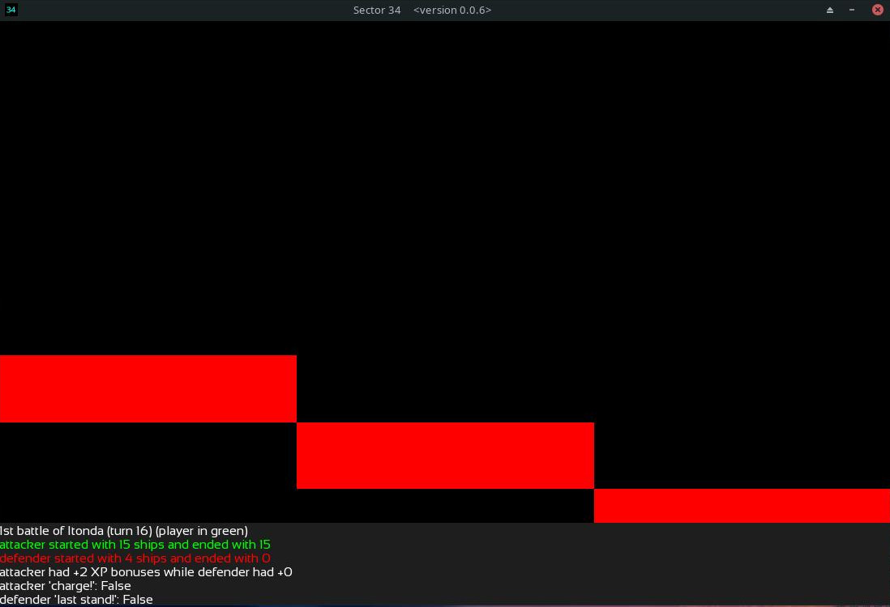
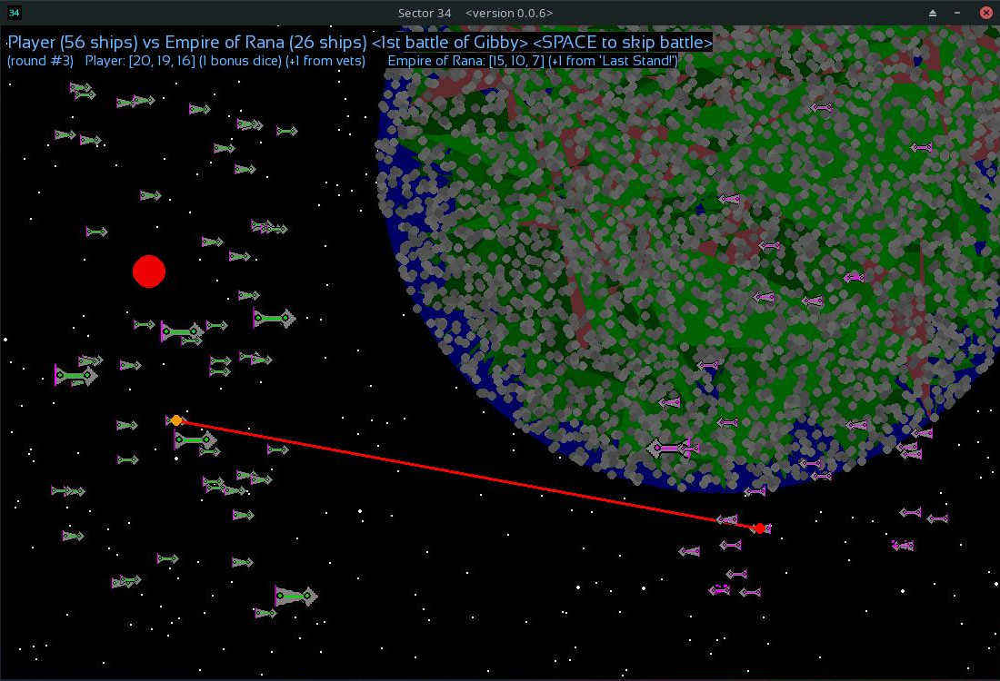
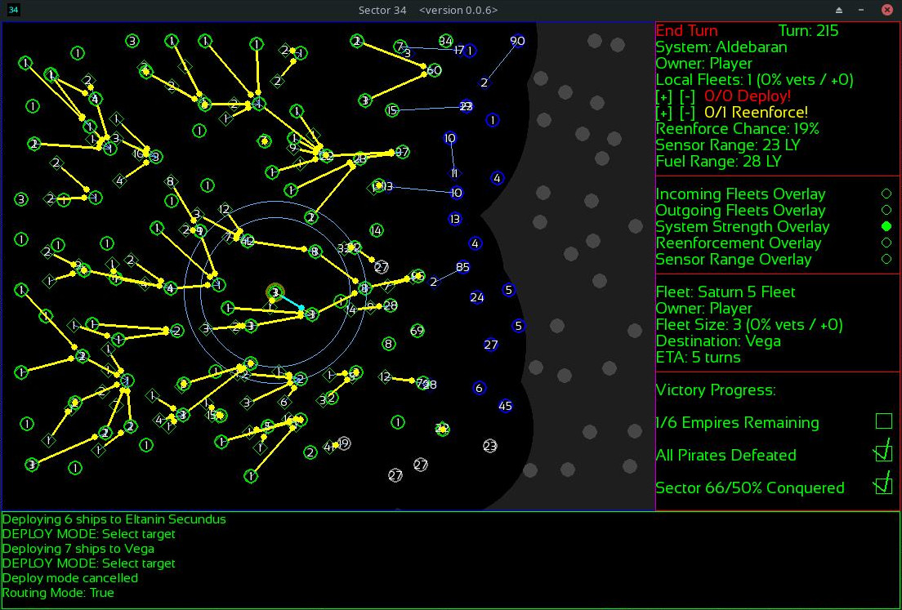
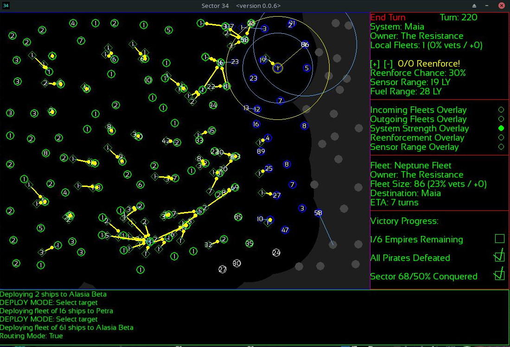
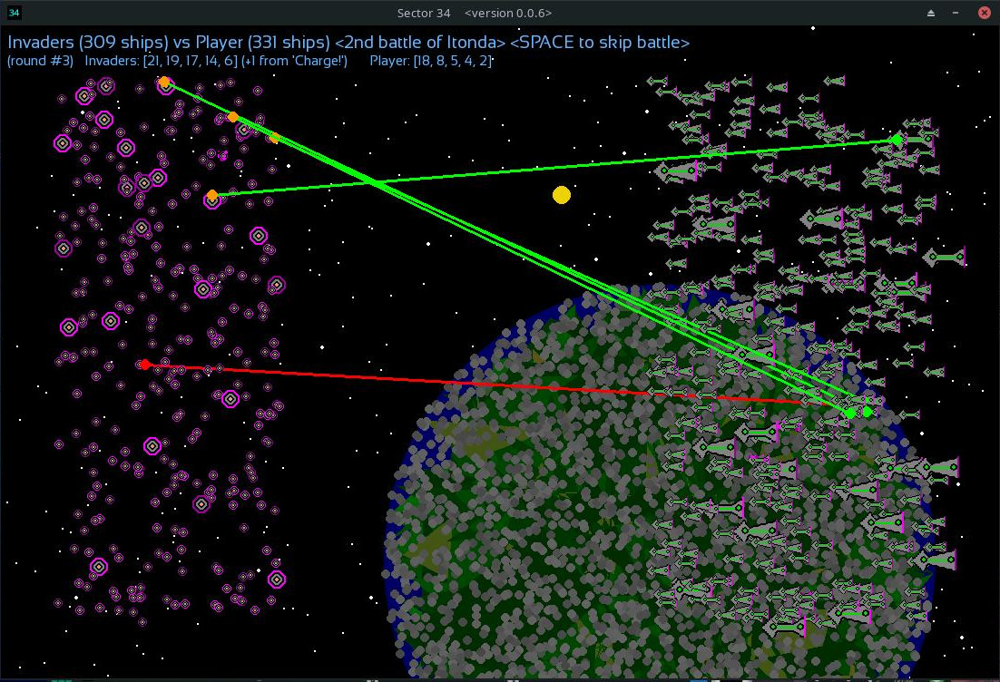
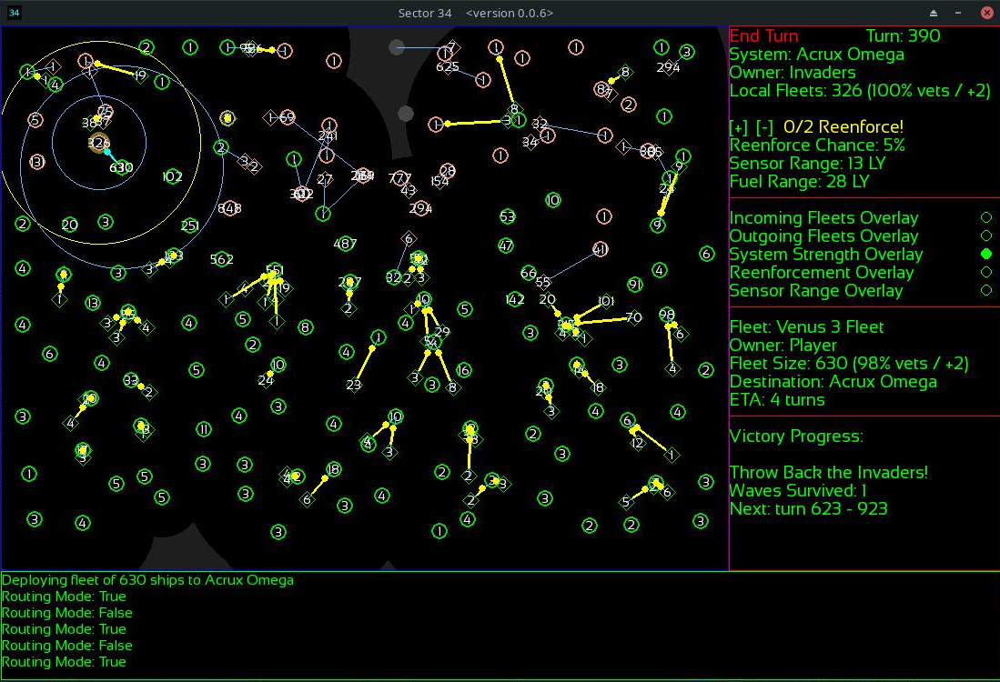
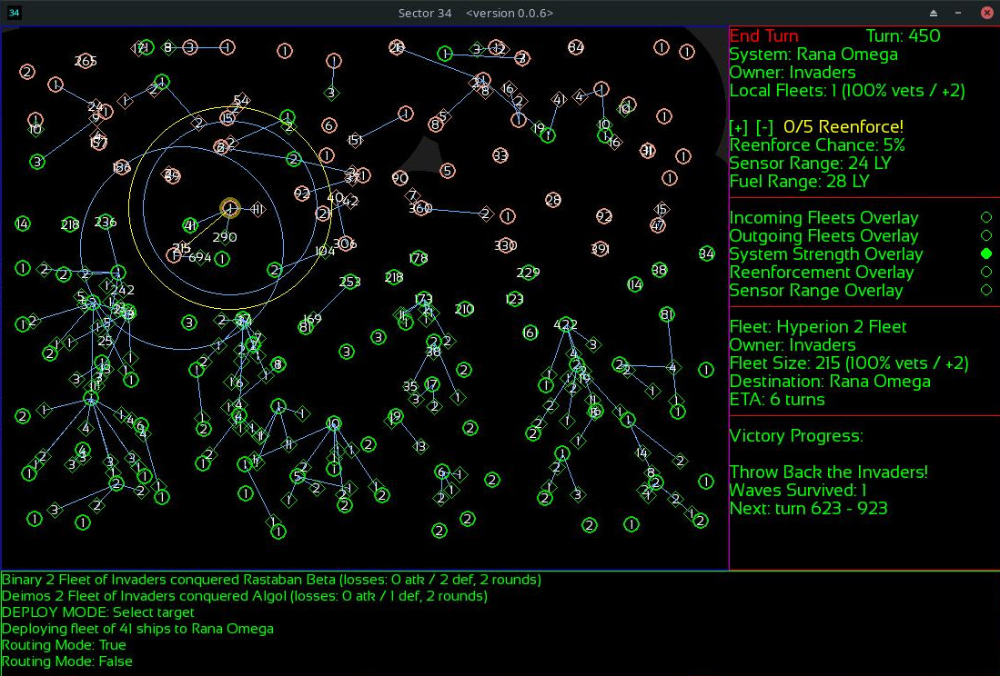
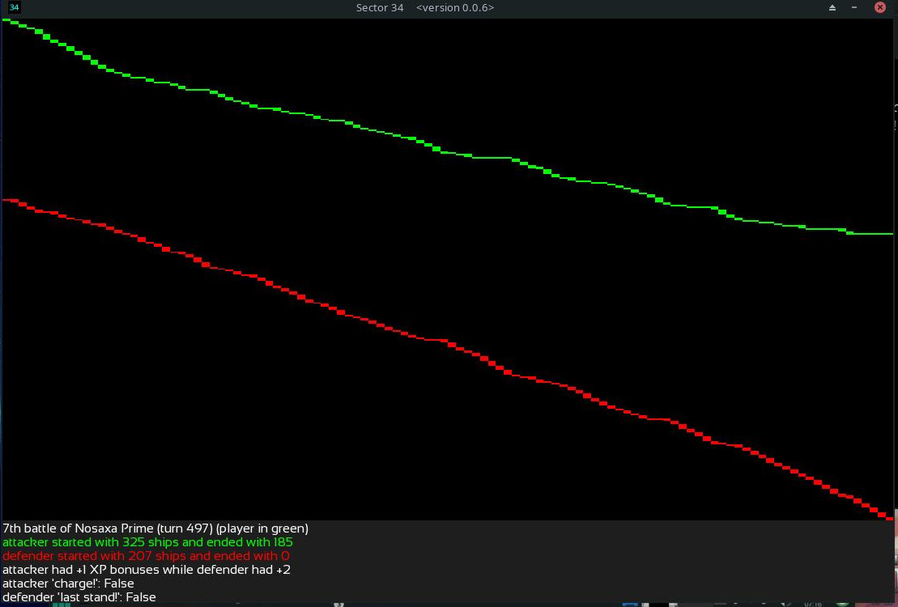

### 0.0.6 AAR run #3

**Background**: The last run was a smashing success. Stages 1 and 2 went according to plan, and the scale for stage 3 is tentatively good. Before I call stage 3 tuned and begin planning stage 4, I'm going to do another run with the same conditions. 

**Start**: It has been 100 years since the collapse of the empire...! At Hamal, we have been biding our time. Most of our neighbors lack FTL travel technology, and we now have the fleets to begin rebuilding the empire for ourselves. Other systems may have survived with their FTL technology as well, and we must be on the lookout for them during this Machiavellian free-for-all stage. We have a corner start! While they are usually safer (you're less likely to be surrounded), there is the off-chance that a faction on the opposite side will get *really big* and outnumber you before you've targeted them. To offset that possibility, good scouting is required so that you can get a line on each faction (even on the other side of the map). Provided we do that, a corner start should work out quite well for us. The last run saw a center-start where we used the advantage of being near all the other factions to pick our timing carefully, and prevent them from getting strong enough to overpower us. We are near to several systems with very good reenforcement chance. So we should take this opportunity to snag a couple (carefully, so as not to lose our fleets). We'll be set for the rest of the stage then!

Although time is usually of the essence, and it's good to move your fleets around all at once in many groups, this is a rare case of it being better to send them in one fleet. We'll take less casualties, and the systems we want to take are all next to each other, while no opponent has appeared yet (or is likely to appear before some defenders spawn at our home system).

With two outnumber dice to start the battle, we didn't lose a single ship to random attrition this time. And,
better yet, those ships will have +2 XP now. We'll domino some non-FTL systems close by, and then save this fleet for an opportunistic strike at the first rival who shows up.

We took a little attrition at the next system.

The third is taken with no attrition. 

A very promising start thus far! The AI will do this to non-FTL systems, but not yet as fast or well-planned as a good player can. In the last AAR I talked about how I wanted to add some layers to the late stages of the game for more coordinated attacks and defenses. What the AI needs in this early stage is a specific layer for early-game expansion and opportunism. The next big AI update will focus on all of these things (0.0.5 was a big upgrade over 0.0.4 as well). While the AI's routines are in many ways a mish-mash of such layers, they all carefully filter through each other to prevent "obviously bad plans" from being enacted. This gives it kind of a conservative attitude when front lines have been formed in earnest, which the player can take advantage of. Thankfully, these routines are pretty performant even as I haven't done much to optimize them yet (I don't want to calcify the routines by combining all the loops until it is further along; until then, flexibility of design is more important), but only because the scale of the game is limited in a hard-coded way by the map size (providing a very firm upper bound on complexity). There is a lot going on in the AI routines already implemented, and I'm surprised how quickly it processes turns even on my awesome old laptop, all things considered. There will be quite a few more layers which explore the specific situations in these AARs before I "harden" the AI routines into something which is more optimal, so expect turn times to increase a bit, and then decrease *a lot*, at different stages of development (optimization in this case is mostly a matter of combining the loops in the different behavior routines, to be honest).

I will go in to less detail about my turn-by-turn strategy this run, since I went in to great detail in the last AAR, and most of the same strategies apply. But, novel things tend to pop up from run to run, and I'll point those out in detail when they come up. Otherwise, it will be the broad strokes here. I am habitually verbose when writing and talking; thanks for bearing with me.

We've amassed a second fleet for securing nearby non-FTL systems. The getting is so good around Hamal that we're going to get as much as we can before any AI factions show up. We have not even done any scouting yet, which is a risk but also saves us ships. We will do some scouting soon.

We encounter our first neighbor to the south of our western expansion: The Empire of Rana! And, we can see from old political maps from before the empire's fall that their eponymous home system is not far from the front lines there. We have the fleets to make a dash for their territory. Although the early game has been a steady and cautious one this time, we've preserved our fleets for this moment! But we will want to start scouting soon, lest we be caught with all of our eggs in The Empire of Rana's basket, hehe. Note that the graph which shows the size of all enemy fleets includes non-FTL systems, which really spikes it at this stage of the game. In a future update I'll make another more fine-grained graph for individual faction fleets rather than just player/not-player.

After some scouting, we encounter the Alasia Beta Empire to the east! A happy byproduct of our scout running into the non-FTL system there will be the sudden transformation of all its defenders in to +2 XP veterans (though that will be quickly watered down with fresh spawned ships). So, to a degree, you can hamper your rivals' advance by alerting their nearby foes to the presence of FTL-capable factions. But that is a happy byproduct of our simply getting the lay of the land here. You often have no way of knowing who occupies the systems you send your scouts towards, unless you send them in a very limited and creeping way (which also has a time and a place). In the south, we begin our move on the Empire of Rana. The don't seem capable of defending against us!

Hehe, we seem to have caught the Empire of Rana at a bad time. Pirates are taking some of their systems, while they send their biggest fleet off to the east to do... something... (maybe at war with another faction?). I think we have this particular little war in the bag!

We do a little "scouting in force" to check up on our rivals to the west, and find that we've arrived at an opportune time. They, too, must be busy with other factions. We seem to have gotten a fairly lucky start! The two factions we are about to pounce on probably had the most potential to blob towards the center of the map. In the south, we've split the Rana forces up and they won't survive our onslaught much longer.

Fresh from conquering non-FTL systems on the way, our experienced fleet makes short work of the defenders at their home system. We can also see why they were having such trouble down there: Pirates everywhere! We got a lucky start, and they got a pretty unlucky one!

As we take the homeworld of the Alasia Beta Empire, we discover two factions crammed in the northwest corner: The Republic of Fomalhaut, and the Alphekka Union. That explains the ease with which we plowed into the unprotected flank of them. While there is a check in map generation to prevent any of them from starting within immediate attack-range of the player, there are no such checks for the AI factions regarding each other. They will sometimes "clump" very densely, and the degree to which they do this can produce very different games! Meanwhile, we prepare our final blow against the Rana Empire!

The Pirates in the south complicate matters. Any systems we leave understrength for advancing into the Rana Empire will invite attacks from Pirates. For all intents and purposes, our advance there must consider the Pirates and the Rana Empire to be the same big front, with a shared front line. We begin our attack there, and start sweeping up a few more non-FTL systems on the way to bringing more fleets east (where they will likely soon be needed).

**Sometimes Correlation Does Equal Causation (Only Sometimes Tho)**: Ah, this one is a neat one. We may trigger the Coalition/Resistance stage waaaay before we take out all the other empires. That should lead to a very aggressive Coalition/Resistance. In any case, we can see why our activities in Sector 34 are arousing a spirit of coalition amongst the other factions. Some brutal spikes are beginning to appear on their fleet graph, as if *something* emerges from the waves, at the same time that ours is rising at a steady pace, while we rapidly expand our territory. I think this will be a very neat graphing relationship to explore during this particular run (which is why I have added some new lines to them for this build). The goal for the Coalition stage is to have it trigger right at the point where the player can beat it with momentum and planning, but still be a tough fight (especially if not executed properly). Currently that threshold is at 55% of the map taken by the player, but I will probably fuzz that number +/- a few percent, in a future build. By choosing better fights and having better strategy, we can maintain a more steady upward trend of our own numbers while causing more drastic spikes in theirs. But even a successful offensive at scale is very costly in Sector 34, and it'll be interesting to see the graphs at the end game here! One thing both 4x games and Risk have in common is the grand-strategic nature of attrition (in 4x games usually with a money mechanic of some kind as well, but we've abstracted that out here while still certainly dealing with a kind of "capital" that must be invested and spent wisely), and that continues to be the case here in a game I've mashed together from Master of Orion and Risk. I may add more traditional economic features of 4x-like games down the road (I would also like to add tech trees), but that's something I want to spend a lot of time planning the implementation of first. 

What I like about this next one is that the "resting spot" where we gathered reenforcements and just waited for a few turns kind of looks like a dude looking ahead. Well, we were! There is a time to rest, and a time to attack. You can afford to let reserves build without moving them around a lot at very specific points in the game. Usually, you want to always be moving most of them around (especially as the wars increase in scope). But that was a little resting spot where we just collected fleets for a bit, and built up border forces.

We capture the last system that the Rana Empire controlled. At the same time as the spikes appear from beneath the waves, Sector 34 is down one less faction. Right about here is where I am going to have some procedural news blurbs in the near future. "Living world" kinda stuff. Galactic News network, etc. But the graph does tell the story: a great disturbance is being felt in the force. Sometimes correlation does equal causation. 

Our advance gathers momentum. We have nearly finished sweeping the bottom-left corner, and are ready to attack the remaining factions along the front, pushing east! The pulse of the Sector notices this. The graphs look ready for another turn...

**Enter the Resistance**: A good indication that the resistance has formed is not only the change of name and color (I'll make the color random from among the faction colors in a future update, as well as vary up the Invader colors from the current Salmon), but much more aggression along previously defensive fronts, as reserves are rushed to the line (as all the fleets are now under the control of a single handler). We are taking a very aggressive approach this time. Quite frankly, I am enamored with the new graph feature. We are *immensely* outnumbered, and as we can see on the graph we have continued to form a shape of sorts on both graphs. Will the dude "looking ahead" have his plans pan out? What will emerge from that red wave? A smiling dinosaur of some kind lets us know we're in for a good ride here. There will be a lot of defensive back-and-forth, and it is the "small ball" that will win us the game here for the most part. You must outplay the AI in the little things when you are severely outnumbered, which is a good balance I think I've struck for now (but I shall improve it further, as I think a very high level of play is possible in this game on both sides; I'm sure some of you would be much better than me, even). Early days yet!

The dude with the plan wonders for a moment if his plan was wise. Mutual attrition levels temporarily level out for both sides, as we must now play very careful defense, trap garrisons, counter attack here and there, trade space for time elsewhere, and carefully bring the flow of reserves to the front, in an adaptable series of currents. Ah, I believe we can win this though. The dude with the plan remains confident in his, uh, plan! For it is flexible, and we know ourselves, and we literally designed the opponent (wily though it be in its nascent state at times). In the north, reserves start to arrive fast enough to chase off the leading edge of our attack, while in the south we begin to hit resistance. Like the invader stage in the last game, there will be some "give and take" until the lines firm up somewhere, and then we will force a breakthrough when we can. Until then, we adapt and take what pot-shots we can. 

"Who is that dinosaur smiling for?" thinks the dude with the plan. Well, the die is cast now. Round 1: Fight!

**It Smiles for Us, This Time**: Although they try to attack us, none of their attacks carry enough momentum to break through. By taking advantages of the AI's weaknesses regarding the nuances of coordinated attack and defense, we're able to give/take/give/take without commiting to *major* battles just yet, and we have almost equalized our numbers. By striking deeply at weak points, smashing garrisons, then withdrawing, we cause their advance to be disorganized. Its main forces haven't reached the line yet, because this AI sends them in a scattered but uniform way to threatened frontline systems (from where the gradient-like local thresholds mostly take over, causing conservative behavior until very high number advantages are reached). The Coalition/Resistance can be a foe, but it is no foe like the invaders (who are scaled to give the player a real time of taking advantage of these weaknesses). Although our position is winning, the war is not yet over. The Coalition/Resistance does not realize its impending doom. You can only win the invader stage after coming within inches of defeat. This stage is a bridge between the FFA stage and Invader stage, which gives the player a chance to practice this momentum against an opponent who isn't as good at using it as the AI controlling the invaders is! But it remains a satisfying nut to crack. I look forward to improving the AI further, to better have it discern the more specific situations in which we took advantage of it. The goal is to have each stage of the game build on the last (and this should also be true of the graphs which are now divided into stages with a white line). Importantly, the scale of the game grows at each stage, requiring a different approach to the strategic use of the few moving parts I have implemented so far. One side effect of the haphazard but mostly direct way this AI sends its reenforcements to the front is that we *will* run into huge roving reserves once we break through, and there's no way to tell where the biggest ones will show up. Although we have won the war, probably, that remains to be proven. Victory is won by the numbers, but execution still matters here. The Coalition/Resistance is kind of like a mini-boss who bridges a tutorial level and the "advanced stuff". In the next build, I should also include the number of veteran ships the AI has in the fleet graph (right now just the player's are shown). The deployment algorithm prioritizes them for both player and AI, and although I use that feature to my advantage I don't do so *that much*. I think it would be pretty similar between myself and the AI there actually. For the most part, the game has been built to cause you to take advantage of it by default during the parts where it matters most (sending detachments from a main body to either defend or attack garrisons), so both the AI and new players will be pretty smilar in their use of it. But the AI does not factor that into its decisions to attack or not, like the player can. It will in a future build once I figure the best way to do that. For now it relies on the preference given to veteran ships when any are deployed from a system in numbers less than the total amount of ships present (which emergently causes them to pool where needed, usually, for the most part). I will also include a fine-grained slider at some point so players can play with that mechanic in more detail without relying on the built-in preferences I've put in there (although a good player can still take advantage of it deliberately either way). I could give the AI a much more accurate idea of when an attack is wise/unwise at the individual scale, but that would also demand it of the player. I will play around with more ways of handling that in future builds.

Most of the battles taking place are at a very small scale. We're avoiding their big fleets for now. Smart interceptions and clever pouncing counter-attacks after trading space for time as the front "wiggles" are the main places to snatch victory from the AI when it has you outnumbered but not fully on the run (as in the main decision point of the invader stage during the last run, where picking good fights was no longer an option, and it came down to picking the "right bad fight at the right time", which is something I'm glad even comes up in that stage because it's a good little nuance and is really what that stage is all about). This stage gives the player the tools to hang in there with the Invaders in the next stage, until that decisive moment.

I don't really do much "gambling" at this stage of the game. But sometimes you win just by good luck. Here, we sent a force to take a non-FTL system along the front for the sake of positioning, but only sent enough to (usually, especially at larger scales) retreat rather quickly. But in the smaller battles you just never know, and they pulled it out. By the time we get to the big battles, these many smaller engagements will have already set the stage. This is true in all three stages, for the most part.

X marks the spot for The Resistance! Before the big battles even begin, they are beaten. We must start preparing for the invader stage soon. The worst position to be in when it hits is with all your forces concentrated in a corner of the map. So at the right moment, it is best to relax some pressure against the Coalition/Resistance and begin pooling reserves in a good zone defense which can prepare to intercept the invaders from any direction. It is not quite that time yet. 

We took advantage of our initial momentum. We won the "little fights" all over the line between when we began to push and when they began to mount serious resistance. Now, the lines firm up. They have reserves bouncing around in the rear, collecting ships into "charges" which the AI handler for the opponent in this stage will only send to the front when they are 80-ish in size, usually (unless the front comes to them, or they happen upon a larger fleet by chance in their collection); which is very different from how the Invaders play. If the Resistance/Coalition starts with less ships and/or systems than the player, then it will use a more high-pressure AI type at first who sends smaller packets to the front more quickly (but for the most part they otherwise behave the same way), before switching to the current one. At the very least, it'll always use the high-pressure type for the first turn, ensuring it sends a few fleets right away to the front regardless. 

As the lines firm up, we scout the interior of their territory, to see where is the best time and place to launch a *real* attack. The center-south is where we'll have the numbers for it. But we can afford to wait a little now. We won the "tug of war" at the line, and they aren't getting territory back from us. At this stage, I like to bring reenforcements up until their probing attacks stop (indicating it feels uncertain about the local numerical advantage all over the line), and then launch a major coordinated attack. In some places that will have to be done. But looking behind their lines, I think we can force a breakthrough in the center. Let's try! That will not only take advantage of our numerical advantage (which increases by the turn now that the X is marked), but it will break their strongest point of resistance all at once, enabling a rapid crumbling of the rest of their realm. This strategy works here because both sides must rely heavily on reserves spawned from systems. Against the invaders in the next stage, such attacks are often at an extreme disadvantage because of the fact that the invader forces overwhelmingly enjoy +2 XP after the first moments of the invasion! This here? But a training exercise for the next one. Lessons must carry over! In both stages, the player must manage that mechanic carefully. But in the next stage it's more about mitigating a general disadvantage against the AI opponent than taking advantage of a mostly-level playing field (remember: the player has some other advantages too, such as the universal reenforcement pool, which does help a bit even when it is generally a trickle).

For a moment, the beat was at a lower tempo along the front lines. The dude with the plan stops a moment to think again. The tip of this graph opens its mouth as we launch the ships in the center-south! In the north, we continue to play back-and-forth in smaller actions while keeping away from larger fleets, and delaying their firming up that part of the line as much as possible. But this attack will break the center!

The tip of our attack hits and is a resounding success. One of the biggest battles we've offered so far. Relatively small-scale, compared to the next stage. Surprisingly, this was the biggest fleet they had yet mustered along that front. We'll break right through, but must be wary of the reserves who will contest us. They have enough to cautious about!

We catch some of their reserves just behind the center. They were in the middle of a line-shift there or something. All of those systems next to the ones we just took are front-line systems now, and we can expect them to get renforced. But if we move quickly we can prevent them from organizing a resistance!

We catch some some attackers in a "charge!" at a system we reenforced in time, at just the moment before we launch our next big attack.

Our advantage continues to grow, while we now have more ships than all the other factions combined did at their peak! Most have not even reached the fighting yet. They get there in waves which we take advantage of as soon as we have the numbers to do so. This was less like two solid lines colliding, and more like the way fluids mix or something. By the time reenforcements made it to the front, they were usually participating in battles made up of only a few small reenforcement packets hastily gathered at a staging point before being launched in either defense or attack against similarly-size fleets. But in this way, we demolished a huge portion of their fleet before it ever had a chance to gain momentum and gather itself, in any serious way. We took a moment here before this attack to gather a few more reserves than we have been.

As we launch the next big attack, designed once more to gain ground in the center (sometimes it is best to charge right up the middle), we notice that a fleet The Resistance really should be using to stop our advance is being used to secure a non-FTL system. One weakness in there right now is that it will launch attacks against non-FTL systems when it would be smarter to use those fleets on a faction which threatens them sometimes. That's not a terrible decision for them, as it'll probably be a good win and also make that fleet +2 XP before it reaches us, but in the particular moment that fleet was needed to counter our advance in the south immediately. That is another little situational thing I will give the AI a layer for discerning, in the near future. In this case it's not the worst thing it could have done, and it might benefit a lot from the +2 XP after winning that battle, but it's not something it was doing on purpose -- it just saw a local numerical advantage and decided to attack there with an available fleet. I appreciate how the addition of the XP mechanic sometimes benefits the AI in unexpected ways. I'm very proud of what the AI can do so far in these various scenarios. It is in a nascent state, but it can surprise you sometimes. It can definitely be outplayed, but you have to play a very coordinated and well-timed game to do so. I want that to continue to be the case even as it is improved. Early days!

As the advance continues, little engagements are still the order of the day. Large fleets just never had the time to form in this very fast war! In these two examples of the battles along the tip of the advance, an attack and a defense mark the X for the other side in decisive ways. These little battles add up!

The center is crushed. We aren't winning every battle! Some of our advance fleets bounce off of timely-reenforced garrisons, for the AI is pretty good about that actually. It's why coordinated attacks are required, and it's one of the main things I'm proud of with the game and AI so far. If you try to attack it piecemeal, it'll gobble your forces up. We are taking some losses by pushing at this pace, but overall we are grinding them down hard. We really carried through our momentum from the first stage big time. That's the biggest advantage the player has over the Coalition/Resistance: that they can prepare for the entirety of the conflict to come from the moment they begin the game, while the Coalition/Resistance must try to adapt to the circumstances at the moment of its triggering, and that's by design. In some of my favorite strategy games, you spend most of the game planning for the "big moment" you're trying to trigger (Paradox games in particular). With the Coalition/Resistance stages I've tried to inject some of those "favorite moments" into the campaign here. And, if I may say so, I'm pretty pleased with the results so far.

At Navi, the Resistance/Coalition pounces upon a weakness in my attack. I gave it the opening, and it took it! It will take advantage of minor mistakes quite well. We've stopped sending so many ships to the front. It's being fought by smaller fleets that are still on that side of the map. We'd prefer to win here without shifting too many more reenforcements over to do so, to be better prepared for the next stage. For the most part, that half of the map is on its own for the rest of this war while the rest builds reserves.

At Navi, we crush one of their largest remaining fleets as the advance rolls to the edge of the map.

At Bubup, we crush the last of their larger, isolated garrisons. Several systems away, the tip of the advance left these fixed defenders far behind many turns ago. The key to really pulling this kind of attack off is intercepting reenforcements in a kind of "chain reaction", so they never get a chance to meet up (or, if they do, it is after being herded in to a spot of your choosing). We begin collecting the remaining few non-FTL systems on the map, to prepare for the invader stage. Non-FTL systems receive a production penalty on top of the normal chance to reenforce, behind the scenes. They will grow at slower rates than other systems after the very beginning. Every player system is boosted to 50% reenforcement chance for the invader stage in this build, to compensate for their numbers being 2x the number of player ships. That phase must be won using the lessons of these two previous stages, plus the additional idea of being forced to make a few costly attritional decisions to affect the momentum at the decisive moment, at times (while also forcing the player to play "behind the lines", and attempting to adjust to the Haymaker AI type's "centers of gravity"). We have the initiative by default in this stage, but in the next stage you have to create a chance to take the initiative after losing it initially! Those are the kinds of "unlisted mechanics" which the stages are really exploring. The numbers game helps you win, big time, but it has to be used to channel or change the momentum. That's really the basic idea I'm trying to explore here. Early days yet, but so far so good!

As The Resistance's last ship flies towards one of our systems (with nowhere else to go), we take stock of the situation.

Towards the end there, our veteran ships on the front line definitely handled the brunt of the fighting. While our numbers grow steadily (and will grow much more over the 30 turns before the invaders land after we finish that ship off), our number of veteran ships remains in a similar zone. Reserves were often brought to the front to replenish them, but those fleets all got sharpened fast in the kind of war we were fighting, where it was many small engagements all over the place instead of a few solid points of attack. Against the invaders this also can be done, but it won't ever win the stage by itself. Even in this stage, it's kind of rare to beat it without a few battles closer to the 500+ ship range. We got a real opportune strike there at the Coalition/Resistance, and set it up very effectively. The invader stage forces the player to pick a few fights at scales much larger, where the attritional costs cast a longer shadow over strategic events. That awesome smiling dinosaur is just foreshadowing for the next stage, and I'm eager to see what the final graphs look like in this build. In the last run, we sort of had an old-school Godzilla thing going on with our fleet line in the invader stage, which happens when we take long rest periods to build up forces before making devastatingly costly attacks (a thing which can only be done at the risk of not pushing them back in time -- we barely pulled that off last time).

For a moment, the Sector is still as our faction seems poised to unite it. Great success! That was an excellent run through the first two stages. Let us see what the Invader stage has in store for us this time. I am eager to see if I can repeat my success from last run at 2x, or if that was a fluke.

A round of applause for the AI here. It is in a nascent state, but it does what it does well and surprises me sometimes even when I've become very good at taking advantage of its weaknesses. I think over the last few AARs I've pinned down my own strategies and situationals well enough to build the next few layers based on how I play the more advanced concepts. This update will be 0.0.6, and 0.0.7 will mostly be HUD and GUI stuff, but 0.0.8 will probably include some of those advanced layers now that I think I have the right idea of how I want it to think about them. Before I implement scrolling/zooming maps and upscale the game, I want to make sure the AI is the best it can be at the 140-system scale for which it is currently optimized. But some of the later scenarios I really want to implement will require a much larger map (perhaps 500+ systems or more), and also zooming will greatly help with the way fleet numbers are currently represented on the map (the biggest weakness in the GUI at present, imo, but overall I am pleased with how the GUI has evolved -- I intend to keep it very simple for the foreseeable future, and not add too many things to the map display, and its basic form is how it will look going forward even as I polish it up more).

(*Data Visualization Note*: I'm not a graph expert, but I've tried to pick some visually pleasing graphs here which show interesting relationships between some of the things being tracked (and also look quite nice, imho). I am open to suggestions on more graphs and charts to include, but these are an excellent start. This game is entirely procedural, and the graphs are an important tool for tuning.)

**The End of the Resistance**: The last Resistance ship arrives at Fomalhaut, and is destroyed. That's a new record for the first two stages for me, actually. Not bad!

**The Invader Stage**: Who are these invaders? What do they want? We don't know, because they're not saying. All we know is that they have been laying waste to every system they come across, and they're headed right for us. We have 30 turns to prepare for their invasion along the top side of the map (it is random every run, but this is several AARs in a row now where it's been the top). The difference in height/width of the map does mean that horizontal invasions are of a different character from vertical ones, as fleets will be concentrated differently. Invasions from the top and bottom are along a broader front (a little more asymmetry is required to win, imo), while the left/right ones can allow the invaders to make *very large* fleets sometimes. But overall, both varieties provide a similar kind of stage and the same lessons apply. All systems are buffed to 50% production chance, and we will begin the invasion with a lot of ships (and the invaders will be scaled to 2x that number of ships, regardless).

Our general strategy is simple: we pull our fleets back from the top of the map, we bring the rest up to varying degrees of depth behind our liquified front line, with a few bigger fleets in deep reserve. We'll try to delay the invader advance and chip away at it until the last possible moment where we can surround and cut off its "haymaker" (for it will try to send fleets towards a "center of gravity", which we can discern if we are scouting throughout the match), before pushing it back. We'll send a lot of little fleets behind the lines to prevent the entire fleet from massing at the front, and to provide intelligence about the movements of its reserve fleets which haven't arrived at the front yet. There will be a window of give-and-take before the lines really "firm up", and we'll need to whittle away their forces for as long as possible before the lines firm up and we start retaking all the ground we just gave (like a bowstring being released, I suppose). 

The invaders arrive! Each of their invasion fleets has over 300 ships, and we'll have a chance to interdict some of them before they arrive. While our fleets have grown much larger since the end of the Resistance, they have also grown less experienced, and we are outnumbered now 2-to-1 by a fleet that will generally outgun as well as outnumber us. Our only hope is to use their momentum against them and pick the right time for a counter-attack while trading space for time and pulling out every dirty trick in the book behind-the-lines. The invader graph gives us an early indication of the increased scale of things! This isn't as large an invasion as the last run. Because we ended the Resistance/Coalition stage with a few less ships (owing to the speed of our crushing advance), our fleets are a bit smaller than in the last run, and the invaders are correspondingly also scaled down just a little bit. This actually benefits the player, as they are at an increasing disadvantage the more the fleets scale up, until they've managed to sharpen enough fleets for big confrontations with the invaders. So the momentum we carried through from the first and second stages has a minor but noticeable effect on our ability to win here. We have prepared small defenses at three forward systems where we'll likely "bounce" some invader fleets, and gain valuable experience on our own forward fleets, before they withdraw. Those will be our biggest interdiction fleets until the line firms up. Importantly, the scale of the invasion means you *can't* do that on every system. You have to trade some space for time to win this stage, and judge the moment to bounce back.

Here we can see the seeds of our victory in a small example, before the invasion has landed fully its first wave. One of the fleets we allowed to land uncontested has split itself in half, to send 170+ ships towards another system we left undefended. To a degree, we can encourage the invaders to spread themselves thin and then pick off small detachments. This only works sometimes: if we do it too much, they are +2 XP and all such pouncings will be costly; while if we give them too much space they will keep their large fleets together or even concentrate them in to fleets we can't sustain victories against (even with influxes of reserves). It's something we want to encourage and try to take advantage of while trading space for time. The AI won't split up fleets for no reason. To really encourage a big fleet to split into many smaller ones, you have to threaten it with many fleets which approach the size you want its detachments to be.

The first major engagement sees the invader fleet we have prepared a "bouncing" attack for decide to "charge!" (5% chance of that triggering when an attacker is outnumbered to start the battle). One the one hand, this is the best time that could have happened for us, as that fleet isn't +2 XP yet. On the other hand, we were hoping to use that fleet as a large +2 XP interdiction fleet while trading space for time and now it is essentially wiped out, although it beat the charge. That was a surprising start to this invasion, and was unlikely!

(*Development Note*: My plan for the fourth stage is beginning to take shape. The player will likely be commanding smaller groups of high-XP ships with a limited amount of "breakthrough" flags to put on them (which give them an additional +1 to rolls, and a speed boost), but be in a situation where they must break through a very strong and layered defense. Essentially, it will be the reverse of this stage, on a larger scale, and a new map -- the counter-strike phase, where Sector 34 hops one sector over to the sector from which it was just invaded and takes the fight to the Invaders.)

The graphs begin to take a turn, as this phase begins. The number of decimated systems rises as our number of controlled systems falls. Our defense must be very coordinated here, to survive! 

That single battle was bigger than any battle in the previous phases, and all battles in this phase are costly when the fleets begin to scale up. We can only trade so much space for time, because our ability to bring up reserves is diminished with every system taken. We will have to bob, weave, counter-punch, dodge, and pick the exact right time for a big knockout blow. Can we pull it off?

Our second defense up front goes as-planned, fending off a fleet while gaining valuable experience.

Our third, between those two, trades space for time in light of its now-weakened left flank (owing to the near destruction of our earlier defending garrison). On the right and center-right, we start making some little counter-attacks at isolated garrisons. Eventually we'll want to firm up the line not only in places where we can numerically afford to do so, but in places where tightly-packed systems allow us to defend a spread-out area while pouncing on staging points. Because of the semi-random placement of systems within the partition grid (visible in the political map mode), each part of the map has a unique "terrain" for salients and such each run. There are good places to make a stand, and bad places. In general, the defender wants the attacker to have to cross long distances towards staging points that can either be quickly reenforced before they arrive, or immediately pounced on after they arrive (or both, ideally). This is our general strategy as we trade space for time until the lines firm up, and we can start to try and track them in a "haymaker" towards a center of gravity (and/or distract them with behind-the-lines play, which only works for a little while until large enough detachments chase you off [at which point they'll return to the front]).

"Everything, everywhere, all at once" is the way to beat the invader stage. These are crucial turns, and we have way more active fleets than we do systems. We must adapt our flow of reenforcements and our collapsing defense to match the changing patterns of the invaders, until the lines firm up. These are the key moments! I am very pleased with how this part of the stage works out, because it makes the "oh, how the turn tables!" when you finally turn them back very satisfying indeed. Each stage increases the scope of play, and the scale of it. My goal is to continue to build on that dynamic in the forthcoming stages. This is why an "organized withdrawl" in real warfare is so difficult: we are dealing with idealized command and control here, and it is the only way we will win. The militaries of Sector 34 are very advanced in their command and control technology.

But the AI has some tools to deal with our little counter-attacks and traps. Sometimes the invaders will reenforce the systems you're trying to trap, rather than push past you. It's risky because even perfectly-executed plans have a chance to be foiled by the opponent, given the greater than 1 turn distance between all systems. So plans need to be flexible. In this case, we take a big loss on account of the AI reacting smartly to our attempt. It reenforces a trapped fleet to bring it up to more than twice the numbers that existed there when the attack was launched. 

*Lore Moment*: Although command and control technology is idealized in this simplified model of a sci-fi war, there are some limits to it. Ships increase your sensor radius in flight because they drop sensor packages behind them which transmit back to the home systems, but they can't actually communicate FTL while in warp. Once an attack is launched, they are essentially flying blind until they drop out of warp, right on top of the enemy defenders. The turns represent at least a month of game time, and the defender only has a window of time in which they can expect the attacker to arrive even if they can see them coming on deep space scanners. FTL engines must be "warmed up" before they can be used, which is why the attacker can retreat but the defender is in it until the end (it takes longer than a battle to warm them up, and the attacker arrives with them already warm, and it would not be feasible for defenders to keep them warm all the time). When I implement tech trees down the road in a future update, I will have the technologies do much more than just add bonuses here and there. Much like Sword of the Stars (which is a game I love very much, and was partially an inspiration for this one), I want new tech to change the way you control fleets and battles. Allowing defenders to retreat, allowing flight-paths to change during the last leg before an attack, allowing you to pick the time to retreat in a battle instead of relying on your fleet commanders, etc. A few technologies which do that kind of thing are more interesting to me than a bunch of technologies which just add +1 to the dice rolls. Very few of the techs implemented will add any more modifiers to the combat system, which at this point is pretty close to how I want it (regarding currently-implemented-systems, it's more a matter of finding the right level of decision-making for the AI, so that they can't too easily be hoodwinked in small battles). So, lore-wise, these stages so far represent the "we're just learning how to conduct interstellar warfare" phase of Sector 34's factions, while more options will be available in the future.

At Tangra, over the skies of a decimated world, our first *successful* counter-attack lands, after several failed ones. We go 111 rounds with the defenders, and come out in a good position to do more damage to their invading force.

At Betelgeuse, while slowing the tendrils of their advance in small battles, a near-thing leaves both sides reduced. But that helped us counter their momentum, and whittle away their advantage. These many small battles add up! 

Dangerous spikes are starting to form on the fleet graphs for both sides. The invaders are taking huge losses in all these small engagements, but so are our veteran fleets. While the slope of our fleet numbers in general is more favorable than the invaders', our veterans are taking a beating holding the line during the advance to the rear.

And we've given up a lot of space for time already! But we'll need to give up a little more before we can bounce back. We're building tension, like a spring, before the counter-strike!

We're still mostly avoiding their big fleets, which seem to be dangerously massing in the center. We are brittle behind the lines this time, having a relatively small strategic reserve for the moment. To counter this, we immediately start sending small fleets behind the lines to distract them from their forward advance a little bit. Remember: the invaders don't reenforce from systems. The only have their numbers brought up to 2x the players' current ships, at the start of each wave. As a result, they are always very brittle behind the lines, and our goal is to harry their advance until they are in just the right kind of quagmire. It will take some time to build up the strategic reserves we need to push them back wherever they manage to mass a breakthrough force. Until then we must try to adapt to their advance, and harry them at every turn!

An enormous coup: as their forces start to gather momentum in the center-right (where the center of gravity may be concentrated), our reserves pounce on a leading element of the advance on the left, which had become separated from its compatriots during our interdictions. This attack is made with our reserves, who have been inching forward, and is in sufficient numbers to both win handily and leave us a lot of +2 XP survivors. There are more fleets incoming on the left, and we should be able to handle them with what we gained (and caused them to lose) in this battle. Our scouts begin to start causing trouble behind the lines in earnest to keep their reserves from reaching the front line for as long as possible!

We have here the first turn since the invasion without a battle! Between now and the start of the invasion, we've lost a lot of systems but given them a ton of bloody noses for it. They still outnumber us, but they've more or less lost the momentum by now. They will continue to push us back in some places, but we've managed to isolate their fleets into chunks which we can begin to surround and destroy. It will be important to continue to play behind-the-lines with our scout fleets, as the "center of gravity" could suddenly change and reserve fleets could head for a different part of the line (but I have programmed this to be a rare occurrence with the Invaders' Haymaker type AI, which only uses a single "center of gravity" and keeps it active for a very long time before changing it). There is a lot of potential there for scenario-oriented AI types, which I will continue to explore in future levels. The Haymaker AI type is tailor-made for this "duck and counter-punch" engagement. The strategy we're using here is a hard-counter to it, and although there may be other viable strategies to win this stage (would be neat to have some more people involved in the project to get a look at other ways people might try) this is the strategic idea I have intended for it. And the basic idea also applies to the earlier stages, if the player should find themselves in a tough spot (the Coalition/Resistance can be a challenge if you don't prepare for it). All of the basic ideas in each stage should build on each other, while new stages occasionally add more, is the plan. This is a tricky moment, because we can't stop giving a little ground just yet, but need to start pushing back at the same time. Judge it wrong and they'll punch through! I like the idea of portraying these Kardashev-scale wars as being more like front lines in land warfare than as a few "fleets in being" striking at each other over vast distances (although, rarely, "fleet in being" duels can happen and that's pretty sweet when it does). One thing Sword of the Stars does extremely well is its 3D map, where such things can be explored in 3 dimensions instead of 2. I like to think I've begun to capture a decent 2D feel for this "front lines" idea, though. Only in the early stages of the FFA stage are a few fleets-in-being making the difference by themselves. A promising start, but early days yet! I would certainly try a 3D SotS-like map if I were more familiar with 3D programming, but my limited expertise right now is entirely in 2D games. Although I am far from an expert, it is my goal to have the game require the application of a little Sun Tzu and Clauswitz in order to win, and I think I've managed to do that in these first three stages pretty well. The next stages will continue to increase the scale and the scope, and it is the game "Light of Altair" which I have in mind as inspiration for that (if you've never played it, check it out: it goes from solar systems to huge chunks of galaxies as the scale of the campaign increases, and is an amazing game). Early days yet here! Anyone else interested in the project is more than welcome to contact me on the game's forums [here](https://sgibber2018.itch.io/sector-34/community), whether they wish to simply play it or offer suggestions or whatever the case may be.

I believe the center of gravity is located in the center-right this time (it is randomly chosen from among understrength or threatened systems on any front, at the time of choosing; it is re-chosen after its "pull period" expires or the center of gravity is fully behind friendly lines) at the system of Maia. We have awhile before it is likely to be anywhere else. Fortunately, our reserves behind the center are considerable now, and we can absorb punches in that area while moving reserves closer to it, and pushing elsewhere. Haymaker's punch will be like a fist impacting a sticky goo, which engulfs it. A more advanced AI of this type would use multiple shorter-period centers of gravity, and some more advanced pre-positioning (a thing which could be implemented now, using the current systems for the most part, and which may be explored in the next stage). For the most part, this "centers of gravity" idea is only as useful as the AI's ability to make more deliberate choices about pre-positioning and the relative shape of the front as a whole. So the most advanced AI types for the game will be implemented after I've implemented the more advanced situational layers for the AI in general.

At Markab Beta, we start pouncing on their bigger spread-out elements with our bigger fleets which have been sharpened and are laying in wait. We're taking brutal spikes, but we're blunting their advance where it is strong and causing them a ton of attrition in the smaller battles going on all over the place. We've been helped a lot by "good terrain", defending from this direction, regarding the relative spacings of systems (which is semi-random). We might have been able to beat a much larger invading force (2.5x? 3x?). It is tempting to scale them up, but the line is razor thin because the dynamic nature of the breakthroughs (when they occur) can make a loss very sudden when it happens. I think 2x is a good number for the invaders at this point. Though currently the "hard mode" toggle has no effect on the invader stage, I may allow that toggle to make the invaders use 3x for their waves before the release. Note that the hard mode toggle is *very hard*, and can result in unwinnable games if left on (during the previous two stages it significantly increases the production of faction ships). The "hard mode" toggle is really just a debug feature for testing the limits of the AI against my play, and I don't actually expect people to try and win games with it left on from the start (that might not even be possible). It will be superseded by the advanced situational layers in the AI for 0.0.8 or thereabouts, in any case. You have to play pretty well to beat it as it is, and I'm pretty proud of it!

This is one of my favorite graphs right here. The number of fleets you have at your disposal relates to the number of systems you have at your disposal. During an extremely desperate defense all over the map, you actually must be using more fleets than you have systems. While on the offensive, sometimes you want to let them sit for a turn or two before deciding their next route, as your wave of attackers advances and you determine the outcome of the previous stage of your plan. The highest points of that magenta line is when the invaders arrived on the map, and the other highest points are where we were playing give-and-take with The Resistance, and at the height of the breakthrough succeeding in their center. Meanwhile, the resting points are where we await fleets to arrive at destinations en masse before deciding where to send them next (a thing which can only mean we hold the initiative for a moment). In short, where the magenta line trends above the cyan one, the opponent usually has the initiative either in general or in large parts of the map, while where it trends below we have the initiative and can take slightly bigger planning steps, and "charge" our shots a little more before deciding where they go. Even on the attack, if it trends above the line it means that you are reacting to their reactions to your attack in a way that could cost you the initiative at any moment (though that's a sign of a successful blitz). Although it trended just above the line right after our breakthrough in the Resistance's center, that quickly dipped below as we ran out of map to take, and began leaving more than half the map in place entirely to prepare for this stage. What is happening right now against the invaders is a larger-scale version of what happened at the start of the war with The Resistance, in some ways. In this case, we had to give up the initiative *all over* the front line and conduct a ton of little fights, but now we have enough initiative to start making plans in "stages" again. Since systems generate ships every turn if their chance triggers regardless of whether the player moves those ships, the player is not punished for leaving them there until needed, except where timing is concerned. You can only really afford to "charge" shots when you have seized the initiative a bit. These things are all biased heavily by the fact that my only samples so far are from my own play against my own game AI. It would be amazing to see these graphs between two players.

It isn't just "pulling your ships back" to beat the invaders, but you have to do a lot of active interdiction while you do it, which (in my opinion) is one of the best things about this stage. It makes the turning of the tables very special. Different situations in the game can sort of have their "feel" mapped by some of these graphs and the way they relate to each other, and I think I've nailed the high and low points of this one to my personal taste at least. It'll be hard to top for the next stage, but I'll think on it (and there will definitely be several more stages at least -- these three are just the game's start and the first two are basically tutorials). 

While the parts where the magenta line trends below the cyan line are less desperate, they are no less active: those fleets are being adapted in their paths to the front in discrete steps, each one bringing them closer to the front, with the changing front itself deciding what to do at each "step". You have to use the entire map in all stages, but when you have the initiative you can do so in pulses and plans, while when you don't have it you must react as best you can. Both kinds of "feels" are important because they require different and adaptable strategies, and you have to find the time and place to take the initiative or give it to the other side a little and trust in your reactions. We gave the invaders a real whalloping during that organized retreat! Now is the time for pulses and plans, and our fleets start to creep up on the front and position themselves carefully for the next big flurry. This "rhythmic" relationship between the freedom you have to organize attacks in discrete steps versus reacting to them with a flurry of defensive blows is something I have tried to give the AI opponents in the reenforcement pool thresholds, but they won't take advantage of it as well as a good player can until I have given it some additional layers. One of the reasons I am going in to so much detail in these AARs is because I am going to use my own play as a reference for the additional layers, which must be very specific to improve on the play it is capable of so far. Eventually a kind of chess-engine-like decision tree will be a good idea, but we're not quite there yet. The closest thing it does to making a sequential decision like that is the way it plans miniature coordinated attacks by doing a small line shift before launching an attack (when it can spare the ships); even the waypointed reenforcements sent to the front are a thing decided on a mostly turn-by-turn basis, for now. There are a lot of little spots where I can improve the AI further based on these detailed observations of my own play (though I am certain many of you will be better than me at my own game!).

And that is exactly what we observe here when looking at the actual map. The lines have firmed up, and there isn't even much opportunity for behind-the-lines-play this time around, just yet. We're still giving a little ground here and there, but we're actually beginning to move big chunks of reenforcements in discrete steps *up* the line, towards the front, as we mould the conditions for a breakthrough. Along the line itself, big "shifts" are happening where every few turns 100+ ships are moved one system over, to concentrate for very specific attacks in a few turns. This is not fool-proof: the AI opponent moves its ships around a lot just to attack, defend, and reenforce, so that we can't be sure the places we want to attack in 10-20 turns are the places we'll still want to attack 10-20 turns from now. But every few turns, we get closer to that decision point and move our fleets one more step towards where we think they need to be. That's probably how the AI opponents should also think about this situation, once more advanced layers are implemented. This results in a "tension point" where the currents you've set up either have to be used, or you need to spend some additional turns reorganizing. For the most successful attacks, your rivers arrive at the right destination to begin a flurried breakthrough as soon as they arrive (like we did to The Resistance). It's not possible to get that right all the time (the AI is good enough to foil enough of your plans for that!), but for this stage you need to judge the "strength" of the Haymaker attack correctly in order to counter its attempted punch. We got them good this time in the center-right by cutting off the tip of their attack and bringing our reserves to the area immediately, but the full weight of it hasn't arrived yet in any case because we've been playing keep-away with our scouts behind the lines. Although I am not an expert programmer, I think the best way to have the AI handle these kinds of things would be an explicit gradient map of some kind, or several, so that it can also emulate this behavior in a more adaptable way. That's a little further down the line, but is something I want to do after giving it a few more situational layers in the current system of behavior routines. Also, we've taken full advantage of the "terrain features" of the map this time around, which is a thing that the AI will only do emergently in an unplanned way (which is a big reason we're winning so hard right now).

As an example: here I waited too long to strike on the right. Knowing that the counter-attack would have to be made with relatively inexperienced fleets, I erred on the side of beefing it up, but now more reenforcements pour into that fleet we wanted to attack in a few turns. The counter-attack on that side is delayed a little, but since we know where that chunk of their fleet is headed we route some of the other reserves on that "level" of the line the other way, while preparing to spend a few more turns on the defensive on the right. Either way, the time to hit back will be soon. The trouble with getting the AI to think this way is that there are multiple kinds of "wars". This is a 1v1 with a usually-solid line dividing the two sides. The FFA stage, and sometimes the Coalition/Resistance stage, are multi-front wars. There is likely no universal algorithm for the AI's waypointing and gradient-like thresholds to handle each kind of war without scenario-specific and situation-specific layers to help it out. But I am never going to give it more information than the player has. The idea is to not have it "cheat", but to play at a high level and require high level play to beat. I consider this a pretty good start so far!

The AI will do its best to try and reenforce locally in addition to the waypointing layer. In this example, reenforcements are being sent to a system that is obviously understrength relative to our positions across from it. The only reason we haven't attacked there yet is that our fleets are +0 XP, while theirs are +2 XP. We'll need to be defensive there for a bit longer, but the places where we need to match them are becoming more and more clear (as will the places where we can break through).

I judge that now is the time to attack. The lines have been relatively stable for several turns now, as both sides occupy good "terrain" and neither has the weight of numbers to force a breakthrough in the center yet. In the rear we keep over 1000 ships distracted, which is crucial right now. On the right flank, we slip by them and send small packets of reenforcements up top to cause more mayhem while launching some small counter-attacks close to the line. On the left, we prepare a big attack which will involve a fixing element and a main attacking element (which will be helped by the fixing attack preventing reenforcements arriving to the main target, and then will finish off the fixed element). Because the main attack will land before the fixing attack, and take that nearby system, the fixing attack will (hopefully) retreat there after its encounter with the larger fleet, and combine with the main element before the finishing attack. These are the kinds of coordinated attacks which (imo) make the game good. It is the > 1 turn distance between systems which really enables this kind of thing, and I would love to see the AI doing some real tricky stuff there when it has decision-trees to work with. In the center we creep slowly up, creating a slow but sure kind of encirclement. We will have them! But the offensive will be costly. We've spent a few turns carefully trying to bring reenforcements to the places we think we'll be able to use them, in an adaptable way. Depending on how the attacks on the left and center-left go, we may be able to use some of those fleets to strike back in the center (or even flank them deep!). The time to strike is now!

The system at which we sent the *main* attack on the left evacuated, to reenforce the far-left. It'll get there after our little fleet pounces on the garrison, and our little fleet there will then evacuate into the top areas before the fleet which just evacuated towards it arrives. The main fleet, combined with the fixing one in between those two on the left, will then finish off that whole side while the small bits advance into the rear.

During the last run, there were multiple "back and forths" along the line at this point of the invader phase before the counter-attack really achieved momentum. This was represented in the ctrl + shift + S graph by the Cyan line spiking and dipping a few times between the initial trade of space for time and the reconquest accomplished. I expect something similar here, but a *perfectly* played attempt at this stage would see nothing but a valley there, followed by a swift rise up the other side. Even in its nascent state, the game's AI will throw some curveballs at you in that endeavor! I am eager to see what the graph will look like for the next stage, which will require the player to heavily conserve limited but elite forces while attacking "respawn points" (AI War: Fleet Command-style, a little bit). I really want each stage to explore different ideas of momentum, beyond the mechanics which are obvious in the numbers game. It's these ideas which the graphs are here to explore, because they aren't obvious simply by describing the mechanics of the game to someone who hasn't played it, and a picture is worth a thousand words in this case (especially my words sometimes -- thanks for bearing with me). In my humble non-expert opinion, these are the kinds of "moments" that make the long-term playing of a 4x game, or something like Total War, or Paradox games, very special. I have tried to encapsulate some of them here in a scenario-based format. Sorry for gushing so much, but I'm extremely pleased with how these first three stages have turned out so far! They're basically my favorite "big moments" from my favorite strategy games, procedurally encapsulated.

As the first parts of our attack on the left land, the bigger part of the defenders is still fixed in place by the attack which hasn't arrived yet. We're hoping that fleet will retreat quickly, to join the main body, before they pounce on the fleet there together to finish the defenders. On the far left, our smaller attack heads into the rear areas of the opponent, and we'll deal with that part of the defensive line (now isolated and alone) after we've dealt with the big fleet on that side. In the center we have them pinned but it's not yet time to attack, and on the right we simultaneously fend off probing attacks while flanking behind them to cause more distractions. Our "hopping" of reenforcements in discrete steps inches on, as we firm up the line and look for a chance to collapse it all at once. We have way more than enough time before the next wave this time, I think! This is a rather ideal playthrough of this stage so far -- the terrain was in our favor, and by luck our reserves weren't far from the center of gravity it chose. Although the stages are procedurally-generated, the "theme" of each stage is supposed to be consistent. I think I'm pretty happy with this one now and will consider it "tuned" for this version.

Here is a great example of the value of our behind-the-lines shenanigans. While the AI will almost never break up a doom fleet which is on the line to chase down small fleets (except to send small detachments which are proportional to the threat, usually), it *will* route reenforcements towards "threatened systems" and "understrength systems" as whole groups. So if a large fleet happens to find itself in the reserve areas, and gets routed to such a place, it will go there in full sometimes. And we can create such places far from the front line with our shenanigans. But the AI in this stage will slowly but surely clamp down on your behind-the-lines activity. After it's chased you out of the rear areas it will send all those ships it has back there back to the front, opening the window to start another rear-area war. This is not as possible against AI types in the previous stage, who both keep more reenforcements in the rear and also spawn reenforcements at rear systems.

We evade this threat to our scouts up there by immediately jumping for the system it just came from. This won't always be possible, but we can dance around it for awhile and force it to send out small detachments to reclaim the systems around it. This is key to preventing the full conglomeration of the invaders' Haymaker before it lands effectively. Southwest of there, the last part of our coordinated attack on the left is being launched. The fixing force and the main force have merged into a now +2 XP fleet which outnumbers the previously fixed defenders significantly. As planned, the fixing portion retreated quickly to this staging point after "bouncing off" the defenders there. Although we still have that big fleet at the top of the map to contend with, it is distracted for now, and we're likely to break through the left entirely.

While big battles such as this will make the procedural news blurbs I plan to implement, it was enabled by dozens of smaller battles which set it up (which, as in reality, will not always make the news!).

We now control the left flank almost entirely! But we are doing a little give-and-take once more in the center as reenforcements arrive for the opponent there, and on the right we are having some of our aggressiveness exploited by probing counter-attacks. For the most part those aren't big threats yet. We have those parts of the line pretty well contained.

We continue to do more damage than we're taking, while using the fact that we have reserves to route towards the front consistently (unlike the invaders). The numbers they have whittle away, long before the next wave is due to arrive. It will not be a *perfect* run though, as it seems likely that there will be some peaks and valleys before the counter-attack gains critical momentum! Every turn counts, and plans are made on both a turn-by-turn basis and on a many-turns-ahead basis, in a flexible way.

The large 900+ ship fleet in the top-left is largely contained for now. It'll send small harassing fleets to try and fight off the little fleets we've surrounded it with, and won't join the main fight in the middle in time to prevent us from taking more ground. We've almost got them chopped into a number of smaller chunks which we can encircle and then destroy! In the center-right, we launch an attack now before reenforcements can arrive to the system there, and this is supported by a series of attacks in the center designed to fix the front in place for a bit. We try to manipulate the entire front over multiple turns in order to get the little parts we want on a given turn! That is the way.

The large doom fleets you can distract in the rear won't split themselves up for no reason. To tempt it into breaking up into chunks we have to give it increasingly large threats to counter nearby. Here it begins to send out 100+ ship detachments, as we have begun to surround it (but avoid directly tangling with it) with fleets of increasing size. How much ground we can actually hold up there is questionable, but it won't be joining the fight in the center any time soon. Those retaken systems have only 5% reenforcement chance, but they are often supplemented by the trickle of reenforcements to our universal pool, which is extremely helpful during these behind-the-lines raids.

**Preparing to Mark the X**: The counter-attack starts to pick up pace again! We have several large fleets decisively trapped in the rear, and the front is divided into parts we can surround and destroy. The turns are about to table! 

We've been gathering forces for a *huge* battle which will take place soon in the center-left, but now is not the time to launch it. A new center of gravity seems to have formed in the center-left, and we may need those ships for a defensive stand there. But we're going to keep building that spot up, and if possible draw the incoming attackers closer to the center before pinning them in a quagmire. *Then* we shall launch our attack! It is important to really take your time with each turn during these crucial moments, as there are usually opportunities to be found in every turn if you are willing to look for them! It is an extremely active battlefield, full of emergent behavior and situations. I'm quite pleased with this dynamic so far!

Elsewhere, *huge* numbers of battles are taking place all over the map. We are creating the conditions for that attack, when the time is right! We will "mark the X" for these invaders shortly.

**Not Today, Invaders!**: The X seems marked for the invaders now. Many large battles remain to resolve this invasion in our favor, but by many small battles we have turned the tide before they were necessary. Favorable "terrain" helped us out big time this time around! We were able to hold them at some good spots where it was hard for them to make deep strikes into our reserve-generating areas. Even if we were to get hit with a second wave, we'd probably be able to survive it with this particular arrangement of system distances (semi-randomly determined at the start of the game). The turns have begun to table! 

**Picking the Time**: It is tempting to try and draw their front line fleets in further, and engage them in smaller battles where there will be less "waste" as our +0 XP ships engage their +2 XP ships (as opposed to in larger battles at a very high fleet width, which will mitigate the value of the outnumber dice and also increase the value of their XP bonus), but every system we let them take heading "south" will reduce the places from which we can gather reenforcements. Baiting them into fights in the top part of the map, which is already largely decimated, is a better way to whittle them over time (when there is time to spare). We have some time (about 200 turns until the next wave) in which to continue trying to bait them into fights in the rear areas while building reenforcements for the invevitably costly battles in the center. Choosing the right time to strike will be important if we want those attacks to carry momentum. This part is very exciting, with a lot of tension for me as a gamer in a good way, as I feel like it will cost the "lives" of my "armies" in a wasteful way if I choose the time wrong. But like any attempt at a good wargame (and in the spirit of Risk itself), victory does hinge at a certain point on "marking the X" to your own disadvantage in a few battles, in order to swing the overall momentum in your favor at the right time. We now have a 2:1 advantage at Kang compared to Rana Omega (which we want to destroy in one fell swoop, as it is isolated, before carrying an attack with momentum behind the forces in the center). In the previous run, in this position, I felt compelled to make the attack early because they were dangerously close to breaking through our lines. In this run, we can wait a *little* longer before launching that attack, because the front is a little more stable. But we will eventually have to attack there, and even with a 2:1 advantage (or much higher) at this scale, the way the fleet width scales up (to a max of 6 per side), based on the *total* number of ships in a given round, means in this situation the very large group of inexperienced ships will take a disproportionate number of casualties even in a total victory. We want enough survivors after the win to have a sizeable +2 XP fleet there after taking on that garrison. If we destroy that fleet and get behind the others quickly enough then we can spread them out and pick them apart in the smaller battles which are less wasteful, and easier to gather groups of veteran ships for. But we are on a time limit, and we'll need to destroy these ships before 200 more turns to secure the win for sure (another wave would push us at least halfway down the map if we got caught in the middle of such a thing). My plan is to launch that attack from Kang very soon, at the latest point where I can get away with it (for example right before reenforcements from their rear area head that way), and *hopefully* break that half of the center, before spending 50-100 turns trying to lure the rest of them into fights in the rear, and then collapsing the whole line as soon as I have sufficient reserves in front (hopefully before 100 turns until the earliest point at which the next wave could arrive). This plan may or may not work, but by picking the time right on it we can cause a chain of events which will help us to win before the next wave hits (and there is a window of time in which it could hit, so that we are really shooting for the earliest possible time -- otherwise it can catch you in the middle of your rear-area activities, and unprepared elsewhere). Will this plan work? Let's find out! I want the next stage to also require this kind of "setting up a chain of events in your favor", but with the player being on the attack and the AI being on the defense, in a similar large 1v1. More scenarios will be explored in later stages, for sure!

Buuuuut, we don't need to hit that big fleet at Rana Omega just yet. Or necessarily with +0 XP ships. I have a cunning plan to collapse their left flank before we run amok in their rear. A small fleet is headed towards Lich. Which is a system our 1400+ ship fleet could take easily. In fact, the garrison there will probably run from the fleet and merge with the 550+ ship fleet next door (ideally -- then we could pounce on it with that fleet after gaining +2 XP from taking an undefended system, and that would be a much less wasteful fight for us). Whatever it does after that, our doom fleet will be waaaay more dangerous to the rest of the fleets on the left flank after that. Doing this will weaken us a little on the left flank regarding the 700+ ship fleet at Rana Omega, so we'll tempt it to split itself up a little by withdrawing the ships right in front of it (but not too much). We'll need to fix the 500-ship fleet in place with a small fixing attack (which will hopefully retreat right away after it engages there). However it goes down, our 1400+ ship fleet will then chase down the remaining fleets on the left flank, one by one, before running behind and into the side of the entire invader line. The AI doesn't give you very many opportunities to rapidly boost the XP level of a doom fleet this way, and we'll need to juggle some moving parts to do it, but it's a waaaaaay better plan than sending it at Rana Omega right now. We're accepting a little unpredictability in the immediate outcome of our attack for the likely eventual outcome that this will make the difference in a few decisive battles to come on the left flank. We shall cheat having to "mark the x" this time, perhaps! When I implement a "high score system" of some kind (which I'd really love to do) it will absolutely reward the player who wins with the least amount of "waste" to their fleets, and that requires clever tricks when they can be found. As this is only rarely possible at scale, I don't intend to change the way XP gain works and like it the way it is (only 1 battle of any size is required for all surviving ships to be veterans).

The attack is launched: fleets withdraw to safer positions in the far-left, while the complex attack commences in the center-left, and a small counter-attack happens in the center-right. In the far right and all over the rear of the invaders' territory, asymmetric warfare continues. Our careful planning over the last few dozen turns is about to be tested in a series of very large engagements which will set the stage for the next hundred plus. Did we get it right? Let's find out!

The first part of the plan works. The fleet at Lich abandons their position to join the 500+ ship fleet at Koeia. When our fleet arrives at Lich, it'll leave about 300 there to deal with the incoming reenforcements we'll arrive one turn before, and then the rest will pounce on Koeia. From there, they'll turn back around and hit the 700+ ship fleet at Rana Omega, before turning towards the center-rear. By this cunning plan, we will avoid the waste that would have resulted from a direct engagement between the Kang and Rana Omega fleets.

*Design Note*: Another of my favorite games is "Into the Breach", in which there is usually a way to solve any presented puzzle given to you if you are willing to look hard enough into the turn. It is often the case in Sector 34 as well, and although the game is fundamentally a dice-rolling procedural game it is nearly always winnable (if not literally always) via good long-term strategy and wise turn-by-turn decisions.

They take the bait on the left and send 500 ships towards the territory we just evacuated in front of Rana Omega. This will cost us some systems (which will be decimated), but we have large enough fleets in the area to keep it from advancing very deeply. We'll be able to hold it off long enough for the big doom fleet to swing first left, and then deeply into the rear-center!

Oh, has the AI foiled my dastardly, cunning plan? Our main attack lands at Lich, unopposed. Our fixing attack wasn't enough to fix the entire garrison at Koeia, and between now and when that attack was launched more reenforcements had arrived at Koeia, and 600+ left from there towards Tangra. By the time our fixing attack arrived there were just enough defenders there to mark the X against our attackers before they had to retreat. Well, "the other side does get a vote", as they say! 

But, although that fixing attack was less successful than it might have been, we are now in a very good position to enact the rest of the plan. A good plan still works even if it goes *slightly* awry, after all. Our 1400 ship fleet at Lich is now smack in the middle of 3 fleets it outnumbers in total by a margin of nearly 3:1. And, they are all mid-flight, while our fleet is ready to go. And, our 1400+ ship fleet is now +2 XP. The only real question now is "in what order to destroy them?". If we play our cards right here, then the left flank is ours for sure. Such a bounty of veteran ships in such a high concentration is rare, at the time in the game where you are often at the biggest disadvantage there. For a variety of reasons, it's not often you get a chance to pull this off. But I will definitely give the AI some layers to watch out for this particular large-scale trap in a future version. It's all about those situationals!

So, in light of this serendipity, I adapt my plan a little bit. Lich is abandoned immediately, and taken by a 200+ ship fleet which won't get far. At Rastaban Beta, the target of the 555-ship fleet, we send the defenders there on a sprint to the invader rear where they'll (hopefully) turn the tide in some small battles for many turns to come. Getting them back there is a real win actually by itself. But they will have to contend with a larger fleet headed to the same destination, which could go a few different ways depending on which fleet was initially launched first. If even half of them make it to the back of the map, they'll make a difference. We send about 500 ships to Rastaban Beta to intercept the 555-ship fleet. Ideally, this will eliminate that fleet's ability to strike deep after landing (if not wreck most of it entirely) before causing it to retreat. That's one of the 3 fleets down. Towards Kang, where we had lured a portion of the 700+ ship fleet we were concerned about initially, and where 535 ships are headed, we send 900 ships. Both contenders will be +2 XP. They likely won't evacuate in the face of that attack, and it will likely be a win where our 900-ship fleet has a lot of survivors. From there they will not split up much further, and try to destroy fleets on the left in detail before heading for the rear-center. The 652 ship fleet, we are going to let fly on its way for now -- it is headed to the center, going east, and we'll deal with it another time. Our cunning plan was flexible, and created more opportunities for us!

Oh, this graph tells a good story right now. From the moment we launched this big offensive, we've had to give up ground in the short term to gain ground in the long term, conducting adaptable and rapid defenses all over the front line for a number of turns as we attempt to stabilize a new line of defense behind the old one. But for the last few turns, as our trap closes on the opponent, our fleets are relatively fixed in place. They are ready for the next big change in the situation, before springing into action once more. Like a walking stick poking into a hallway, we are positioned and poised to trip this unsuspecting opponent before pouncing on them. 

And this graph is about to take a *big* turn!

**Ah, I Love it When a Plan Comes Together**: The smaller portion of our fleet we sent to Rastaban Beta did its job perfectly. Instead of having our X crossed in a big wasteful battle, we have eliminated a large fleet of theirs at a nearly 1:1 ratio in a defense that was just right for them to not flee from until they were nearly destroyed. Meanwhile, our larger fleet got a much better deal on its target. The center is now that much more in our favor, while the left is open for exploitation. It was still costly, but our cunning plan has achieved the goal of opening the left for an eventual breakthrough behind the center at much less cost than an attack as initially hypothesized from Kang to Rana Omega would have been. The small fleet we tried to break through the center with was turned back, and will bounce around in that area for awhile before reenforcing the line. In the center-left, we launch the next phase of the plan: destroy the forces on the left, before moving behind the center! These large attacks can't occur without losing a lot of ships. So it's important to pick the big ones wisely, and conduct most of your battles at a smaller scale after forcing the invaders to play as much small ball as you can afford to get them to play.

Our next target is Diadem. We sent enough combined ships there to convince the invader fleet there to evacuate (a wise decision on the AI's part), and we will merge three fleets there into a larger fleet, The defenders at Diadem decided to evacuate immediately to the west, towards Alasia. which we are about to hit with a small fleet (the defenders there are few). By the time it gets there, our assembled fleets at Diadem will be in position to corner it. From there, it is open country for it to drive a wedge between the center-left and the left, and pick them apart individually. In the center we'll just continue to give and take a bit, until they settle down. By the time they push too hard there, we'll have cleaned up the whole left side of the map and be right behind them!

We've delayed the "big fights" for a long time, for they are costly. They have to happen at the right place, at the right time, after some preparation, to be worth the expense which comes from the waste at scale! Those two battles cost us almost as many ships as we have produced since the invaders first appeared on the map (although not even close to as many ships as we produced in the 30 turns before their arrival). But they cost the invaders more, and time is on our side now. That was the big momentum swing we were looking for! The ripples in this graph will not be so small for the next while. The smooth whittling away of the invader forces must be turned into a steep ledge, if we are to turn them back before the next wave (which would bring their numbers up to 2x our numbers that turn). By design, the stage forces the player to make some costly choices if they want to win. But it is hard to lose by playing *really good defense*, so that you don't *need* to beat it on the first wave. Players can have multiple cracks at it in the same run without being at too much risk of losing unless they bungle the defense very badly. And I think I have provided the tools to allow players to get the hang of this "momentum handling" on a large scale over a few runs even if they find it challenging. Like this stage (and the previous two, to a lesser degree), I want each stage to be asymmetric, and I have many stages planned. I think the game itself has reached a stage where I can make quite a few using the current mechanics implemented (and a few upgrades to the AI) over the next half-dozen updates or so.

We give a little ground in the center, and repeat a split-merge move in the center-left. The larger portion of our fleet is sent west to Alasia, while the smaller portion is sent north to Rana Omega, where it will arrive immediately after a smaller fleet that it will destroy. After those things happen, they will merge again and head "north". The crushing of the line in the left is almost complete! When our big fleet hits that gap between the forces in the top-left, and in the center, we will collapse first one, and then the other. Like dominos! Satisfying! I love it when a plan comes together, and this kind of thing is why I am extremely pleased with my game so far.

Sensing danger, the fleet in the path of our largest fleet (which outnumbered it greater than 3:1) heads for Rana Omega, to join in the defense there. But, that works to our advantage. The smaller fleet headed there will destroy the first fleet to arrive there, and either flee before the second one arrives or hold it in place until it can be finished off by our big fleet. Meanwhile, we start pushing some of the forces we had in the center-left north a bit, to be prepared for another breakthrough. We can't break through the whole line at once before the next wave. We have to break it in parts, and use the fleets freed up by those breakings to assist in other breaks, like a chain reaction. We have 173 turns in which to do this. I think it is doable! Although our first big move had to be made with flexible parts, the overall plan seems sound. The current wave timers are made with potential new players in mind, and an experienced player should usually be able to win before the 2nd wave hits. In addition to increasing the scale of waves, I may have "hard mode" also shorten the intervals between them. But "hard mode" is not a default I intend people to use as a norm. The campaign (there will be many more stages) is always going to be optimized for default difficulty, and good players can beat them in spectacular fashon while newer players are challenged over a few runs until they master the ideas. The use case for "hard mode" in the previous stages (beyond simply testing), is for when you just want the AI to have more ships, to encourage a particular kind of war you want to fight (the Coalition/Resistance war, for example, is another beast entirely if you toggle hard mode for 50 turns before you begin your attack on them). Simply leaving hard mode toggled on is likely to result in unwinnable games, and I'm not going to balance the game for it. That's why it's a toggle!

We replenish our losses relatively quickly, for we have saved many systems from decimation. But those replacements must be routed to where they are needed, which takes time. Once the final push begins, we won't be able to rely on reenforcements. So we must make sure we are making good decisions with these big battles. While our fleet graph forms some dangerous looking spikes along the spine, the invaders' begins a precipitous drop! But they will shoot right back up to 2x our number if we don't drive them back within 173-473 turns. Driving them back in the first wave is not something I expect a first-time player to just be able to do, although I am sure some will! The timer now is very generous on the long end, while being close enough to the edge on the short end to lend some urgency to this part of the game (so that you can't just play small ball with the invaders to win -- you have to try and hit a *few* home runs). I think I've struck the balance pretty well here, through much playtesting. And in the process, I've come to appreciate the little things my game AI does quite well. I look forward to incorporating some of the situational ideas I've laid out in these AARs into its more advanced routines in the near future!

Our smaller fleet crushes the defenders at Rana Omega, and is more than big enough to thwart the incoming fleet which just ran from our larger one. We send the larger one to rejoin it there, while in the center and on the right we begin preparing for the next big attacks. While this fleet works its way towards the center-rear, the rest of the line will get into position for the right moment. 

The evacuees we intercepted at Rana Omega flee north, towards the gap in the line we're about to head for as soon as the fleets link up. We'll be hot on their tails, and the arrival of our fleet there will begin the general attack on the left, which should crush the whole corner up there in one fell swoop. In the dead-center, our shuffling of reserves to a point of attack has changed the AI's calculations about local strength *behind* the lines, and it has sent probing attacks there. We'll try to bounce them rather than absorb them, since we're trying to hold the line here while also preparing to attack. But we may have to try and trap one of them. In the center-right, we almost have enough ships at our staging point to launch an attack as well. If all goes according to plan, then by the time our fleets in and around Rana Beta reach that gap, the whole line should erupt (and largely in our favor!).

As the first probing attack in the center is about to land, and our leading element into the gap is about to catch the fleet it just bounced back at Rana Omega, our big fleet shoots into the northwest corner through the gap, at the same time as a big attack is launched in the center-right. We'll smash the northwest corner, hold them in the center, isolate them on the right, and then our fleets on the left will roll up the whole line.

The first attack in the center is repelled with a heavy but efficient defense.

At Wasat, our leading element finishes opening the gap in the rear center-left in a crushing blow. In the center-right, we create a new gap, utterly destroying the defenders of Dalim. Only one fleet really opposes us in the east now, at Nosaxa Prime, just to the right of Dalim, where there are almost 400 defenders. We have them mostly pinned in place with a bunch of little fleets, so it don't dare try making attacks into areas it knows we can defend, but we can't attack it directly yet. What we can do, however, is move behind it with the fleet that just took Dalim -- a move it's in no position to oppose! We may now be in a position to collapse the left and right flanks of the invaders simultaneously, before jumping on a soon-to-be-pocket in the center!

At Nova Gumala, the 2nd probing attack breaks through the defenders we mustered there, but not before being reduced to such a size that it will be immediately pounced upon and destroyed by one of the surrounding fleets.

At Procyon we smash through the first part of the far right. At Pollux, we continue pushing into the gap behind the center.

At Rastaban Beta, we crush through the center in the back-and-forth which has erupted there (a chain reaction which began with the AI reacting to my line-shifting attempt to prepare for a large concentrated attack there earlier -- which never happened as planned, but is now happening opportunistically, in reaction to their reaction). That same fleet hops one system back to Sarin, where another Invader fleet is headed and will arrive before ours on the same turn.

At Nova Gumala, our fleet from a few turns ago is avenged, and the center is wide open after those probing attacks disorganized the position and allowed us in!

At Procyon Beta, on the right, we fend off another probing attack -- but we don't yet have the numbers there to scuffle like we are in the center. Soon, though! Our center-right-gap fleet from earlier is almost behind them there.

At Sarin, we hit them hard again in the center!

**Oh, How the Turn Tables**: It is beginning to look an awful lot like a general breakthrough! From the sharpening of that big 1400+ ship fleet, we kicked the anthill just right, and like a jenga tower it falls!

At Itonda, in the top-left corner, the leading elements of our advance there pick a brutal but winning fight with a fleet that we didn't want merging with the final fleet in that corner, which we're about to attack!

At Nova Gumala, we smash one more of the probing attacks in the center. In this case, the AI might have been bettter off with a more deliberate strategy for taking advantage of our reserve-concentration there, as its decision to strike behind our lines was, in this case, not wise. We beat their multiple attempts by out-playing them in the small timing details.

At Vindemiatrix, in the center-right gap, we catch them again! The center, right, and left are now totally isolated from each other (and the left is but a few turns from being entirely taken).

At Uruk, we crush them in the last major battle on the left. Battles have erupted all over the front line now, and behind it on both sides. We're winning some, and losing some, but we're winning all the important ones!

We now have more veteran ships than they have ships period! And with way more than enough time to spare. Our attack has been relentless, and from the moment we launched that 1400-ship fleet *it was on*. But as exciting as the final push is, it was only enabled by the trading of space for time, spreading them out a little, interdicting them on defense, playing behind-the-lines, and whittling away cracks in their line for a good while before we attempted this breakthrough (starting with the hypothesized attack on Rana Omega with our 1400 ships at Kang).

At Koeia, a fixing attack lands and is forced to retreat after a rough exchange. But the next wave is right behind!

The left flank is totally swept away, and our forces there begin to pour in behind the center. In the center-right gap, we exploit the position to attack both the center and the right!

At Vindemiatrix Prime and Nosaxa Prime, on the right, two fixing attacks are turned back. But the main attack is two turns out from landing there (which will at the very least permanentaly pin that whole front in place, to be consumed from behind, even if it doesn't succeed in taking the system).

The main attack on Nosaxa Prime is costly, and turned back. Less attrition is caused than expected, because "last stand!" triggered for the defenders. But it was the timing that mattered most here, and now that fleet at Nosaxa Prime is surrounded on all sides.

Because at Alphekka, we land right behind them. The center-right gap is now wide open. There is nothing stopping us from rolling up the center and the right from behind now.

In fact the breakthroughs in the center-right have been so successful that by the time the remnants of our 1400 ship fleet (now reduced to the 593 racing east) reach the center or the right, they will be on mop-up duty!

At Grumium Beta, the last big fleet in the center is beaten.

The final pieces of our checkmate fall into place. 

At Centuari, a small battle is won by a fleet at the tip of the advance.

At Nosaxa Prime, the last major battle. The invaders are crushed in a coordinated front-wide collapse of every front at once!

We close in on Markab and Ogma Alpha, the last remaining systems the invaders control, and take a moment to reflect on this run. That was pretty good, although I might be a bit biased! I think this level is tuned and 0.0.6 is ready. I want the next stages to be more like this one in scale than the first two, which again are kind of "learn how to play" levels.

We absolutely demolished them, using a combination of "good small ball" and a few big ideas executed flexibly. Once we turned up the heat and "snapped the line back" at them, we burned through a lot of ships! But they burned through much more. Time is of the essence in this stage, and as it's currently tuned a player can beat it with a variety of less aggressive approaches than I've used here (especially in such favorable terrain as we got this time for an attack coming from the top). This was probably my best run yet. But I did lose only a couple of runs ago, because I mis-timed my counter attack and didn't prepare it enough. I think this stage is hard-ish, but beatable by anyone who takes the time to master the game (almost every time, if not every time). Rather than old-school Godzilla spikes, this time our fleet graph looks more like the back of a Leviathan at full-burn, just breaching the surface as it skewers the opponent; hardly seen by them, but surely felt by them. The invaders are not meant to offer a symmetric opposition to the player -- they are brute force, throwing a haymaker which can be hard-countered with good strategy (trade space for time, lure them into a quagmire, and then choose the right moment to push them back at great cost before they get another wave). Each stage will have its themes in that regard, and try to be different from the others in the strategies required. There is no "correct" way to play (I'd like to see some other people try other strategies), but there are "intended strategies" and that will continue to be the case. In an emergent way, these stages have some analogues in history (for example, you can "Cannae" the invaders if you pull it off just right, in a tactical kind of wa -- although that overall scenario has more in common with applying the Fabian Strategy in general or with any "quagmire" situation in military history). And I will continue to look towards military history and my limited understanding of military science for inspiration there.

I want to bring the AI up to a higher level of play, to explore deeper ideas of play-and-counter play during the "small ball" in which we crushed it; and also to give it some situational layers which can better recognize our well-laid traps. But the trap we laid for it here was such a kick in the groin that it will be some time before enough of those layers are implemented to properly fend off such a thing (we took advantage fully of the weaknesses in its decision-making at the moment). Although I intend to brings its "ELO" up, this is first and foremost a game. I want the AI's level of play to be good enough to require mastery of the mechanics and ideas being explored, in levels which moderately increase in scale and scope each time while getting the player comfortable with a few new mechanics which add to their toolbox and have to be used together to beat each subsequent stage (as I think I've done so far). Although the campaign will always have a "winnable" AI opponent, I absolutely want to do some chess-engine-like stuff with it, because that would be incredible to play against (and watch play itself) in Skirmish modes! It's not just a numbers game (although it is a numbers game) -- it's also about the concepts of momentum and strategic timing which I will program into the AI in several layers, which it will need to consider in a way not unlike chess moves eventually to be at the level I envision. This is still in a nascent state, but I'm pretty proud of it so far. That is long term stuff. For now, I am very pleased with what it can do in the stages I've designed so far. I'm sure some of you would be even better at it than myself after some playthroughs, and those would be some interesting graphs to compare. That breakthrough was *satisfying* after the "bend but not break", and that's exactly the "feel" I was going for with this level. For the FFA level it is like a civ-lite-style grand strategy FFA situation, and for the Coalition/Resistance level it is like the end-bosses in Paradox games and also sometimes in Total War games. The "feel" I was going for in the invader stage was kind of like how in XCOM you eventually "turn the tide" against the invaders after getting your butt whooped for most of the game. And, like all those games and all of my favorite strategy games, you're rewarded in each subsequent stage by the steps you take to plan for them in the previous stages. This is the start of something awesome, and I intend to keep these themes going in the next stage now that this one is basically how I want it! The first two stages are informally "tutorial stages", while this stage is more indicative of how the subsequent stages will be. There may be more "lighter" stages interspersed at points to introduce new mechanics (which is one way I might handle tech trees -- with an optional branching campaign that brings different mechanics into play at different times!), but the *big* stages will be epic boss fights like this one against the Haymaker AI. It's like The Butcher in Diablo: it'll kick your butt until you know the game a little, but it's still just a mini-boss (and imo the best part of the game so far)! Stages won't be introduced that often, but will be parts of big updates. The next stage will be about timed coordinated attacks when you have limited reenforcements, and have to take out specific parts of the map in the right order under a time limit (very AI War: Fleet Command-lite), and will also introduce a specific "breakthrough unit" flag which will be a limited resource the player has, and must use wisely on some of their fleets at the right times. However, I will introduce "skirmish mode" (including AI vs. AI mode) relatively soon! I do that a lot during testing and writing the game itself, and it'd be easy to include that in a near-term update. Some people play strategy games *only* for the skirmish modes, and I want my game to have a good skirmish mode too. Multiplayer would be wild, but as a programmer there are a lot of things I need to master before that one is on the table.

Anyway, hope anyone reading enjoyed the run! That was a freaking blast. 0.0.6 is ready!

(*Rambling Author's Note*: Also, I am pretty darned stoked on these graphs. Both the fleet graph (above) and the stats graph (below), as well as the battle graphs, add a lot to the game. I intend to have the procedural news blurb system directly draw from the patterns in them (to whatever degree I can figure out how to do, as it evolves) for their reports. I can definitely do something akin to what Sim City 2000 does, and what Galactic Civilizations 2 does there. In fact, I want that to be a very deep system eventually (a rabbit hole of links and stats you can go down in a kind of procedural self-building Wiki each run). But that is also a much later thing, as there are more systems to be implemented before that will be as deep as I want it to be. As this is still barely out of the "prototype stage", it is a marathon to consider. But it will get there! And I am pretty pleased with this so far. It's basically the early version of "the game I've always wanted to play but nobody's *quite* made yet", though it's definitely a mixture of all my favorite games. I'm not actually sure if there is a "market" for this game beyond myself and maybe the three other people with my exact taste, but I am very tempted to do a Kickstarter or something. That's something I'll have to think on deeply before doing so, however, as I have no business or professional experience which suggests I would be able to effectively hire and manage others to help build the game according to my vision, in a cost-effective or time-effective way (although it's possible). For now, at least, I intend to keep building it by myself. But I am very open to the idea of collaboration with people who are on board with the idea and get what I'm trying to make (and, to a degree, share my taste in strategy games). Regardless, I intend the game to always be free to download and also open source (so that those who like the idea but differ significantly in taste can make forks to their own taste, which is a thing I've tried to make easy for people to do in the code although I am not experienced at all in writing code which is meant for other people to use; I'm a bit of a shameless cowboy coder!). 4x and strategy games are rarely commercially successful without good marketing campaigns, and I think the game itself would suffer if I had to try and appeal to people in a commercial way. But this is a far cry from the eventual game I have envisioned, and it is very tempting to try and secure funding for a better development setup and a few helping hands. While most of the projects in my GitHub repos are "practice projects", this one is a real personification of my favorite games and something I want to make a reality in full. I don't have the professional or commercial experience to make that a smooth process were I to secure funding. So that's not really an immediate concern. But I am very tempted to do a Kickstarter, all the same.)

This was not a *perfect* run, but it was a pretty good one. There was but one little mountain in our invader valley this time. We didn't get the moment of "snap the line back" perfectly correct, but it was pretty close! That's the key mechanic being explored in that stage, but to use it you have to use all the ones mastered in the previous two ("small ball", scouting reserve movements, coordinated attacks, organized fighting advances to the rear, etc.) while grappling with a combat system (and its strategic consequences) that scales with each phase. I'm sure some people who take the time to try the game will probably do much better than I did! And I would like to see that, and those graphs.

**Victory is Not About Winning All the Battles, But Winning the Right Ones**; Sector 34 is saved from the invaders. The people rejoice! Just under half of the sector (including our home system) has been decimated, and it will take decades or centuries to recover. Never once did the invaders try to communicate with us. They brought only destruction without mercy or reason. Will the invaders return? Or should we go after them at their home sector? (spoiler alert: it's the latter, because this is a wargame, but when a branching campaign is implemented... who knows?). As is generally the case, our W/L is negative while our K/D is positive. If the player is trading space for time and playing "small ball", then it is difficult if not impossible to win with a positive W/L. The K/D ratio, combined with the fleet graph, really tells the story of how the engagements went. I added one statistic to the victory splash here ("Biggest Battle"), but in the next few updates I am going to make a point of including a few more stats and graphs (including a full stats page soon). 

Thanks for reading! Hope some of you try the game!

