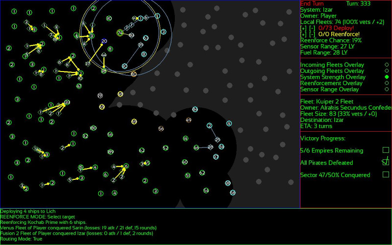
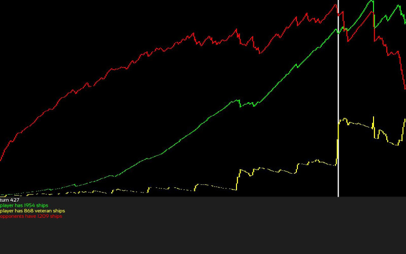
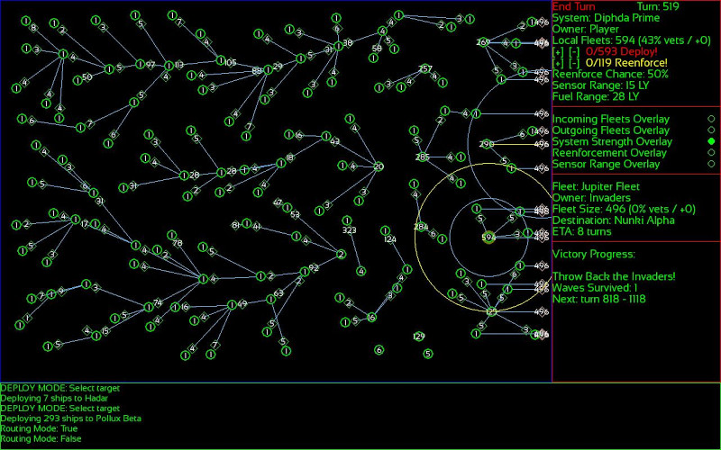
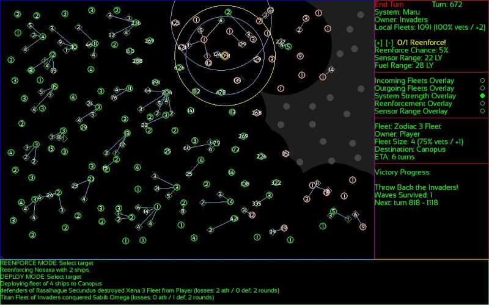
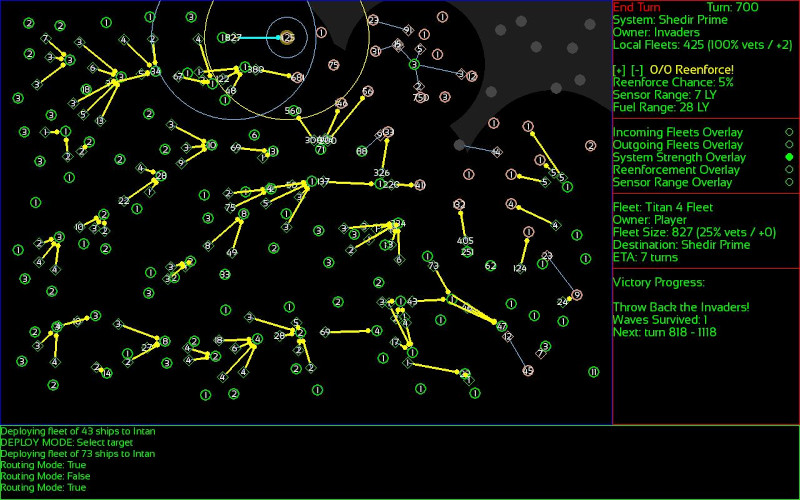

# 0.1.0 AAR test run #3

**Background**: Having implemented full-screen and a new relativizer system for fleet display and hitboxes, I am testing these mechanics in a full run. The new fleet display system shows fleets in a cleaner way than before, but under-the-hood they still fly the same routes from center-of-system to center-of-system. GUI and game logic has been separated a bit here. While under the hood fleets still fly from center-point-of-system to center-point-of-system, the displayed routes are now lines between the edges of systems (and their flight path is an even spacing between them). This creates a slight disconnect between where they are in the actual under-the-hood game logic, and where they appear on the map. However, for the purposes of FOV and IO, the player will never tell the difference (and as a result of this fleets will no longer overlap their source and destination systems, although they will still overlap systems (and other fleets) which cross the path of their flight [a further solution for that will have to be thought of]). While the GUI for this game is mostly in its final stage (regarding the map display, anyway -- I have lots of HUD things I still want to implement), the "noise" of fleet numbers on the map is its least elegant element. I have considered using some of the less noisy solutions sometimes seen in other games (like using increasingly large icons, or pips of some kind, instead of the raw numbers) but I have designed this game in such a way that the raw numbers are very important every turn and it wouldn't make much sense to make the player do guess-work there, or have to find those numbers in another menu. So what I've done through the versions instead is make it possible to click on places where fleets and systems overlap, and view the distinct numbers separately in the side HUD. For the most part I'm pretty happy with this approach, and it's likely the form it will continue to have for many versions hence in the map display. For the side HUD there is a major redesign coming soon (perhaps in this version), as the overlays which I made buttons for are only some of the overlays which are important in the game (and not even the most important) and it would be better if every overlay had a toggle button there in addition to the hotkeys I've implemented. I'm quite pleased with it so far! It's my first *major* attempt at a game GUI rather than a TUI. Although I am partial to keyboard-only TUI games, it has been a real pleasure to make one which is only really feasible with a GUI and a mouse (although my preferred way to play is mouse + keyboard). Some games are best that way! A game in this genre would not really be possible with a keyboard-only TUI approach.

**Note**: This AAR will have relatively few asides on tactics and strategy. It will be the broad strokes, for the most part, although I'll commentate at length on anything which hasn't been covered previously. Also, because these are full-screen images this time, I have made them clickable thumbnails. Click on the scaled-down images to open the full-resolution versions.

### FFA Stage (stage 1)

**Start**: A corner start! Better yet, a corner start with some very good systems nearby. Even the Pirates we share the territory with sit on a good system worth taking.

**Crowded Road**: We are hemmed in this time! We shall have to fight for every inch.

We manage to beat them back a little bit and secure a good little staging ground. The Republic of Acrux (in blue) is the bigger threat, but we're in less of a position to challenge them just yet. The Kochab Clique (in brown) is a better target, as they have more systems in range of our staging points.

A little scouting around Lich (a border system with a very low sensor range) reveals that we have more neighbors to consider. They aren't immediate threats, but may keep the Republic of Acrux busy for awhile.

We pick a good time to launch a coordinated attack against all of the Kochab Clique's systems in our immediate area. They may not all succeed, but it'll leave them in no position to resist follow-up attacks at the very least!

After some warring, we remove the Kochab Clique from our corner of the map, and are now able to make some good front lines and be in a position to secure the nearby non-FTL systems at the bottom of the map. We even took their home system!

We sprawl across the bottom of the map, taking non-FTL systems and trying to counter the other factions in the process. We encounter the major power on the right side of the map: the Alrakis Secundus Confederacy! Probing battles begin on that front as we prepare for the latter phases of the FFA stage.

**Securing the Left Flank**: Our center is secure because of "good terrain" afforded by the semi-random distances between systems. There are few staging points any faction can use to attack us there successfully. On the right, we've been having some back-and-forth with the Alrakis Secundus Confederacy but we move to strengthen our hold there. On the left, it is time to attack: we've been building forces for awhile and begin to outnumber the Republic of Acrux. 

The battle at Denebola is the biggest so far in this run, and an unusually large one for this part of the FFA stage.

The FFA stage can be a little tougher when factions get a chance to blob. This is a consequence of our corner start being somewhat hemmed in. As we are pushed back a little towards more defensive positions on the bottom-right of the map, we make good progress in the top-left. But large fleets begin to appear from the reserve areas of the Republic of Acrux!

We break through in the top-right, and prepare to disorganize the reserve areas of the Republic of Acrux, while organizing the rest of our forces in defensive positions to keep the other factions at bay for now. 

The Republic of Acrux in on the back foot, with their main forces now nearly surrounded. In the center we begin massing forces for an offensive against the factions there, and on the right we have established solid defensive positions for now. From a crowded start, we managed to fight our way to a dominant position!

**Preparations**: Some scouting reveals that the center is densely packed with various factions who have clumped there, while the right side of the map is dominated by the Alrakis Secundus Confederation. We have 10-15% of the map left to take before the Coalition/Resistance stage triggers, and it would be wise to prepare ourselves for that now. The center will be very dangerous for us then because all of those fleets will suddenly be under the control of a single faction (and will give us a hard time, potentially even breaking through as things stand right now). The wise move here is to build some depth in the center, and abort the plan to break through there right away, while continuing to inch behind it through the Republic of Acrux in the top-left. This is a situation in which stage 2 would surprise the unprepared player, when those fleets in the center spring in to action.

The Alrakis Secundus Confederation pushes us back a little on the right, while we land the finishing blows against the Republic of Acrux in the top-left!

As we continue to be hard-pressed on the right against the Alrakis Secundus Confederation, we come across the *other* side of their empire while finishing off the Republic of Acrux. Meanwhile, the center begins to look like it will be to our advantage when the next stage begins.

On the cusp of the Coalition/Resistance stage, here is the shape of things as we finish off the Republic of Acrux.

The next stage could trigger at any moment. To make the coming fight more in our favor, we're going to crush the center while it's still disunited -- now is the time! The Alrakis Secundus Confederation's forces will form the bulk of the Coalition/Resistance, once formed.

### Coalition/Resistance Stage (stage 2)

**Round 2: Fight!**: As hoped, although The Resistance formed relatively early, we have crushed the main danger in the center and placed a lot of fleets at the center of the action right as it begins. Although they only enjoy a slim ship advantage over us this time, and also have most of their fleets placed in active areas to begin with, we should be able to have a dog-fight in the center of the map and come out on top, if we play our cards right!

Some wild battles are won in the center by the slimmest of margins as this phase of the game unfolds!

**Nut Crackin'**: The initial push settles in the center, just in time for a new push to begin in the top of the map! 

A few turns later, we turn up the heat in the center again. While we're still giving ground in the bottom-right, that's where we'll try to surround them in the final pocket!

The crucial advantage we gained with our momentum during the cracking of the nut in the center will likely decide this war. We have won it with that move, and now it's a matter of execution as the other side will do its best to thwart a clean victory. We will want to begin preparing for the Invader stage by leaving some fleets in the less active parts of the map.

Our advance now is swift! Strong centers of resistance are pinned and bypassed by exploiting elements, until larger fleets can crush them. Relatively few large fleets remain for The Resistance!

The breakthrough is successful, and picks up pace!

A surprising encounter results in a staunch defense, barely pulled out by our fleet.

Their mountain's far side is but the beginning of our upward climb! That was a pretty epic stages 1 + 2. As we close in on their last systems, the state of the match: 

### Invader Stage (stage 3)

**Round 3: Fight!**: Who are these invaders? What do they want? We don't know, because they're not telling us. All we know is that if we don't defend our sector then we'll lose all we fought to gain! They are coming from the right side of the map this time, which means a narrower front from my previous AARs. They'll have more numbers concentrated in big fleets, but at the same time we'll have more space to retreat. Towards the middle of the map, we have good terrain for making a stand. 

The plan will be similar to previous runs: withdraw from the invaded edge, draw them in, and then destroy them in separated pockets at the right time. As usual, we'll need to try and interdict them in the rear and try to anticipate the center of gravity of the Haymaker AI type controlling the invaders. This will perhaps be more challenging than in the last few runs, as there is less room to play behind them until they have pushed pretty far in. Will we be able to push them back in the first wave? Let's find out!

The invasion begins! Due to the orientation of their forces regarding the map this time, their fleets are dense! Only in one spot can we even try to mount a sharpening defense thus far. The balance of things as stage 3 begins:

Our first stand is by far the largest battle so far in this run!

(*Playtesting Note*: The increased size of the display in full screen means that in a well-played game, it is less likely a battle will reach the final stages of the animation. However, it still happens in the 3rd stage, which is good. That said, this has been an amazing run so far, and the changes to fleet displays have worked *extremely well*. A great success so far! I may take this opportunity to add more phases to the animations and re-work the way ships move, this update. Especially now that I have identified several common patterns in the battle graphs which lend themselves to unique "battle types". It would be best to have a distinct family of procedural animations for each of these patterns, and I have laid the groundwork for that quite well. In particular, I think "heavy defenses", "parthian shots", "trapped defenders in death ground", and "charges that could succeed" all deserve their own animation routines. The current one was only intended as a placeholder for that more advanced idea, once I had the data [and now we have the data!].)

**Defensive Lines**: We are helped here by favorable gaps in the "terrain" which make it difficult for the AI to push forward in this situation. Also, the fact that it is attacking left/right instead of top/bottom works both ways: we are able to bring larger fleets to bear which make the AI cautious about its advance. There are less gaps in this configuration, and we have yet to find an opportunity to play behind the lines. 

**Haymaker Lands a Punch**: Due to the higher density of ships along a left/right front (as opposed to the top/bottom one), Haymaker's punch landed with decent force at a center of gravity I failed to anticipate in time. Although the invaders' advance is largely thwarted, they've punched through in the top portion of the line and will do some damage before they can be stopped! But, although the battles have been very costly, we have mostly mitigated their numbers advantage by now for the first wave. It is an open question whether they'll be pushed back in one wave this time! Very proud of the Invaders' AI right here. That was a good punch!

As we continue to absorb the blow, the time is looking right for some cautious counter-attacks very soon! We've been "sharpening" some of our fleets on the defensive, and taking out isolated garrisons while we can. Meanwhile, the rear areas have opened up for a little asymmetric warfare which is keeping them distracted for a time. In this particular run, I am not sure if they will be beaten back in the first wave or not, and it will be interesting to find out!

There is a large 1500+ ship invader fleet which seems to be headed for our lines in the top of the map! Meanwhile, we've got enough fleets towards the bottom of the map to begin a counter-attack there. I think the line has firmed up enough to begin counter-attacking (especially as we now have a sizeable presence behind the invader lines). But that big fleet may cause us to trade a little space for time wherever it lands!

(Dev Note: I will likely include some level-specific procedural news blurbs and "living world" stuff in the next update, now that I have fine-tuned the phases of the first three levels.)

The battles going on behind the lines are small but fierce. The idea is to slowly dripfeed forces back there to draw larger and larger fleets away from the invader lines. This is essential to stopping their heavy concentrations of ships! It was a little harder to get that ball rolling when they invade left/right as opposed to top/bottom, but still worked pretty well. This has been a pretty epic run, and I am especially pleased with the way the "behind the lines" play works out in the invader stage (it is not always required to beat it, but good play should certainly include it). This (imo) is part of why the invader stage is the best in the game so far (you have to play big ball and small ball). I intend to keep this kind of dynamism going in the 4th stage and beyond. 0.1.0 (this upcoming update) will include at the very least the 4th and 5th stages, which will be of a similar scope to the Invader stage. The "campaign" will probably include a few dozen stages eventually, and 0.1.0 will also include a nascent version of "skirmish mode" which allows the player to pick and choose elements of all the stages for a custom romp. Early days!

Although we continue to take attrition holding the line, and the counter-attacks will be costly, we've already "marked the x" for this wave and we can afford to bleed them a little to set up decisive momentum-shifts.

Our fixing and sharpening attacks to break through at the bottom of the map were both costly and wild. One of our fleets "charged!" when it was hoped that it would retreat early (costing the entire fleet), while the main attack broke the garrison with only *three* survivors and came down to the very last turn. As a result of this, however, we have broken through the bottom part of the map! That was pretty epic.

The invaders' AI will eventually clamp down on behind-the-lines play, meaning you only have windows of time in which to distract them that way. In this case, we pulled off a breakthrough in the bottom of the map just in time! The big fleets seem contained in the top area, and little opposes us in the bottom. But it was a costly advance!

*AI Note*: This is a relatively unwise attack by the AI right here, and I'll be doing some things this update to improve its judgement in this situation.

This might be winnable in the first wave! Perhaps it was partially because of the orientation of the attack this time around, but the counter-attacks were extremely "sharp" and the tide turned very quickly once that epic back and forth in the bottom part of the line went down. 

**Oh, How the Turn Tables**: With just over a hundred turns until the earliest point at which the 2nd wave could hit, now seems like the time to counter-attack across the line. With the bottom part of the invader line broken, we now seek to repeat the complex mixture of fixing attacks, sharpening attacks, and main attacks, to break their line and push through!

**Mopping Up**: A couple of big battles remain, but our combined attacks and timing overwhelmed the invaders! And with quite a lot of time before the next wave. 

The steep ledge representing the invader forces crashes to the ground, while the spikes on our fleet graph represent but a temporary disturbance in our mountain. Victory is at hand! That was a sweet invader stage.

The climactic 5th Battle of Xihe is appropriately epic, with both sides forming strong lines for a long time. Gatling lasers and missile pulses abound! It's a huge fleet of fresh ships against the biggest remaining invader garrison, and with that they are about to be thrown back!

*Dev Note*: I will likely implement achievements, save/load, and a high score list / run tracking this update (it's a big one), as I want those things in place before I implement the next level.

**Victory**: It was not a *perfect* run, but we judged the moment to bend and the moment to attack just right! Again our "invader valley" has a small hill in the middle, but I believe that is mostly due to the back and forth "behind the lines". Once we took the momentum on the front lines, we held on to it and they never recovered. That was a very satisfying win after the strength of the initial "punch" in the first moments of the invasion. booya! We even saved our home system from devastation this time (there will be an achievement for that)!

**On 0.1.0**: 0.1.0 is going to be a huge update. I am very happy with 0.0.6, and so I am going to take my time with 0.1.0 and implement a lot of the "little things" on my list which are vital for making the next level as awesome as I want it to be. It could be a few weeks or even a few months, but I think 0.0.6 will keep until then. It's had a few downloads on itch.io, and I hope those who have tried it enjoy it as much as I do. It is in the early stages, but it is a pretty pure distillation of my favorite moments in strategy gaming (in addition to a fine excuse to do some procedural programming). Thanks for reading and/or playing! 

*Dev Note*: Oh, I will likely implement a "map replay" feature (ala Civ) for this update as well. One thing I love doing with these AARs is looking at the change of the map over the screenshots, and some civ games allow the player to "replay" the run like a little time-lapse afterwards. That would be pretty straightforward to implement, actually. I will try and make a little YouTube video of that feature once I've implemented it, although my awesome little old laptop's ability to do screen capture is a little shaky.

**Stages 4 and 5**: The next AAR previews will include stages 4 and 5. For stage 4, the player will be "counter striking" towards the invader sector. It'll be a new map, and the player will have small fleets of +2 XP ships with which to take out "generator systems" that pump out decent sized fleets on a regular interval. The whole stage will be asymmetric, as the player will have to avoid the roving AI fleets while preserving their forces for the necessary attacks on generator systems while also preserving "lanes" to the home edge of the map so that infrequent reenforcements can make it through. Stage 5 will take place on the same map as stage 4, and involve a more general symmetric battle with some wrinkles that haven't been seen yet in earlier stages. Stages 1/2 are basically tutorials, and stages 3/4/5 are more how the rest of the campaign will be in terms of scope, scale, and complexity. Stage 5 will end the "invader arc", but there are quite a few more stages planned beyond that, which I won't spoil just yet.

**Skirmish Mode**: 0.1.0 will include a "skirmish mode" which allows the player to set up a one-off level and customize which features of the various levels so far are included (and to fine-tune them to their taste and preference). When I have included some more chess-engine-like features for the AI, these one-off Skirmish Mode games will be the real meat of the game for people who have beaten the campaign, and (hopefully) a place to play some multiplayer at some point! While I'm proud of the AI thus far, it would be very exciting to play this game against some other people.
